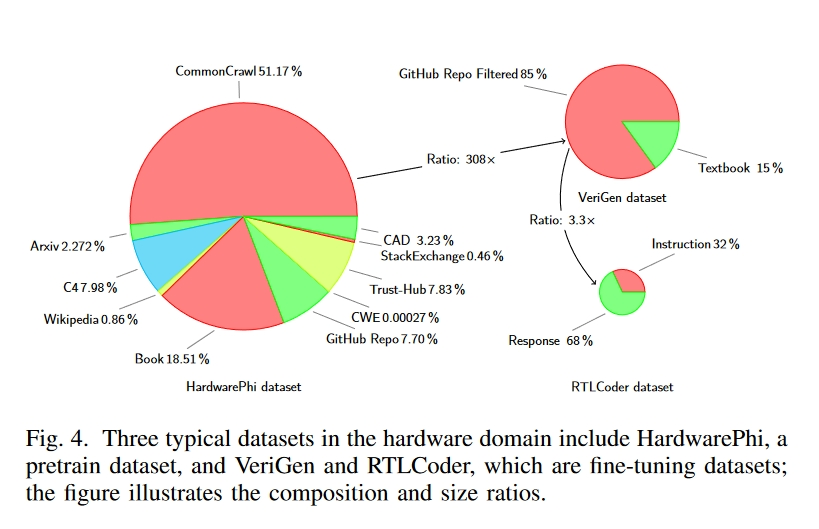
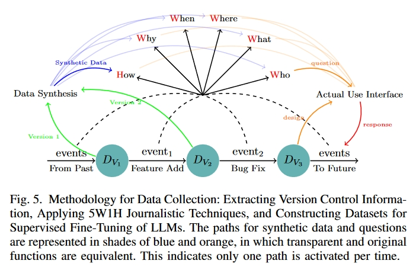
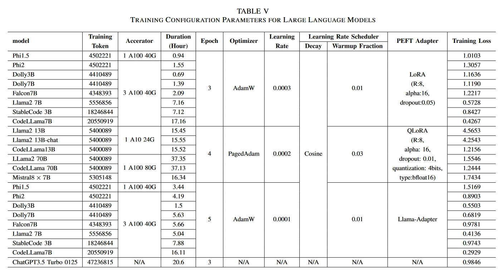
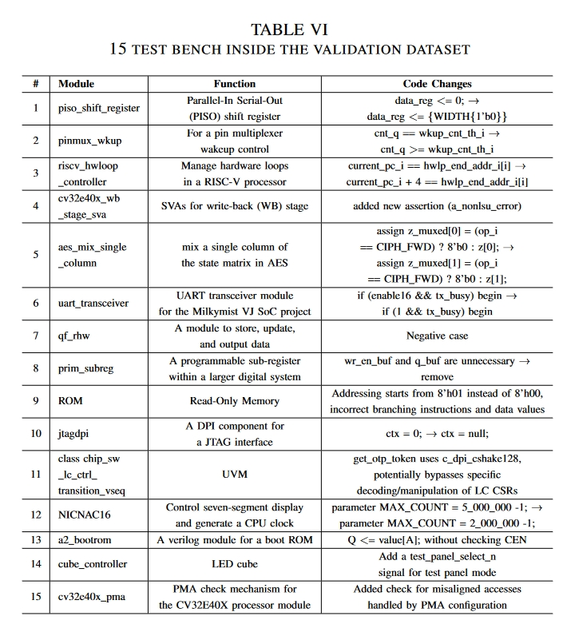
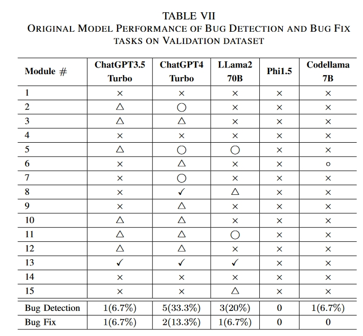
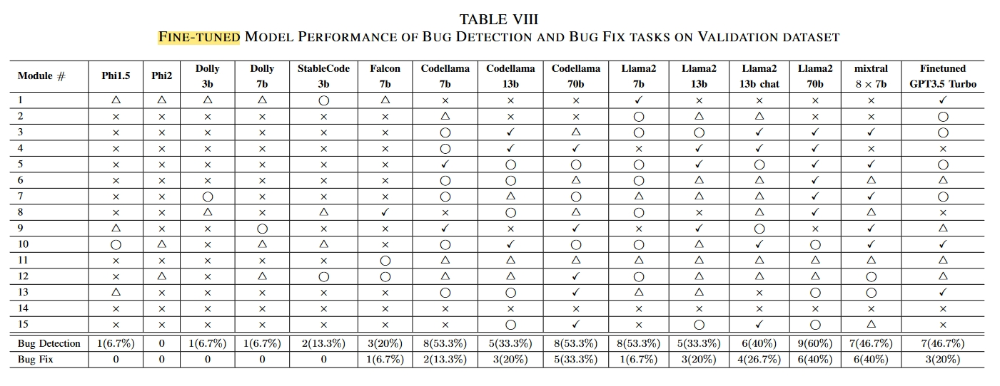
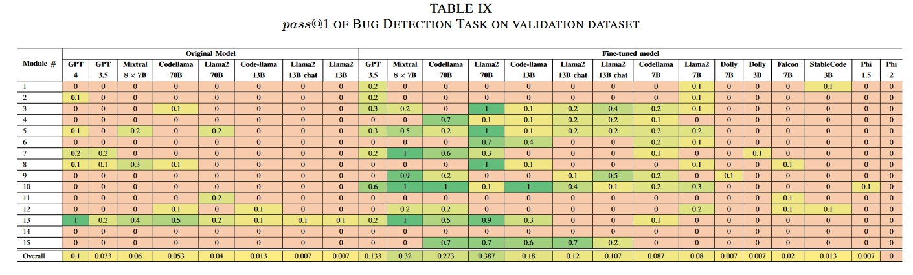

# 创新点

提出了一种利用**版本控制信息**和**新闻事件描述**的**定向半合成数据合成方法**。为了生成高质量的数据，这种方法利用了来自硬件项目的版本控制数据和 5W1H（谁、什么、何时、何地、为什么、如何）新闻原则。它有利于数据集数量的线性扩展，而无需依赖熟练人工。在收集的开源硬件设计数据集上实施了这一方法，并对 15 个通用 LLM 进行了微调，使其能够胜任硬件调试任务，从而验证了我们方法的有效性。

本文的主要贡献如下：

1. 利用硬件设计迭代的**版本控制信息，建立了 RT 级硬件调试数据集**。通过利用来自硬件设计新旧版本的数据，而非人工制作的详尽提示，创建可扩展的 LLM 训练数据集成为可能。半合成方法具有普遍性和通用性，适用于任何规模的数据收集。
2. 这项工作采用 **5W1H 叙事方法来提取和利用版本控制数据信息**。这种跨学科的创新方法本质上能够描述代码功能、问题和解决方案，最大限度地有效利用数据中的所有信息。
3. 利用现代 **LLM 阅读能力，通过比较版本来识别设计问题，从而避免了硬件代码分析的挑战**。该策略通过比较不同版本的信息，最大限度地发挥了现有 LLM 的潜力，从而避免了在接触到自己难以理解的内容时产生幻觉。
4. 在该数据集上对 15 个开源 LLM 进行了微调，以验证其潜力和可行性，并证明了其在提高模型性能和实际应用场景中的有效性。

# 方法

## 相关工作

### 大语言模型数据集

1. 预训练数据集：
   1. 自然数据集
      1. C4：C. Raffel, N. Shazeer et al., “Exploring the limits of transfer learning with a unified text-to-text transformer,” arXiv e-prints, 2019.
      2. Falcon：G. Penedo, Q. Malartic et al., “The RefinedWeb dataset for Falcon LLM: outperforming curated corpora with web data, and web data only,” arXiv preprint arXiv:2306.01116, 2023. [Online]. Available: https://arxiv.org/abs/2306.01116
      3. Redpajama：T. Computer, “Redpajama: An open source recipe to reproduce llama training dataset,” 2023. [Online]. Available: https://github.com/ togethercomputer/RedPajama-Data
      4. SlimPajama：D. Soboleva, F. Al-Khateeb et al., “SlimPajama: A 627B token cleaned and deduplicated version of RedPajama,” 2023. [Online]. Available: https://huggingface.co/datasets/cerebras/SlimPajama-627B
   2. 合成：Phi论文中从ChatGPT提取的数据。
   3. 硬件数据集：上文Hardware-Phi1.5中的数据集。

2. 有监督微调阶段：有监督微调因其高效性和取得重大成果的潜力而备受关注。一旦人们认识到微调可以大幅提高模型性能，微调数据集的多样性就开始出现。Alpaca [48] 是发布大规模开源微调数据集的先驱，它选择了一种合成数据方法，推动合成数据成为主流。
   1. 自然数据集
      1. OASST1：是一个大型、高质量、由人类撰写的对话数据集，旨在生成更自然的 LLM 回复。
   2. 合成数据集：如图 4 所示，VeriGen和 RTLCoder 是两个著名的 SFT 数据集，它们走上了不同的道路。
      1. VeriGen 通过聚合 GitHub 和教科书中的硬件设计，积累了 400MB 的数据集，并已达到其可扩展性的极限，因此在不产生巨额成本的情况下，扩大数据集规模具有挑战性。
      2. RTLCoder 采用 GPT-3.5 从随机指令生成 Verilog 源代码，然后通过模拟器进行语法验证，共生成了 27k 个问题-答案对。然而，通用 LLM 在硬件相关任务中表现出复杂性，导致数据质量问题。自动生成的结果总是相似的；数据非常相似，导致数据集内出现冗余，如 24 个 4 位计数器、11 个 FIFO 缓冲器和 42 个 4 对 1 多路复用器。RTLCoder 中的这些硬件实现需要更多的实际意义。

## 微调阶段

1. Low-Rank Adaptation (LoRA)
2. Llama Adapter

## 微调方法在硬件领域的局限性

硬件领域面临的一个挑战是，**通用 LLM 的典型预训练数据集中的知识分布与硬件领域的知识分布有很大不同。**这种差异会导致无监督预训练的优势得不到最佳利用。预训练数据集（隐含在预训练模型中）与微调数据集之间的分布存在巨大差异，导致以往在原始数据上的微调性能仅部分达到预期。

假设我们有一个预训练数据集 $dataset_{pt}$ 和一个微调数据集 $dataset_{ft}$。鉴于 $dataset_{pt}$  和 $dataset_{ft}$之间的不匹配，我们确定了两种可能的解决方案：

1) 修改数据集pt，纳入硬件领域的重要知识。
2) 修改数据集ft，使其更符合通用语言模型的描述性规范。

考虑到第 II-A1c 节中的讨论，基于硬件领域现有的开源知识实施第一种方案是不切实际的。因此，该文选择的策略是采用更类似自然语言的描述方法，使数据集ft更接近一般 LLM 预训练阶段使用的数据格式。

## 5W1H 解决问题方法（讲故事？）

在新闻报道中，5H1H 是一个核对表，用于确保第一段包含报道的所有要点。5W+1H一词是六个关键问题的缩写：谁、为什么、什么、在哪里、何时、如何。

## 为什么版本控制信息可以作为以聊天机器人模式运行的 LLM 的训练数据集？

基于 LLM 的聊天机器人助手始终致力于回答特定问题。图 5 右侧红色和橙色箭头的组合说明了一个典型的现实世界场景：当用户输入信息时，预期的回应要么是回复，要么是修改输入内容。

虽然用户可能不会有意识地迭代特定版本，但这一过程反映了版本控制。版本控制系统的主要目的是记录所有修改。版本控制系统就像一个数据库，随时捕捉项目的快照，并对项目的演变过程做出精确的解释。

如图 5 所示，底部的茶色圆圈表示不同的版本，黑色箭头表示更改。不同版本之间的变化有很多原因，如功能添加、错误修复和性能增强。这些修改与之前版本的内容直接相关，更确切地说，它们往往是为了解决早期设计中的不足。

该方法受到了聊天机器人助手使用模式的启发，这与经常试图建议潜在代码的副驾驶模式形成了鲜明对比。鉴于工作模式（用户交互与版本控制信息）的相似性，从版本控制中获取的信息可用作训练数据集。

## SEMI-SYNTECTIC AND FINE TUNING DATASETS

### 5W1H in hardware domain

1) Who: To whom does the module for the code belong? 
2) What: What is the modification addressing the bug? 
3) Where: Where is the issue located?
4) Why: Why is the modification necessary? 
5) When: When was this specific change prompted? 
6) How: How was the modification executed?

### 半合成数据集

我们将收集到的原始数据和这些已定义的问题输入商用 LLM，以提取答案。这一过程会产生一个由四个部分组成的元数据组，其中包括两个版本的硬件设计、问题和 LLM 代理的回答。

由于转换器模型本身的局限性，LLM 只能有效利用指定内容窗口内的数据。这就需要合并该内容窗口内的输入。虽然最近的进步大大增加了允许的内容窗口长度，但硬件设计的规模往往超过了这些限制。更重要的是，我们的方法需要同时从两个版本的硬件设计中输入信息，因此必须在整体设计长度上做出权衡。因此，我们在下面设计了三种不同的生成模板，以缓解空间占用加倍带来的问题。

1. 短代码
2. 长代码
3. 文档

# 实验

## 本文用到的大模型及其参数

## 文中的测试案例

### 测试结果

#### 原始结果

-  × Bug could not be identified. • 

- △ Bug was detected but described inaccurately. •

-  ⃝    Bug was correctly identified, but no accurate correction suggestion was provided. (Bug Detection task) 

- ✓ Provide Appropriate correction advice. (Bug fix task)

#### 微调过后的模型表现

在测试中，使用我们的数据集进行有监督的微调大大提高了 LLM 的性能。具体来说，如果只考虑在微调前和微调后阶段初始成功率都不为零的模型，错误检测任务的性能提高了 287.5%。错误修复任务的性能提高了 400%。对不同模型的比较分析表明，经过微调的 ChatGPT3.5 Turbo 超过了 GPT4 的性能，而 Codellama 7B 和 Llama2 7B 则超过了原始的 70B 版本。尽管这些模型不是专门为硬件相关任务设计的，但半合成数据集显著增强了它们在这一领域的能力。与以往的工作不同，我们的工作从概念验证过渡到了可扩展的数据集生成方法，并在实际场景中验证了其有效性。

# 总结

**开发了一种自动生成半合成数据集的方法**

*在一系列通用 LLM 中验证了该方法在硬件领域任务中的潜力。虽然我们的方法仍然受到原始数据稀缺的固有限制，但它显著提高了现有数据的利用效率。*

*此外，数据生成的成本随着原始数据量的增加而线性增长，从而实现了完全自动化，无需经验丰富的人工参与。这是将 LLM 集成到硬件生产场景中的一次成功尝试。我们的方法与众不同之处在于直接利用了来自真实世界的数据，从而避免了合成数据常见的冗余和低质量问题。未来，我们计划探索合作伙伴关系，以扩大该方法的应用范围，并进一步在实际环境中加以实施。*

