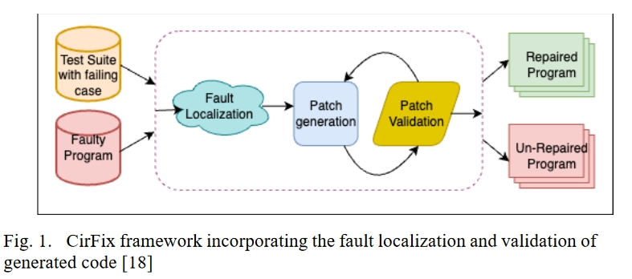
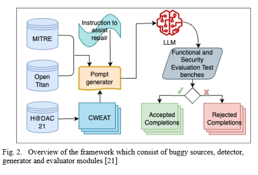
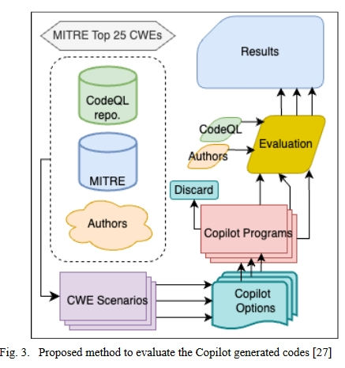
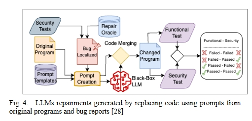
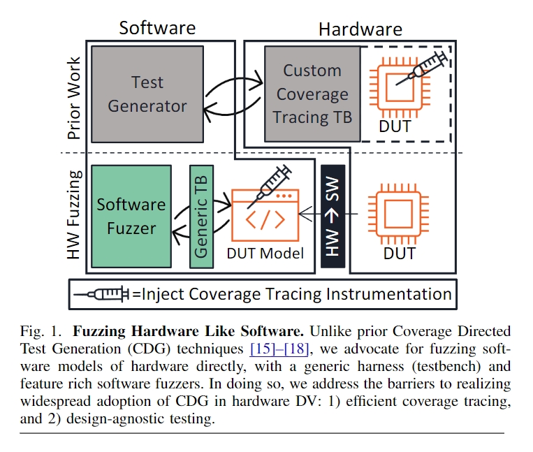
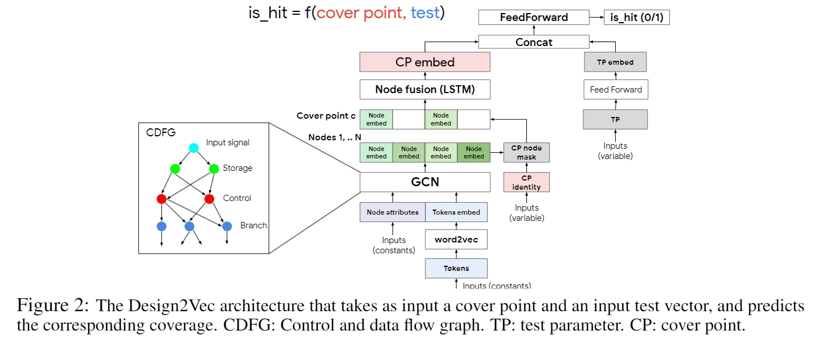
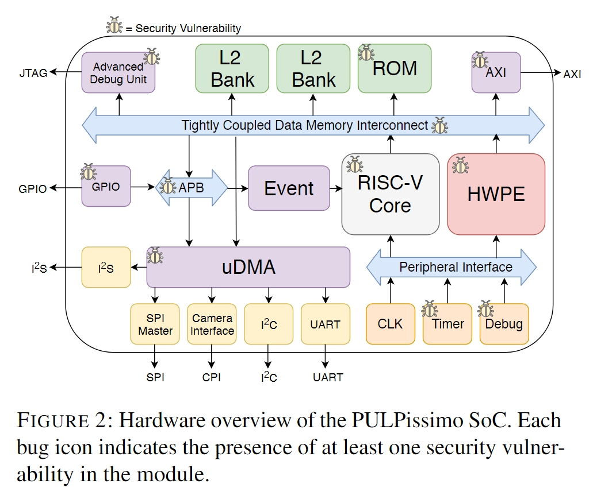
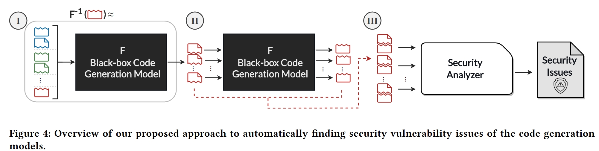

# 创新点

**综述类文献**

本文研究了硬件设计自动修复和验证技术的最新进展。报告讨论了与调试和修复硬件设计中的错误有关的挑战，强调了在制造芯片之前解决这些问题的重要性。

报告根据各种方法的贡献对其进行了分类，并指出了每种方法中使用的具体技术。研究证明了不同方法（如故障定位、置信度评分、大型语言模型和基于学习的方法）在**自动修复**和**硬件设计验证**中的有效性。根据每种方法的结果，这些技术都有可能提高硬件系统的安全性和可靠性。

# 方法

## 典型文章

### CirFix: automatically repairing defects in hardware design code

为了通过精确查找硬件缺陷来节约成本并改进硬件设计，CirFix 旨在基于数据流分析和与硬件设计并行架构兼容的定制适配函数，对硬件设计进行高效的自动修复。它引入了一种通过为导线和寄存器分配特定角色来定位故障的方法。然后，CirFix 会改变当前的测试平台，在设定的时间间隔内记录输出值，作为该过程的一部分。随后，一旦设计进行仿真，更改后的测试平台就会收集并转发设计的输出值。然后根据预期功能对这些值进行评估。预期输出与实际输出之间的差异是 CirFix 故障定位方法的基础。

自动软件修复中使用的**传统适配函数**可能无法充分考虑硬件设计中固有的并行性，与之不同的是，该适配函数经过专门设计，可与硬件设计的并行架构保持一致。它执行全面的位级分析，将输出线的暴露值与预期行为进行比较，以评估潜在修复的功能准确性。CirFix 框架如图 1 所示。它包括故障定位、修补、创建和验证等阶段，这些阶段基于存在缺陷的程序和至少包含一个失败测试用例的测试套件。

### Fixing Hardware Security Bugs with LLMs

这种方法的目的是研究 OpenAI Codex 和 CodeGen 大型语言模型（LLM）在生成硬件安全漏洞修复程序中的应用，重点是研究在自动修复硬件设计中与安全相关的缺陷时部署生成式人工智能（GenAI）的可行性。

作者创建了一个具有代表性的硬件安全漏洞集合。

他们开发并实施了一个系统，用于定量评估为纠正这些特定漏洞而分配的 LLM 的有效性，旨在建立一个全面的漏洞修复框架。

**研究表明**

1. LLM 的组合可以修复他们测试的所有十个基准，并在解决其错误集方面超越了领先的 Cirfix 硬件错误修复工具的性能。

2. 模型的温度（temperature）和提示工程很关键。
   1. 较低的温度（temperature）一般表现的更好，更容易得出正确的回复，结果表明，OpenAI LLM 在 t=0.1 时表现最佳，而 CodeGen 在 t=0.3 时表现最佳。
   2. 在五种不同的提示中，那些在错误代码后包含修复指令的提示包括两个独立的指令：错误代码前的错误指令和错误代码后的修复指令。当错误指令被格式化为伪代码时，工程提示最为成功。

### Asleep at the Keyboard? Assessing the Security of GitHub Copilot’s Code Contributions

该文献提出尝试解决下面的几个问题：

1. 工具生成包含常见弱点的代码的能力。
2. 提示词如何影响代码安全？
3. 工具生成硬件规范 Verilog RTL 代码的效果如何？

通过评估，该文献列出了一些局限性，包括：

1.  GitHub Copilot 界面是手动部署的，这限制了可收集的样本数量；
2. Copilot 置信度得分和用于向用户建议默认选择与最高得分的最高可信度得分没有正式定义，这使得统计显著性的要求变得困难；
3. 此外，该模型是闭源的，无法进行直接检查；
4. Copilot 的输出是生成的，无法直接复制；
5. 此外，由于每个场景中可能没有足够的样本，因此无法使用 CodeQL 进行统计；
6. 而且，CodeQL 处理某些 CWE 的能力有限，例如需要额外信息的 CWE 或在静态分析中无法检测到的 CWE。

由 Copilot 评估生成代码的建议方法如图所示。有几种情况可以借助 Copilot 代码贡献来完成。当 Copilot 在这些场景中贡献不复杂的代码时，可能会出现 CWE。共使用了三种编程语言来检查 Copilot 的安全贡献：Python 和 C（CodeQL 均支持这两种语言，并且有足够的实例来处理前 25 个 CWE），以及 Verilog（用于探索 Copilot 在不太流行的领域中的行为）。

### Examining Zero-Shot Vulnerability Repair with LLMs

图 4 展示了如何使用 LLM 修复零样本漏洞。

1. 程序中的每一段代码都要进行安全漏洞测试，如果发现漏洞，就会将其本地化，并通过修复 Oracle 转发到漏洞修复部分的提示创建模块。
2. 对转发的代码进行测试，以确定提示模板是否准确。
3. 代码合并模块接收提示创建的输出，并创建提示答案。
4. 一旦对更改后的程序完成安全和功能测试，就会发布安全错误修复程序。

这项研究探索了 LLMs 用于零样本安全补丁生成的可行性，**证明模型无需训练即可生成安全补丁，同时确定了在现实世界中应用 LLMs 修复漏洞所面临的挑战**。

人们对语言模型和程序修复提出了许多研究问题，包括它们能否有效修复安全漏洞。通过对几种语言模型的评估，他们发现：

1. 虽然这些模型可以生成编译并通过某些测试的代码，但它们并不能有效修复安全问题。
2. 本文还研究了语言模型如何影响代码生成器生成的提示上下文的质量。这与上面文献的研究结果一致，即提供更多的上下文可以提高生成代码的质量。
3. 在修复场景中，当前语言模型的局限性在于无法处理文件数量大于 1 的情况。
4. 

### A Benchmarking LLMs for Automated Verilog RTL Code Generation

这篇文章通过在两个主要语料库（包括 GitHub 公共代码和 Verilog 书籍）上进行**大量参数调整和微调**，评估了几个预训练 LLM 的改进情况，最终形成了**五个专门模型**。除了修改 LLM 的输入参数（如**温度、最大令牌数和每次提示的完成度**）外，还为模型提供了**三种不同声明级别的提示**。使用各种硬件描述挑战和测试套件来评估生成函数的正确性，以测试代码的准确性。最后，还提供了功能分析测试台和语法测试流程，用于评估针对各种问题创建的 Verilog 代码。流程如图 5 所示。本研究利用各种场景和测试台，探讨了**有关 Verilog 代码生成质量的四个研究课题**，目的是降低硬件开发的成本和开发人员的工作量。

## 硬件设计验证

### Fuzzing Hardware Like Software

本文介绍了一种名为 "硬件模糊 "的硬件设计验证新方法，它利用现有的软件模糊来解决与传统动态硬件验证相关的问题。为了弥合硬件和软件执行之间的差距，作者将 RTL 硬件转换为软件模型，然后直接对该模型进行模糊测试。

该文通过开发一种使用软件测试方法的硬件模糊方法，为硬件设计验证做出了贡献。它解决了几个关键的部署难题，包括开发通用语法和 RTL 模糊测试平台。

**硬件设计被翻译成 C++ 等软件语言，编译后与测试平台和仿真引擎链接，然后直接进行模糊处理。**

硬件模糊利用现有的软件模糊器来验证硬件设计。为了减少硬件和软件执行模型之间的差异，有必要对测试用例进行表示，识别软件崩溃的硬件等价物，建立覆盖率模型。

在提出的评估 Copilot 生成代码的方法中，

1. 将被测硬件设计转换为等效软件模型。
2. Verilog 生成 RTL 后，**覆盖率**由一组种子输入文件决定。
3. 最后，使用灰盒软件模糊处理对输出进行模糊处理。这一过程有助于识别潜在漏洞，提高软件领域硬件的整体可靠性和安全性。

### Learning Semantic Representations to Verify Hardware Designs

作者提出了 Design2Vec，这是一个复杂的框架，利用图神经网络理解 RTL 硬件设计中的语义抽象。其基本概念是在更抽象的 RTL 层面上进行操作，类似于软件源代码，而不是专注于门或位，将控制流和数据流整合到图形格式中。

根据仿真测试输入的结果，Design2Vec 可预测特定分支（如软件中的 case 语句）是否会被覆盖。这项研究表明，Design2Vec 优于不具备 RTL 语义的基准方法，并能很好地扩展到工业设计中。因此，利用仿真数据预测硬件设计的功能，特别是其 RTL，并使用 Design2Vec，可以开发出一种连续的表示方法。

### HardFails: Insights into Software-Exploitable Hardware Bugs

HardFails试图对安全敏感的 RTL 错误的硬件验证技术进行全面而详细的研究，同时也强调了当前验证实践中的局限性。

作者提出了一种被称为 "HardFails "的新型硬件缺陷，并对其进行了分类，这种缺陷对整个平台构成了巨大威胁，而且很难用传统的安全验证方法来识别。

该文的主要贡献在于

1. 开发了一个具有真实 RTL 缺陷的广泛测试环境，
2. 对最近针对安全关键 RTL 缺陷的硬件验证方法进行了方法分析和案例研究，
3. 认识到 "HardFails "是使用标准安全验证技术识别 RTL 缺陷的特别挑战。
4. 本文还将公开测试环境。

下图显示了一个易受多个组件中各种错误影响的片上系统。

### Systematically Finding Security Vulnerabilities in BlackBox Code Generation Models

1. 提出了一种检测黑盒代码生成模型安全漏洞的新方法，黑盒代码生成模型是开发人员广泛使用的人工智能辅助结对编程中的一个关键组件。该方法涉及一种通过少量提示进行黑盒模型反转的技术。研究人员在包括 GitHub Copilot 在内的著名代码生成模型中发现了许多漏洞。
2. 他们还提出了以安全为导向的提示，以便在各种安全环境下进一步检查和比较这些模型。他们的研究成果已作为开源工具发布，用于评估这些代码生成模型的安全性。

该研究还强调了其方法的局限性。它可能会产生误报，而且可能无法检测到所有类型的 CWE，特别是那些需要更广泛背景的 CWE，而他们的方法无法捕捉到这些背景。该方法还依赖于访问代码生成模型的逆模型，这在黑盒环境中是一项具有挑战性的任务。本文试图回答以下关键问题：

1. 如何系统地识别导致不安全代码的提示？
2. 是否有可能使用少量提示对黑盒代码模型进行逆向工程，以找到产生易受攻击代码的场景？
3. 最后，这种方法在发现各种代码生成模型中的安全漏洞方面有多有效？

# 总结

提供了一个硬件自动修复的综述，文中介绍的文章都很有意义，有必要对每一篇文章进行研究。
