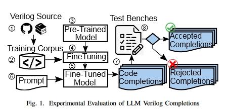
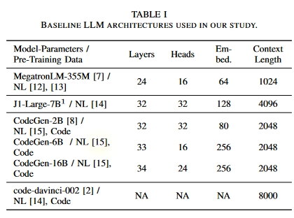
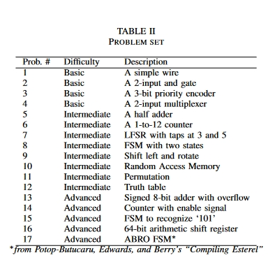
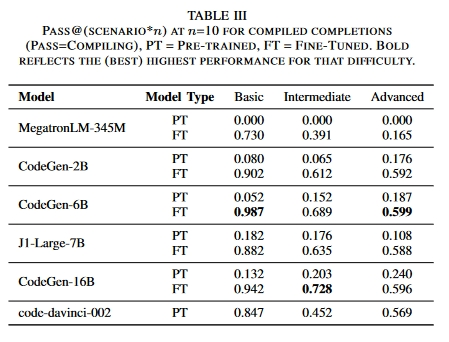
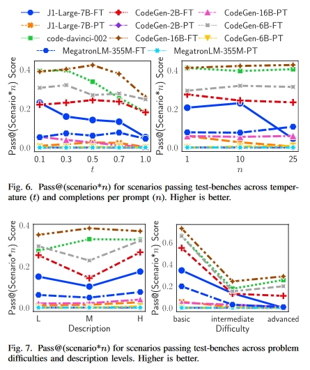
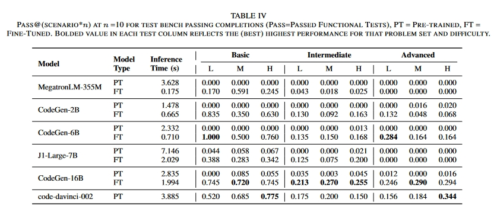

# 创新点

1. 通过整合现有的开放源码 Verilog 代码以及对有关 Verilog HDL 的教科书的广泛搜索，我们创建了（据我们所知）迄今为止用于训练 LLMs 的最大 Verilog 代码训练语料库。（没开源）

2. 利用该语料库，我们对参数数从 345M 到 16B 不等的五个不同的预训练 LLMs 模型进行了微调，产生了五个专门用于 Verilog 的新的微调模型。

3. 为了评估模型的有效性并确定参数大小的影响，我们设计了一组难度不同的 Verilog 编码问题，并设计了相应的测试平台来测试生成代码的功能正确性。

# 方法

## 数据集

1. 主要 Verilog 训练语料来自 GitHub 公共存储库中的开源 Verilog 代码。此外，还创建了一个来自 Verilog 教科书文本的数据集，以了解这是否能进一步提高 LLM 性能。
   1. GitHub 语料库：使用 Google BigQuery 从 GitHub 收集 Verilog 软件源，GitHub 拥有超过 280 万个软件源的快照。我们使用的查询可查找 "Verilog "等关键词和扩展名为".v "的文件。我们删除了重复文件（使用 MinHash 和 Jaccard 相似度指标 [11]），并通过保留至少包含一对 module 和 endmodule 语句的 '.v' 文件来过滤文件。最后，我们过滤了大文件（字符数≥ 20K）。**来自 GitHub 的训练语料库产生了 50K 个大小为 300 MB 的文件。**
   2. Verilog Books 语料库：我们从一个在线电子图书馆下载了 70 本 PDF 格式的 Verilog 教科书，然后使用基于 Python 的工具 pymuPDF 提取文本，该工具使用光学字符识别来提取文本。根据 PDF 的质量不同，文本质量也各不相同。我们通过过滤无关段落（如索引、前言和致谢）来清理文本，并使用正则表达式从周围的散文中检查 Verilog 片段的高级语法，然后在过滤后的文本语料库上使用重叠滑动窗口来生成训练示例。**最终的 Verilog 语料库包括从课本中提取的代码和 GitHub 代码，大小为 400 MB。**

## LLMs

1. CodeGen16B推理都要30GB显存，训练则需要超过250GB显存：two RTX8000s, four RTX8000s, and three A100s。
2. Megatron-LM 采用默认配置：一台 RTX8000 对 9 个历元进行了 15 小时的微调。
3. 现成的商用 AI21 工作室对 J1-Large 进行微调。

# 实验

**测试的数据集**

## 基础LLM 在 Verilog 生成集上的表现如何？

## 微调 LLM 是否能提高性能？

表 IV 报告了每个 LLMs 查询的推理时间，包括必要时与远程服务器的通信时间。请注意，这些结果是仅使用 GitHub 的训练语料对模型进行微调后得出的。我们将在讨论中讨论在 GitHub 和 PDFs 上进行微调的情况，作为一项消融研究。**微调后的 CodeGen-16B LLM 优于所有 LLM。所有经过微调的 LLM 均优于经过预训练的 LLM。**

## 参数越多、规模越大的 LLM 是否越好？

完成度与 LLM 大小的关系：图 6 和图 7 显示，**参数较多的 LLM（CodeGen-16B、code-davinci-002）优于参数较少的 LLM，如 Megatron-355M 和 CodeGen-2B。**这些 LLM 可产生更多通过测试台的补全和更多正确的补全。

## 问题描述的变化是否会影响质量和正确完成的数量？

提示质量影响 LLM 生成质量。我们从两个层面研究了提示描述变化的影响：提示难度和提示描述如何影响代码完成率。我们使用 Pass@(scenario\*10) 作为衡量标准。图 7 右侧面板显示，Pass@（情景\*10）随着提示难度的增加而降低。与 LFSR 等高级问题相比，AND 等简单问题很容易转化为 Verilog 问题。图 7 左侧面板显示，正确解决方案的数量随着简短提示的增加而减少。

如表 IV 所示，与预训练 LLM 相比，微调 LLM 生成的代码编译效果更好。使用最佳Pass@(scenario*10)值，预训练 LLM 生成的完成代码中只有 11.9% 能编译成功，而微调 LLM 生成的完成代码中有 64.6% 能编译成功。因此，设计人员可以使用这些带有文本和/或伪代码的 LLM 生成语法正确的设计 "骨架"，然后再对其进行调整以满足功能要求。

# 总结

本文介绍了一种根据 LLM 自动生成和验证 Verilog 的新模式。

使用表 III 至表 IV 中给出的 Pass@(scenario*n)值，仅经过预训练的 LLMs 生成的补全功能正确率仅为 1.09%。经过微调后，这一比例上升到 27.0%，**这表明微调 LLM 比微调特定语言有明显优势。**微调后的 CodeGen-16B LLM 在完成功能正确性方面最为成功。总体而言，它在 41.9% 的时间内生成了功能正确的代码，而商用的最先进（非微调）code-davinci-002 LLM 在 35.4% 的时间内生成了功能正确的代码。
