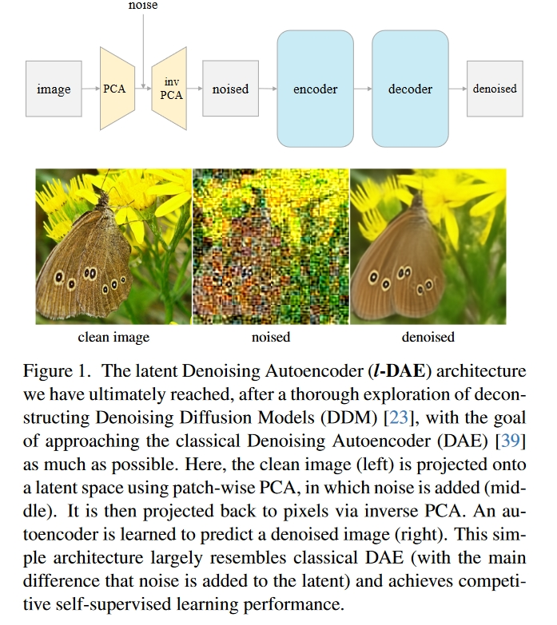
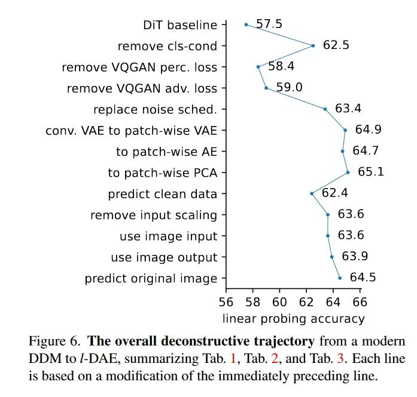
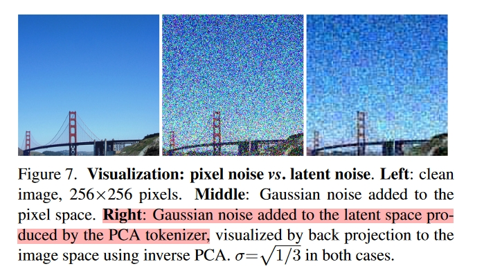
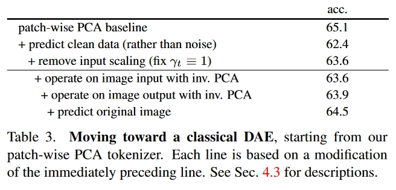

# 创新点

解构了去噪扩散模型，使其更贴近于基本的去噪自编码器。

# 方法

1. 移除类别条件：
2. 结构 VQGAN：
3. 替换噪声调度器：
4. **解构Tokenizer：探索了标准 VAE、片段式 VAE、片段式 AE 和片段式 PCA 编码器。最终发现标准的PCA效果反而很好。**

# 实验

# 总结

化繁为简，很有意思的idea。

但是PCA效果为什么好，似乎没有深入的讨论，是一个方向。
