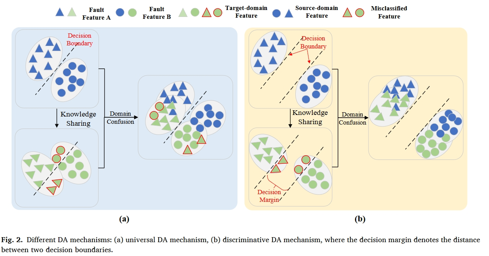
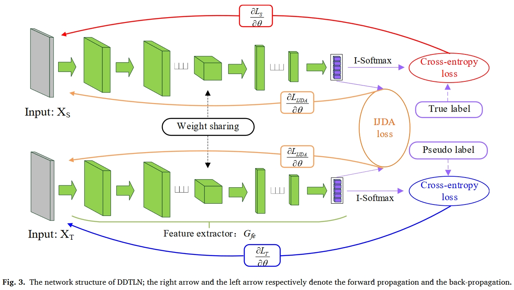
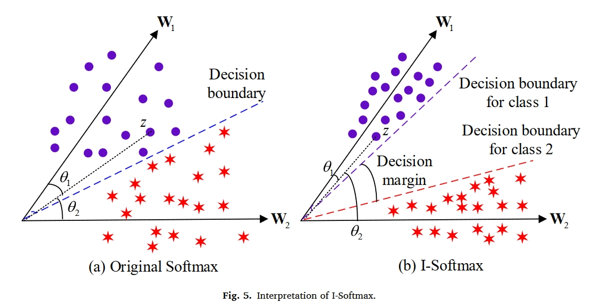
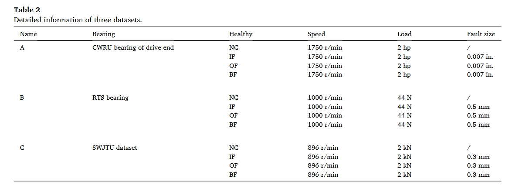
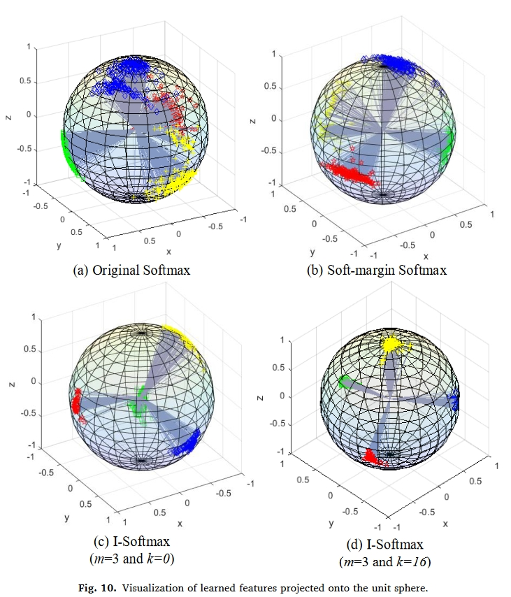

# 引言

1. 转子机械工作在复杂环境中，经常遇到错误。深度学习诊断方法取得了很好的效果。更重要的是，与传统的基于机器学习的方法和基于信号分析的方法相比，基于DL的诊断方法可以大大减少对人类经验的干扰。

2. 介绍了迁移学习，以及域泛化技术。域泛化主要包含两个类别：

   1. 基于对抗机制
   2. 基于统计度量机制

3. 尽管上述基于DA的方法在各个领域和转移任务中取得了重大成就，但它们忽略了以下两个关键因素。

   1. 首先，他们只关注目标域和源域之间的边际分布对齐（MDA），而忽略了同一类两个域上的条件分布对齐（CDA）。
   2. 其次，分类转移任务的目标是获得具有判别性但领域不变的特征。然而，几乎所有的DA模型都主要考虑域不变特征学习，同时忽略了判别特征学习。

4. 在**判别特征学习**中，相关工作可以分为两个方面：

   1. 设计损失函数
   2. 设计网络结构

5. 介绍DA机制与判别特征学习之间的关系，首先应强调以下关于DA的共识：

   1. 由于源域具有标签信息的先验知识，因此目标域特征旨在对准DA过程中源域的分布。
   2. 具有相同类别的两个域之间的分布距离最小，这意味着在DA过程中，目标域特征将优先对齐源域中相同类别的分布。

   如图6所示，如图2（a）所示，通用DA机制总是采用图2（b）所示的决策裕度等于零的原始Softmax损失来获得可分离特征，这只能保证标记源域特征的可分离性。由于源域和目标域之间的分布差异，一些目标域特征不可避免地会被源域的决策边界错误分类。即使在领域混淆之后，这些错误分类的目标领域特征可能仍然不能被正确分类，因为它们远离决策边界。

   对于判别DA机制，由于两个决策边界之间有很大的决策裕度，错误分类的目标域特征仍然更接近于同一源域类别。因此，它们可以通过域混淆正确地重新分类，如图所示。第2（b）段。

   

6. 通过以上分析和讨论，当前故障转移诊断中存在以下几个关键问题：

   1. 通用联合分布自适应机制由于其近似性，无法更好地实现领域混淆。
   2. 现有的DA诊断方法忽略了判别特征学习。
   3. 目前的判别特征学习方法存在优化或不稳定的困难。

   本文的创新如下：

   1. 考虑到现有CDA机制的接近性，建立了一种新的CDA机制，以更好地对齐两个域的真实条件概率分布。然后利用MDA和所提出的CDA提出了IJDA机制。
   2. 为了更好地从均值和协方差两个方面测量分布距离，设计了一种结合MMD和CORAL的改进度量，以进一步减少分布差异。
   3. 为了学习更多可分离的故障特征，提出了一种新的具有灵活边界的I-Softmax损失，以使转移框架在跨机器转移诊断任务中具有更出色的诊断能力。

   

# 相关工作

## Joint distribution adaptation

联合分布自适应(Joint distribution adaptation)被定义为MDA（即，$P(X_S)＝P(X_T)$）和CDA（即，$P(Y_S|X_S）=P(Y_T|X_T))$的组合。$P(X)$表示X的边缘概率分布。它的优化目标是学习一个特征表示T，在该特征表示中，两个域中的**边缘分布**和**条件分布**的分布差异可以显著减小。因此，联合分布适应的目标函数 LJDA 可以显著减少两个域中**边缘分布**和**条件分布**的差异。在类条件概率分布$ (P(Y|X))$ 等于条件概率分布$ (P(X|Y))$ 的假设下，联合分布适应的目标函数$L_JDA$ 定义为:

$$\begin{gathered}L_{JDA}=\left\|\mathrm{E}_{\mathbf{P}(\mathbf{X}_S)}[\mathrm{T}(\mathbf{X}_S)]-\mathrm{E}_{\mathbf{P}(\mathbf{X}_T)}[\mathrm{T}(\mathbf{X}_T)]\right\|^2+\sum_{c=1}^{c}\|\mathrm{E}_{\mathbf{P}(\mathbf{X}_S|\mathbf{Y}_S=\mathbf{c})}[\mathrm{T}(\mathbf{X}_S)|\mathbf{Y}_S=\mathbf{c}]-\mathrm{E}_{\mathbf{P}(\mathbf{X}_T|\mathbf{Y}_T=\mathbf{c})}[\mathrm{T}(\mathbf{X}_T)|\mathbf{Y}_T=\mathbf{c}]\parallel^2\end{gathered}$$

其中$P(Y_T|X_T)$是通过来自标记源域的知识，即通过伪标记来估计的。参数C表示类别的数量。

## Maximum mean discrepancy and correlation alignment

最大均值差异是迁移学习任务中最常用的分布距离度量。其定义为：

$MMD(\mathbf{X}_S,\mathbf{X}_T)=\left\|\frac{1}{n_S}\sum_{\mathbf{X}_S\in\mathscr{D}_S}\mathbf{\Phi}(\mathbf{X}_S)-\frac{1}{n_T}\sum_{\mathbf{X}_T\in\mathscr{D}_T}\mathbf{\Phi}(\mathbf{X}_T)\right\|_H^2$

其中$n_S$和$n_T$分别表示源域样本和目标域特征的小批量大小$||h||_H$表示再生核希尔伯特空（RKHS）,$\mathbf{\Phi}(\cdot)$表示RKHS中的映射函数。为了简单起见，在实际应用中，显式映射函数被核函数（即核技巧）所取代。常见的核函数包括**高斯核**、**多项式核**、**拉普拉斯核**和**西格莫德核**。

正如MMD对齐RKHS中源域和目标域的平均值一样，相关对齐(correlation alignment, CA)旨在匹配两阶协方差统计：

$CORAL(\mathbf{X}_s,\mathbf{X}_r)=\frac1{4d^2}\|\mathbf{Cov}_S-\mathbf{Cov}_T\|_{F}^2$

其中$Cov_S$和$Cov_T$表示协方差度量，其可以被下式计算为：

$\begin{gathered}
Cov_{s}= \frac1{n_{S}-1}\left(D_{S}^{T}D_{S}-\frac1{n_{S}}(I^{T}D_{S})^{T}(I^{T}D_{S})\right) \\
Cov_{T}= \frac{1}{n_{T}-1}\left(D_{S}^{T}D_{S}-\frac{1}{n_{T}}(I^{T}D_{T})^{T}(I^{T}D_{T})\right) 
\end{gathered}$

其中$I$是所有元素都等于1的行向量。

# 提出的迁移学习模型

## DDTLN框架

所提出的DDTLN的结构如图3所示。由于细胞神经网络具有较强的特征学习能力，因此被用作特征提取器。网络参数如表1所示。可以看出，该表包括五个“Cov1D”块、一个全局平均池（GAP）层和两个完全连接（FC）层。每个“Cov1D”块由卷积层、批处理归一化（BN）层和最大池化层组成。GAP和BN可以加速网络收敛，缓解过拟合现象。

## Improved joint distribution adaptation

为了克服CDA近似的负面影响。提出了改进的CDA机制来对齐两个域中的条件概率分布。使用贝叶斯定理，条件概率分布可以转换为类条件概率分布的形式，表示为：

$$P(Y=c|X)=\frac{P(Y=c)\cdot P(X|Y=c)}{P(X)}$$

其中其中类条件概率分布$P(X|Y=c)$是类条件概率分布。$P(Y=c)$表示类先验分布，其可以计算为：

$$\begin{aligned}&P(Y_S=c)=n_S^c/\sum_{i=1}^Cn_S^i\\&P(Y_T=c)=n_T^c/\sum_{i=1}^Cn_T^i\end{aligned}$$

其中C表示类别号，而$n^c_S$和$n^c_T$分别表示整个资源域批量大小和目标域批量大小中第四类的批量大小：

$$\begin{aligned}&\sum_{c=1}^Cn_S^c=n_s\\&\sum_{c=1}^cn_T^c=n_T\end{aligned}$$

MDA的目标是对齐边缘概率分布，即$P(X_S)=P(X_T)$。使用等式（5），改进的CDA机制公式化为：

$$L_{cO\Lambda}=\sum_{c=1}^{c}\left\|\mathrm{E}_{P(X_{S}|Y_{S}=c)}[T(X_{S})|Y_{S}=c]P(Y_{S}=c)-\mathrm{E}_{P(X_{T}|Y_{T}=c)}[T(X_{T})|Y_{T}=c]P(Y_{T}=c)\right\|^{2}$$

然后，通过改进的CDA机制和MDA机制，最终的IJDA机制可以定义为：

$$\begin{aligned}&L_{CDA}=\left\|\mathrm{E}_{\rho(X_S)}[T(X_S)]-\mathrm{E}_{\rho(X_T)}[T(X_T)]\right\|^2+\sum_{c=1}^{c}\left\|\mathrm{E}_{\rho(X_S)Y_S=c)}[T(X_S)|Y_S=c]P(Y_S=c)-\mathrm{E}_{\rho(X_T|Y_T=c)}[T(X_T)|Y_T=c]P(Y_T=c)\right\|^2\end{aligned}$$

在定义了IJDA机制之后，我们需要找到一个分布距离度量来评估等式中的边际分布差异和条件分布差异。由于大量的随机噪声，收集到的旋转机械的振动信号近似服从高斯分布，高斯分布包括两个估计参数（均值和方差）。因此，为了更好地实现IJDA机制，同时进一步提高域混淆能力，将CORAL和MMD分布差异度量合并为一个新的度量，命名为DDM(A,B)：

$DDM(\mathbf{A}, \mathbf{B})= MMD(\mathbf{A}, \mathbf{B})+ CORAL(\mathbf{A}, \mathbf{B})$

将设计的DDM度量纳入IJDA机制，最终的IJDA损失函数可以重写为：

$\begin{gathered}L_{UDA}=DDM(T(X_S),T(X_T))+\sum_{c=1}^{c}DDM[P(Y_S=c)\cdot(T(X_S)|Y_S=c\mathrm{~}),P(Y_T=c)\cdot(T(X_T)|Y_T=c\mathrm{~}\mathrm{~})\mathrm{~}]\end{gathered}$

## I-Softmax loss

对于多分类任务，Softmax函数由于其概率解释性和简单性而被广泛应用于神经网络中。**然而，在某些情况下，它仍然不能满足类内紧致性和类间可分性的要求。**因此，设计了一种新的I-Softmax损失来学习更多可分离的特征并提高迁移任务中的分数，其定义如下：

$$\left.L_y=\left\{\begin{aligned}&-\frac1n\sum_{i=1}^n\log\left(\frac{e^{F^i(c)/m-k}}{e^{F^i(c)/m-k}+\sum_{j\neq c}e^{F^i(j)}}\right),F^i(c)\rangle0\\\\&-\frac1n\sum_{i=1}^n\log\left(\frac{e^{\prime mF^i(c)-k}}{e^{mF^i(c)-k}+\sum_{j\neq c}e^{F^i(j)}}\right),F^i(c){\leqslant}0\end{aligned}\right.\right.$$

其中，$\mathbf{F}^i$ 表示特征提取器输出的特征向量，即。参$F^i=G_{fe}(Xi\Theta_{fe})$数 $F^i(c)$ 和 $F^i(j)$ 分别表示与 $X_i$ 的标签索引相对应的第 c 个元素和其他元素，n 表示特征向量的个数，k⩾0 和 m⩾1 被定义为控制决策边界的超参数。如果 m = 1，k = 0，I-Softmax 损失将等于原始 Softmax 损失。

为了清楚地说明I-Softmax，从angular角度对其进行了解释。如图4所示，原始Softmax可以通过余弦相似性分解为角度和幅度分量：

$F^i(c)=W_c^TZ^i=\|W_c\|\|Z^i\|\mathrm{cos}(\theta_c)$

其中$Z^i$表示倒数第二个FC层输出的特征向量，$W_c$表示最后两个FC层之间的第c个权重向量，$θ_c∈[π，π]$表示$W_c$和z之间的角度。

$W^T_1Z > W^T_2Z$

**然而，原始的Softmax仍然不能保持严格的决策边际，从而影响了它的紧致性和可分性。**为了使I-Softmax获得更合适的决策边界并实现正确的分类，必须满足以下表达式：

$\left.\left\{\begin{array}{l}W_1^TZ>W_1^TZ/m-k>W_2^TZ,~W_1^TZ>0\\W_1^TZ>W_1^TZhm-k>W_2^TZ,~W_1^TZ{\leqslant}0\end{array}\right.\right.$

显然，所提出的I-Softmax损失对于类别1具有比原始Softmax损失更严格的决策标准。本质上，I-Softmax函数的类内紧致性和类间可分性也是通过根据[cosface-CVPR2018]控制$θ_c$来实现的。以$W^T_cZ>0$为例，我们可以证明：

$\begin{aligned}&\|Wc\|\|Z^i\|_2\cos\left(\widehat{\theta}\right)=\|Wc\|\|Z^i\|\cos(\theta_c)/m-k\\&\Rightarrow k=\|Wc\|\|Z^i\|\left[\cos(\theta_c)/m-\cos\left(\widehat{\theta}\right)\right]\geqslant0\\&\Rightarrow\widehat{\theta}\geqslant\theta_c\end{aligned}$

其中$\widehat{\theta}$表示等效边角。从上式中可以立即得出，k和m的影响等效地作用于增大角度$θ_c$。

如图5所示，我们考虑$||W_1||=||W_2||$和$W_1^TZ>0$的情况。给定类别1的样本特征Z，可以对力$W_1^TZ>W_2^TZ（θ_1<θ_2）$的原始Softmax损失进行分类。然而，所获得的决策边界不足以学习可分离特征。对于I-Softmaxloss，它严格要求$W_1^TZ/m-k>W_2^TZ（θ1<<θ2）$。因此，它可以获得一个更具判别力的决策边缘。

根据[L2-constrained softmax loss for discriminative face verification]，特征归一化将鼓励更多可分离的特征学习。因此，我们使用L2范数来归一化权重向量：

$\widehat{W}_c=\frac{W_c}{\|W_c\|_2}$

最后，I-Softmax损失可以重新定义如下：

$ \begin{eqnarray}L_y=\left\{\begin{gathered}
-\frac1n\sum_{i=1}^n\log\left(\frac{e^{\widehat{W}_cZ^i/m-k}}{e^{\widehat{W}_cZ^i/m-k}+\sum_{j\neq c}e^{\widehat{W}_j^TZ^i}}\right),\widehat{W}_c^TZ^i>0 \\
-\frac1n\sum_{i=1}^n\log\left(\frac{e^{m\widehat{W}_c^TZ^i-k}}{e^{\widehat{mW}_cZ^i-k}+\sum_{j\neq c}e^{\widehat{W}_jZ^i}}\right),\widehat{W}_c^TZ^i{\leqslant}0 
\end{gathered}\right.\end{eqnarray}$

## Optimization objective

所提出的DDTLN模型包括两个优化目标：用无监督训练挖掘IJDA损失和用有监督训练挖掘分类的I-Softmax损失。

通常，将分类的交叉熵损失应用于标记的源域，以学习判别特征。为了在TL任务中学习更多的可分离特征，通过伪标签将I-Softmax损失应用于目标域样本。因此，整个分类损失定义为：

$L_W=L_S+\gamma L_t$

其中$L_S$和$L_T$分别表示源域I-Softmax损失和目标域I-Softmax损失。参数γ是权衡参数。

通过对所提出的IJDA损失和I-Softmax损失进行积分，将整个目标函数定义为：

$L_all=L_W+\gamma L_{IJDA}$

其中λ表示权衡参数。然后，利用均方根道具（RMSProp）优化器更新DDTLN的可训练参数。

# 实验

## 数据集

- CWRU
- RTS
- SWJTU

## 实验结果

| Methods     | A土B        | B士A        | A土C        | C士A        | B士C         | C士B         | Avg   |
| ----------- | ----------- | ----------- | ----------- | ----------- | ------------ | ------------ | ----- |
| DDC         | 78.54土4.10 | 82.05土4.97 | 51.57士4.57 | 52.00士4.56 | 55.13土5.37  | 38.87土4.36  | 59.69 |
| DCORAL      | 80.29士6.06 | 91.19士2.70 | 39.19土3.73 | 43.50土6.00 | 45.39土7.14  | 48.52士4.96  | 58.01 |
| DANN        | 65.23士8.34 | 52.61士5.14 | 35.69士8.16 | 40.68士6.34 | 39.54土6.59  | 51.31 土7.68 | 47.51 |
| MCD         | 66.65土4.21 | 50.61土5.05 | 40.51土4.22 | 44.15土4.12 | 30.69土6.87  | 31.52土6.32  | 44.02 |
| FTNN        | 81.34士3.67 | 82.66士291  | 43.87士3.94 | 50.05士2.98 | 56.87土4.39  | 40.52士4.95  | 59.22 |
| JDA         | 78.93士457  | 84.42土3.68 | 54.40士3.87 | 43.29士5.00 | 54.63 土4.44 | 41.49土4.41  | 59.53 |
| IJDA(MMD)   | 82.73士5.85 | 83.22士2.99 | 56.35土4.35 | 55.57土5.97 | 55.64土6.08  | 39.57土5.66  | 62.18 |
| IJDA(CORAL) | 88.83士3.54 | 85.01士2.98 | 56.74士2.99 | 49.57土4.31 | 51.89土5.62  | 47.03 土5.81 | 63.18 |
| IJDA(DDM)   | 84.17士7.15 | 88.39土2.01 | 56.04土3.98 | 54.43土5.21 | 57.42土6.51  | 54.95土5.26  | 65.90 |
| DDTLN       | 98.08土2.33 | 95.12土1.92 | 82.36土4.35 | 87.09士6.69 | 91.55土6.32  | 88.92土8.01  | 90.52 |

## 对I-softmax的分析

为了直观地展示从不同边际学习到的特征的判别能力，将这些特征从最后一个 FC 层投影到图 10 中的单位球体中。 可以看出，I-Softmax 带来了更严格的决策边界和更具区分度的分布。 与原始 Softmax 和 Soft-marginSoftmax 相比，I-Softmax 明确使类内距离变小，类间距离变大。

# 启示

1. 本文理论上包含三个创新：

   1. 新的域泛化方法
   2. 新的softmax损失
   3. 新的对应网络

   但实际上每个点的创新都不大，比如IJDA，实际上就是加看一个correlation alignment。

2. 对比的方法也很传统，就他自己的方法，比如DDC, JDA等，都没有对比其他神经网络。其实更像是一个消融实验。
