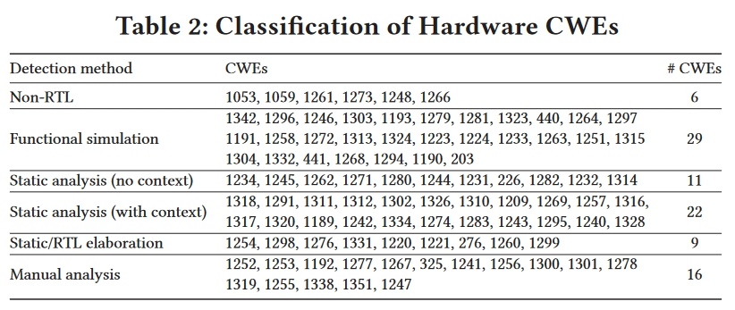
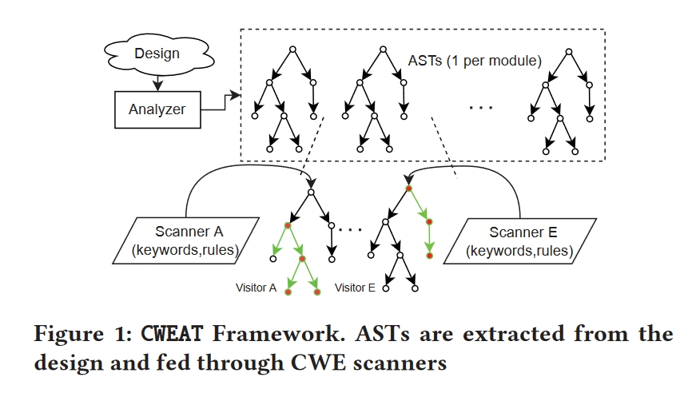
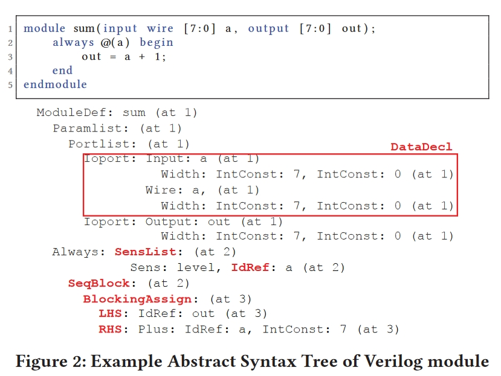
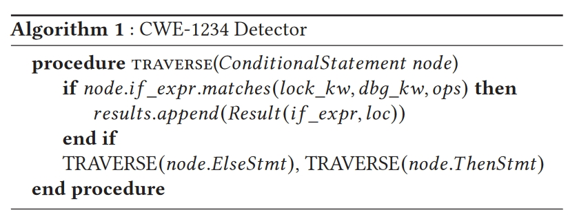
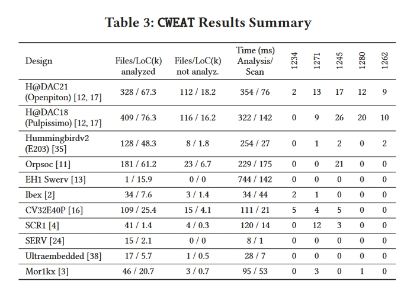
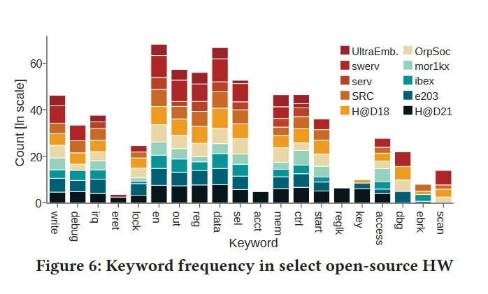

# 创新点

在这项工作中，研究了制作一套**针对 Verilog 源文件的安全扫描程序的实际意义和可行性**。这些扫描程序会指出代码中可能包含 MITRE 的一组常见弱点枚举 (common weakness enumerations，CWE) 的部分。

我们探索了 CWE 数据库，以确定 CWE 的范围和属性**，并识别出适合静态分析的 CWE**。在 **11 个开源设计（4 个片上系统 (SoC) 和 7 个处理器内核）上制作了扫描仪原型**并对其进行了评估，同时探讨了所发现的弱点的性质。我们的分析报告显示，Hack@DAC-21 中使用的 OpenPiton SoC 存在 53 个潜在弱点，其中 11 个已被确认为安全问题。

# 相关工作

有几种方法可以提高硬件设计的安全性，包括使用与传统功能驱动开发并行的安全开发生命周期（security development lifecycle，SDL）。

1. （Planning stage）规划阶段是 SDL 的第一阶段，在这一阶段要明确安全要求。
2. 随后是架构和设计阶段（Architecture and Design stages），在这两个阶段要考虑相关的威胁模型。
3. 根据这些安全威胁模型检查设计是在实施和验证阶段（Implementation and Verification stages）进行的。
4. 实现阶段包括人工检查和代码静态分析，而大部分验证工作则在验证阶段（Verification stage）进行，通过 HDL 中的断言来验证安全属性。
5. 物理测试也在制造完成后进行。最后一个阶段是发布和响应（Release and Response）。

在整个过程中，可以使用多种安全分析技术。最近的工作提出了形式验证、信息流跟踪、模糊测试以及运行时检测。**这些技术都依赖于模拟，或者使用完整或接近完整的设计在现场运行。作为补充，我们将重点放在设计过程的早期阶段，特别是实现阶段。**我们的前提是，对寄存器传输层 (RTL) 代码进行静态分析，可以发现一些安全漏洞，防止它们扩散到下一阶段。

静态分析是一种成熟的软件识别错误和 bug 的方法；例如，Lint 于 1978 年被提出用于分析 C 代码，此后被许多编程语言采用，并被称为 "Linter"。Lint 算法试图在准确性和实用性之间取得平衡，因为生成的警告只能与发现的真正错误成正比。如果误报太多，就会掩盖真正的问题。

前面有一些用于Verilog等语言的工作，虽然这些工作强调了 "线索 "在减少验证阶段负载方面的能力，**但它们并没有关注功能正确但不安全的硬件。这取决于设计人员的安全专业知识能否识别出与安全相关的林特信息。**

# 方法

这项工作旨在通过查找硬件 CWE，改进早期 RTL 设计中的特定安全分析和反馈。然而，CWE 列表包括不同具体和抽象程度的无数弱点。我们首先根据对 CWE 适合静态分析程度的评估对 CWE 进行分类，然后提出了 CWE <u>A</u>nalysis <u>T</u>echniques, CWEAT。

## Classifying CWEs for Scanning

在撰写本文时，MITRE 网站 [26] 上共有 96 个硬件 CWE。在本节中，我们将根据检测能力对它们进行分类，表 2 列出了我们对 CWE 的分类。

1. **首先是 CWE 是否基于代码。我们排除了不是源于 RTL 设计的 CWE (6)。**我们考虑 CWE 是否可以静态或动态（即在模拟或运行时）检测。我们的方法侧重于可静态检测的 CWE。像 CWE-1264 这样的 CWE，其数据和权限检查逻辑之间的非同步只有在运行时才会显现，因此需要采用不同的方法进行检测（30 个需要进行功能仿真）。我们根据所需数据对可静态检测的 CWE 进行了分类。

2. 有些错误可能只需要对 RTL 代码进行静态分析就能检测出来，在静态分析中，源代码被转换成解析树，执行类型参考并检测语法错误。在这里，可以使用不同的算法对创建的解析树进行进一步分析，以提取有用的信息用于 CWE 识别。这些信息可分为可直接从代码中检测到的信息（11）和可能需要额外上下文的信息（21）。其他 CWE 可根据扫描弱点所需的 "额外信息 "或上下文的数量进一步划分（共 9 个 CWE）。对设计进行静态解释需要将实例绑定到模块、解析库引用、处理 defparam 语句、解滚 for 循环、扁平化实例数组以及用常量替换参数。静态阐述的结果是一棵阐述解析树。然后，RTL 详细设计使用预定义的基元（如 AND、OR）和运算符（如加、乘）对设计进行综合。RTL解释的结果是一个生成的RTL网表。

3. 其余 16 种 CWE 在设计中没有普遍现象，因此无法进行形式化和识别，需要 IP 安全专家进行人工分析才能检测出来。

在这项工作中，侧重于对 RTL 源进行静态分析，几乎不涉及任何上下文。因此，特定于有限模块类型的 CWE、跨模块 CWE 或需要模拟的 CWE 都不在该文的研究范围内，是其未来工作的重点。以下列五个 CWE 为代表进行说明。

1. CWE-1234：硬件内部或调试模式允许覆盖锁。调试或调试相关信号会覆盖内部安全相关信号（如锁或访问控制信号）的值。这样，如果对抗者进入调试模式，就可以重新配置敏感策略值或禁用安全保护。
2. CWE-1271： 带有安全设置的寄存器重置时的未初始化值。带有敏感信息（如密钥、锁位或访问控制位）的寄存器在重置时不会默认为安全状态。
3. CWE-1245： 硬件逻辑中的不适当有限状态机 (FSM) - FSM 逻辑中包含 "缺口"，可允许对手将系统置于未知或脆弱状态。
4. CWE-1280： 在资产被访问后实施访问控制检查 - 在对资产的访问控制信号进行检查之前，资产是可以被访问的。只有在检查成功后才能访问资产，否则安全性可能会受到影响。
5. CWE-1262：寄存器接口访问控制不当 - 寄存器值未受写保护或未受正确保护，即未受信任的用户可通过寄存器接口覆盖信号。必须正确实施安全相关信号的保护机制，以避免数据泄漏。

## CWEAT框架

为了协助检测目标 CWE，该文提出从 Verilog 源代码创建抽象语法树 (AST)，并使用手工制作的启发式检测算法遍历这些语法树。图 1 展示了 CWEAT 框架，其中输入是包含源代码的设计库。

设计可以是单个硬件知识产权块（IP），也可以是整个片上系统（SoC）。具体流程如下：

1. 相关的源代码文件（Verilog 和/或 SystemVerilog 格式）将从该资源库中提取出来，并按分析顺序进行排序。如果某个文件有错误或没有必要的依赖关系，工具就会忽略它。

2. 最终排序后的源代码列表将发送给分析器。

3. 分析器在整个源代码文件集上运行，并生成 N 个 AST（每个模块一个）。

   

该文使用 Verific作为前端解析器来构建 AST。每个扫描器都会使用相关规则和关键字，根据 CWE 的检测算法遍历每个 AST。未来的工作可以为该框架添加新的扫描器。

## CWE 扫描算法

该章节中，作者为刚刚每一个CWE都创建了一个Scanner流程，下面给出CWR-1234的具体算法：

算法 1 演示了 CWE1234 的扫描程序。分析 if_expr 时，要检查它是否符合以下三个条件：

1. 是否存在 lock_kw 列表中的锁定关键字；
2. 是否存在 dbg_kw 列表中的调试关键字；
3. 是否存在表示 "覆盖 "的二进制逻辑运算符（如 or）。如果满足这些条件，if_expr 就会被归类为潜在漏洞。相关信息将被收集并附加到结果中。接下来，会依次遍历条件语句的 else 和 then 语句。这种递归将处理嵌套的 if-else 语句。

# 实验

本文再实现所提出方法的同时在几个开源设计上进行了应用。

表3 总结了扫描结果。扫描仪对每个项目分析了少则 1 个、多则 409 个文件，代码行数多达 ∼ 76k (LoC)。在所有项目中，CWE-1245 扫描仪发现的潜在 CWE 实例最多，而 CWE-1234 扫描仪发现的最少。扫描的平均运行时间为 63 毫秒；生成 AST 平均耗时约为运行扫描器集合耗时的 3 倍，这表明这些静态分析器可为设计人员提供快速反馈。对于 Hack@DAC'21 SoC，**我们生成了 53 个安全警告；这比商业工具生成的 597 个警告更有针对性**（第 2 节）。

## 关键词匹配规则

我们根据自己在各种设计风格方面的经验，设计了一套关键词匹配规则。这包括我们对开源设计的初步实验、对其他文献中错误实例的回顾以及对硬件错误查找竞赛的参与。为了进一步了解情况，我们分析了不同开源项目中与我们的关键词相匹配的信号频率。结果见图 6。由于不同设计的标识符总数范围较大，因此频率值以对数标度报告。关键词涵盖了所考虑基准的很大一部分，这表明像 CWEAT 这样的框架具有广泛的适用性，可以在不同项目中开箱即用。虽然我们的关键字对我们所考虑的各种设计都很有意义，但我们的目标并不是提供一组最好的关键字，而是要表明关键字是构建安全扫描器的一种有效方法。在实际应用中，设计人员可以通过修改关键字来提高性能。

# 总结

面临的问题：

1. 如何平衡平衡准确性（真阳性实例与扫描仪捕获的实例总数之比）和全面性（识别出的真阳性实例数量）。
2. **可以通过加入学习方法，而不是经验性的扫描方法来检测漏洞。**
3. 所提出的方法无法保证在未发出警告的情况下不存在弱点。这些 "false negatives "之所以存在，是因为本文使用了**启发式模式检测**。

该文已经证明了

1. 在RTL实施的早期阶段可以检测到某些CWE。在11个开源设计中，CWEAT捕获了180个实例。
2. CWEAT将特定弱点的搜索限制在较小的子集内。搜索特定问题仅限于几个信号和模块，而不必遍历数千行源代码。通过添加新的扫描仪，可以分析其他CWE，提高设计的安全级别。CWE的性质各不相同，可以在不同阶段检测到。

因此未来的方向可能有一下两个：

1. 可以为21个CWE开发扫描仪，这些CWE可以使用表2所示的规范文件进行静态检测。
2. 可以为我们瞄准的CWE开发更准确和全面的扫描仪。

