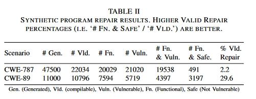

# 创新点

1. **比较了**不同提示词、上下文、模型设置（温度、采样策略等。）对LLM生成功能安全代码的影响。-这和上一篇不是一样？
2. 我们首次评估了 LLMs 在零样本生成安全修复方面的能力，结果表明现成的模型能够在简单的场景中生成安全修复，而无需任何额外的训练。然而，当我们在一些真实世界的场景中评估 LLM 时（第五部分），我们发现 LLM 在生成可信的修复程序时会很吃力，因此仍无法在程序修复框架中提供实际价值。（**主要落脚点还是零样本**）
3. 为鼓励进一步研究如何在漏洞修复中使用 LLM，该文**开源了数据集和评估框架**，包括 "gpt2-csrc "的训练数据和训练模型。

# 方法

NULL

# 实验

## 问题 1：现成的 LLM 能否生成安全且实用的代码来修复安全漏洞？

结果表 II 总结了合成程序修复结果。在 CWE-787 方案中，22034 个有效程序中有 2.2% 被修复。在 CWE-89 方案的 10796 个有效程序中，29.6% 的程序得到了修复。

结果：表 II 总结了合成程序修复结果。在 CWE-787 情景下，22034 个有效程序中有 2.2% 被修复。在 CWE-89 情景中，10796 个有效程序中有 29.6% 被修复。

总结：此外，鉴于原始程序也是由语言模型生成的，且没有错误，因此值得注意的是，即使没有额外的上下文，LLM 也能够生成没有错误的代码**--前提是它们 "理解 "生成任务（即任务很简单）。**事实上，这两种情况下的原始生成任务所生成的错误程序（CWE-787 中 4.4% 的程序无错误；CWE-89 中 93.6% 的程序无错误）要少于综合修复提示（分别为 2.2% 和 29.6% 的补丁无错误）。这表明，虽然两种情况都通过该提示进行了修复，但应进一步研究修复提示的内容（问题 2）。

此外，考虑到图 5 显示的结果，即温度越高，CWE-787 越好，CWE-89 越差，反之亦然，**我们可以得出结论，没有一个温度/最高 p 可以最好地覆盖所有场景和引擎（也许是意料之中的）**。不过，鉴于 Codex 官方文档建议改变其中一个参数，而不是同时改变两个参数，我们可以选择将一组温度 {0.00、0.25、0.50、0.75、1.00} 设置为集合查询的参数，并将最高 p 固定为 1.00。这样，在我们随后的实验中，潜在修复的 "搜索空间 "就会缩小 80%。

## 问题 2：改变提示注释中的上下文量是否会影响 LLM 提出修复建议的能力？

结果：很难得出明确的结论：不同提示、不同场景和不同 LLM 的性能差异很大。

不过，任何一个正确的代码完成都是修复特定错误所必需的，而且所有场景都至少通过模板和引擎的一种组合成功修复。每个单个模板的性能都能指导未来的工作，以制造出强大的通用单个提示（问题 2）。

## 问题 3：在现实世界中使用 LLM 修复漏洞会遇到哪些挑战？

根据经验，我们发现 LLM 制作 Verilog 代码的熟练程度不如 C 或 Python，因此我们对 Codex 模型的温度和最高 p 进行了全面扫描。由于应用程序接口的使用限制，我们没有对 Jurrasic 模型进行扫描。我们还排除了 "polycoder "和 "gpt2-csrc"，因为它们不支持 Verilog。

为此作者又为Verilog硬件场景提出了一个后验布骤？？？

## 问题 4： LLM 生成修复的可靠性如何？

在针对两个 CWE 的 117 个简单合成程序中，LLM 生成了 58,500 个可能的补丁，其中 3,688 个修复了程序。然后，我们手工制作了 7 个脆弱程序，以实现 7 个 CWE。对于这些程序，LLM 生成了 10,000 个可能的补丁，其中 2,796 个修复了程序（100% 修复了程序）。我们使用了 12 个具有历史 CVE 的真实世界项目，让 LLM 生成了 19,600 个可能的补丁，其中 982 个补丁 "修复 "了程序（12 个补丁中的 8 个）。

一般来说，详细的提示能更有效地引导模型生成补丁程序。当 LLM 只需要制作简短的局部修补程序时，它们的效果最好。而在需要复杂上下文的情况下，它们的表现则较差。考虑到我们研究中的整套实验，对于 "LLM 生成修复程序的可靠性如何？**总的来说，我们对 LLMs 在执行安全漏洞修复任务时生成代码的质量和成功率感到惊讶，因为合成和手工创建的场景 100% 都得到了令人信服的修复。不过，基于对真实世界场景的定性分析，我们认为 LLM 还不足以取代自动程序修复。此外，基于 LLM 的其他限制条件也适用：修复仅限于单个文件中的单个位置，虽然安全漏洞往往比其他漏洞更加局部化，但这并非普遍现象。**

# 总结

在本文中，我们试图从代码的大型语言模型（LLMs）在零样本环境下修复软件漏洞的能力角度来描述其特性。我们发现，通用的黑盒 LLM 在得到精心构建的提示后，可以生成安全漏洞的修复程序，包括在我们 100% 的合成和手工创建的场景中。不过，我们对 LLM 性能的评估表明，目前的技术水平还不足以让这种方法在程序修复框架中提供真正的价值。虽然我们相信未来有针对性的 LLM 在这一领域具有应用潜力，但挑战依然存在。对于一个完整的端到端系统来说，完整的系统需要结合错误定位和改进的测试平台来进行评估。要让大量开发人员在日常工作中使用 LLM，查询 LLM 的集合是不太可能的。
