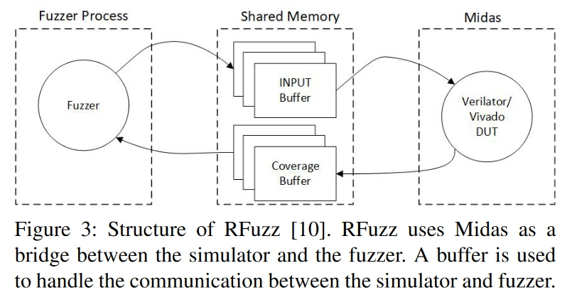
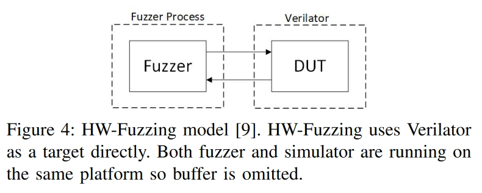

# 创新点

总结了Fuzzing在硬件中应用。


# 方法

## 硅前硬件安全验证

主要是在寄存器传输层（RT 层）。

### Interactive Theorem Proving（交互定理证明）

Interactive Theorem Proving（交互定理证明）是一种形式化方法，用于在计算机辅助下构造和验证数学证明。下面是一个简单的使用交互式定理证明来验证一个基本的硬件组件——加法器的设计。

### 加法器设计验证示例

假设我们要验证一个4位的二进制全加器（Full Adder）。全加器是一种组合逻辑电路，用于计算两个二进制位以及来自低位的进位输入，并产生一个和输出和一个进位输出。

#### 步骤 1: 设计加法器

首先，我们需要设计一个4位的全加器电路。这个电路可以由一系列的逻辑门组成，例如与门、或门和非门。

#### 步骤 2: 形式化设计

接下来，我们需要形式化加法器的设计。这意味着要定义输入和输出信号，以及它们之间的逻辑关系。我们可以使用布尔代数或者更高级的形式逻辑来描述这些关系。

#### 步骤 3: 选择交互式定理证明器

为了进行验证，我们需要选择一个交互式定理证明器。这里我们选择 Isabelle/HOL，因为它支持高阶逻辑并且有丰富的自动化工具。

#### 步骤 4: 编写形式化规格

使用 Isabelle/HOL，我们首先定义加法器的输入和输出：

```isar
theory FullAdderVerification imports Main begin

type_synonym bit = bool

definition add :: "bit ⇒ bit ⇒ bit ⇒ (bit × bit)" where
  "add a b cin ≡ (let s = a ⊕ b ⊕ cin; cout = (a ∧ b) ∨ (b ∧ cin) ∨ (a ∧ cin) in (s, cout))"

definition full_adder_4_bit :: "bit list ⇒ bit list ⇒ bit ⇒ (bit list × bit)" where
  "full_adder_4_bit xs ys cin ≡ 
    let (s1, c1) = add (xs ! 0) (ys ! 0) cin;
        (s2, c2) = add (xs ! 1) (ys ! 1) c1;
        (s3, c3) = add (xs ! 2) (ys ! 2) c2;
        (s4, c4) = add (xs ! 3) (ys ! 3) c3
    in (s1 # s2 # s3 # s4, c4)"
 
end
```


这段代码定义了单个全加器 `add` 和4位全加器 `full_adder_4_bit`。

#### 步骤 5: 定义属性和定理

然后我们需要定义要验证的属性。例如，我们可以定义一个定理来验证4位全加器的正确性：

```isar
theorem full_adder_correctness:
  assumes "length xs = 4" and "length ys = 4"
  shows "full_adder_4_bit xs ys cin = (zs, cout) ⟷
         (∀i<4. zs ! i = (xs ! i ⊕ ys ! i ⊕ if i=0 then cin else zs ! (i-1))) ∧
         (cout = (xs ! 3 ∧ ys ! 3) ∨ (ys ! 3 ∧ (if 0 < 4 then zs ! 3 else cin)) ∨ (xs ! 3 ∧ (if 0 < 4 then zs ! 3 else cin)))"
  using assms
  by (induction xs ys rule: list_induct2) (auto simp add: full_adder_4_bit_def add_def)
```

这个定理说明了全加器的输出应该与输入的一致性关系。

#### 步骤 6: 证明定理

最后，我们使用 Isabelle 的自动化工具和手动指导来证明上述定理。在这个例子中，我们使用了归纳法来证明全加器的正确性。

### Model Checking（模型检查）

有许多基于模型检查的方法被用于验证和确认硬件和软件应用程序。在这种方法中，通过探索模型的**状态空间**来检查给定规范是否满足。在硬件验证中，伴随初始状态的硬件 Verilog/VHDL 代码被表示为一个转换系统，其行为规范被表示为一个时序逻辑。如果存在模型不符合规范的情况，模型检查器就会生成一个反例。此时，用户可以自由利用这些信息来修正设计。

### Information-Flow Tracking（信息流追踪）

信息流跟踪（IFT）方法试图检测可能导致敏感信息泄露的意外或隐藏路径。因此，在这些解决方案中执行了互不干涉策略，减少了较低敏感度输出与较高敏感度输入之间的依赖性。因此，在这些解决方案中执行了**互不干涉策略**，减少了低敏感度输出与高敏感度输入之间的依赖性。现有的 IFT 解决方案通常需要人工注释 RTL 代码或证明属性。**用户的任务是选择潜在信息泄漏的来源和目标。**IFT 是基于语言的安全领域的支柱，允许创建 HDL，以确保硬件在设计阶段的可信度。各种安全 RTL 编程语言，如 Caisson 、Sapper 和 SecVerilog，都是基于 IFT 来检查互不干涉特性的。IFT 的主要缺点是应用该方法的成本较高。要设置信息流策略，开发人员或用户必须学习语言和工具所使用的复杂标记系统.


## 软件安全分析

### 静态分析

静态分析是一种通过语义分析对源代码进行检查的技术，无需执行代码。最早使用的是 PFORT 校验器，它被用来筛选可移植的 Fortran 代码，以检测潜在的问题。静态分析工具根据预定义的特定模式检测漏洞。这对所能完成的工作造成了限制。

1. 如果没有编写用于发现特定问题的规则，静态分析工具将无法检测到该问题。

2. 由于一种模式可能出现在非恶意或脆弱的环境中，静态分析工具很容易出现高误报率，并可能被迫泛化而错过实际的脆弱代码。

3. 静态分析在模型大小和功能方面存在挑战，可能导致状态爆炸。

### 动态分析和fuzzing

与静态分析相比，动态分析利用**程序运行时的状态**来检测潜在的错误。这种方案可以实现**高精度**的错误检测，但也面临一些基本限制。最突出的问题是，*穷尽所有测试输入是不切实际的*。在编写测试用例时，用户一般会考虑一些常见的情况，如正向测试、逆向工程和边界值。

Fuzzing（模糊测试的简称）最早由 Miller提出，是 "一种自动测试技术，它使用无效数据（来自文件、网络协议、应用程序编程接口（API）调用和其他目标）作为应用程序输入，**涵盖大量边界案例，以更好地确保不存在可利用的漏洞**"。Fuzzer（模糊器）可自动生成用于动态测试程序的输入。这不仅降低了人力成本，而且提高了测试效率。此外，模糊器生成的输入是不可预测的。**模糊技术是大数定律的典型应用。**随着模糊测试技术的不断进步，它必将检测到zero day vulnerabilities（零日漏洞） 。

### Fuzzer的类型

模糊器可按测试平台生成方法、目标源代码依赖程度和探索策略进行分类。模糊处理框架可以属于其中一个或多个类别。

#### 输入生成

模糊器可按其生成测试程序输入的方式进行分类。

1. **基于生成的Fuzzer**利用配置文件中的条目作为输入。这种方法提高了测试效率，因为最常见的输入都能轻松提供给程序。这类模糊器的例子包括 Peach 、Trinity 、Sulley、Csmith。遗憾的是，配置文件可能并不详尽，可能导致漏洞未被发现。

2. **基于突变的Fuzzer**利用单一输入，并在每轮测试中自动对其进行突变。这种类型的模糊器对被测程序的了解很少，而且可以将使用过的输入作为种子，自动生成新的测试输入。这类模糊器的例子包括 American Fozzy Lop (AFL)、Driller 和 Mayhem。然而，基于突变的模糊器很难应用于可接受多种不同文件类型的程序。

#### 目标源码依赖程度 

模糊器还可按其对测试线束中应用程序源代码的依赖程度进行分类。

1. 白盒模糊器（如 Peach [43]）需要访问程序源代码，通过静态分析获取信息。

2. 黑盒模糊器，如 LibFuzzer [51]，直接在可执行文件上执行模糊测试，无需访问源代码。

3. 灰盒模糊器（如 AFL）则在编译过程中检测被测程序的源代码。之后，就不再使用原始源代码了。AFL 利用二进制代码中的仪器监控程序的执行，并生成执行代码的覆盖图。

#### 探索策略

模糊器也可分为定向模糊器和基于覆盖范围的模糊器。

1. 定向模糊器的目标是生成覆盖程序目标路径的测试用例，**期望更快地测试程序**。

2. 基于覆盖范围的模糊器则旨在生成覆盖尽可能多执行路径的测试用例，**期望能进行更详尽的测试，最大限度地发现错误**。

### 总结

| Technique        | Deployment | Accuracy | Scalability |
| ---------------- | ---------- | -------- | ----------- |
| static analysis  | easy       | low      | good        |
| dynamic analysis | hard       | high     | unknown     |
| fuzzing          | easy       | high     | good        |

## 硬件 Fuzzing

### RFuzz

RFuzz 是 Flexible Internal Representation for RTL (FIRRTL) 的一部分。该项目旨在研究如何在 RTL 硅前测试中使用覆盖定向模糊。如图所示，其结构类似于普通的软件模糊测试。



受 American Fuzzy Lop（AFL） 的启发，多路复用器被选为分支覆盖点，类似于软件模糊测试中的边缘覆盖。这一选择是合理的，因为多路复用器的特点与软件中的分支非常相似。软件中的分支决定了执行路径，可能会改变变量的值，而多路复用器对信号的作用方式与此基本相同。


RFuzz 使用 Midas作为后端。Midas 提供了一个性能和功耗评估平台，可使用不同的 HDL 仿真器来模拟硬件设计，并提供了一个接口，允许模糊引擎与被测单元通信。


RFuzz 可使用 Verilator 进行仿真，或使用 Xilinx Vivado进行 FPGA 加速。后者是为了解决大规模硬件设计仿真速度慢的问题。RFuzz 采用 AFL 作为模糊引擎，用于输入生成和突变。


**然而，通过仿真软件的监督进行测试并不理想。在软件模糊测试领域，进程是被测设备（Device Under Test，DUT），崩溃是操作系统发出不正确操作信号的结果。与传统的软件FUZZ相比，RFuzz相当于使用虚拟机管理程序作为程序的测试工具。就像程序中的非法操作不会使管理程序崩溃一样，模拟硬件也不会使模拟器崩溃。仿真软件将为给定DUT的任何输入稳定地产生输出。**

### HW-Fuzzing

HW-Fuzzing沿用了 RFuzz 模型，同时也表现出了它的一些缺点。如图 4 所示，在几乎相同的模型下，作者对设计进行了三大改动。HW-Fuzzing 将模糊引擎的应用范围缩小到**被测单元**，而不是**整个测试线束**。作者还修改了覆盖率统计方法，以减少工具运行时间。最后，**HW-Fuzzing 采用预定义的 SystemVerilog 断言作为仿真终止条件**。HW-Fuzzing 提出的理念是，模糊器的测试目标不应包含模拟器本身。



1. **HW-Fuzzing 团队使用 Verilator 作为代理，将 SystemVerilog HDL 编译成 C++ 代码，然后由标准 C++ 编译器构建。**不过，Verilator 还要求在生成最终可执行文件时链接额外的辅助库。这可以被视为模拟模型，而不是模拟模型，这带来了准确性的问题，以及从模型发送和接收数据是否足以确定模糊覆盖率。
2. ❓该小组认为多路复用器的覆盖率缺乏与设计验证覆盖率等同的证明。因此，他们选择使用 AFL 中的默认覆盖率统计，即在编译过程中对仿真软件源代码的仪器统计。只要转换的结果是等效模型，这样做就没有问题。Verilator 是一种周期精确仿真器，它并不保证软件模型和硬件模型在任何特定时刻都会产生相同的状态。
3. ✳️**由于硬件模型不会直接导致仿真器崩溃，因此作者在仿真中引入了 SystemVerilog 断言，将其视为崩溃。**这限制了 HW-Fuzz 的测试范围，因为需要额外的手动工具。例如，作者只能利用 OpenTitan来测试他们提出的机制。**由于硬件和仿真器的特性，人们可能会对 SystemVerilog 断言和软件崩溃的等价性提出质疑。**此外，Cadence JapserGold或 Synopsys VC Formal等现有工具可以在覆盖范围内执行相同类型的评估，所需的工作量类似或更少。这些工具与 HW-Fuzz 很相似，但由于需要手动检测，可能很难发现硬件中的漏洞。断言只会根据其检查的特定条件触发。测试人员负责创建断言。


# 总结

1. 软硬件Fuzzing的不同-反馈不同：如果希望在现有模糊器的基础上建立硬件模糊系统，模拟器应提供与常规软件模糊器使用的崩溃模型类似的反馈模型。在软件测试中，由于测试环境与实际运行环境相同，模糊器可以通过操作系统生成的进程终止信号来确定软件运行的终止。执行环境为模糊器提供了获取终止原因（如崩溃和挂起等）的手段。与此相反，**HDL 模拟器和仿真器不提供等效的终止信号供模糊器利用**：RFuzz 和 HW-Fuzz 利用的模拟中不存在崩溃或挂起。**即使模糊器检测到预定义断言的可满足性，它也只是检查已知缺陷，而不是探索未知威胁。**
2. 使用断言来模拟软件Fuzzing中的异常，可能会面临多轮问题，即断言的结果可能是多轮执行的结果，例如，一条指令对 CPU 架构状态变化的反映可能需要几个时钟周期，包括解码所需的时钟周期、调度、执行和提交效果。如果由于错误预测而导致指令错误发出，那么这个过程可能会更长，在这种情况下，必须回滚对微体系结构的任何临时更改。当前的断言机制无法 "跟踪 "顺序硬件的多周期运行，从而进一步限制了可执行的检查类型。
