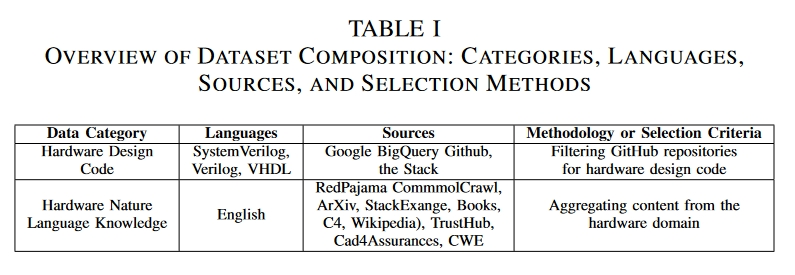
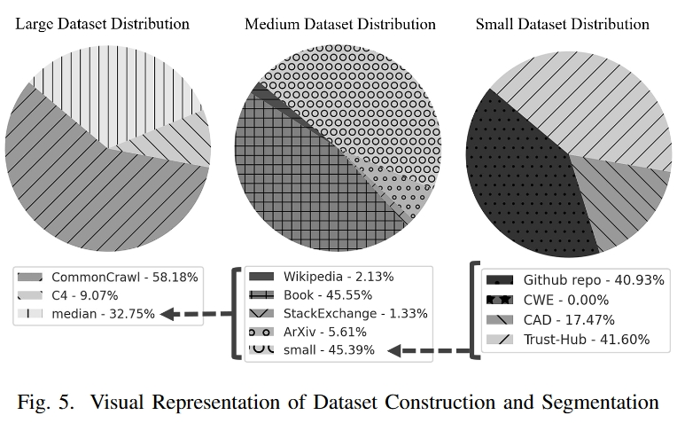

# 创新点

1. 基于Phi-1.5B模型结构进行了预训练，使其更符合硬件领域的需求，提高了模型在硬件设计和验证任务中的性能和稳定性。据我们所知，这是第一个预训练的硬件领域特定LLM。
2. 创建了三个不同大小的数据集，并对其进行了严格筛选和优化，以保证内容的相关性和质量，从而为模型训练奠定坚实的基础。
3. 预训练模型向社区公开提供，从而为学术和工业领域的持续研究、开发和创新提供支持。

# 方法

## 数据集介绍

代码数据主要来自两个地方：

1.  Google BigQuery GitHub 公共数据集 ：选择了三种重要的硬件编程语言上：SystemVerilog、Verilog 和 VHDL。
2. 整合了来自知名硬件安全资源的代码和自然语言内容，包括 TrustHub、CAD for Assurance of Electronic Systems和 Common Weakness Enumeration (CWE)。

自然语言数据主要来自Redpajama。

## 模型

Phi1.5[原文](https://arxiv.org/pdf/2309.05463)。结构与[Phi1](https://arxiv.org/pdf/2306.11644)相同。其结构为经典的transformer架构，24层，32个头，每个头64维，上下文长度2048。

> Phi-1模型是微软研究院推出的一个专注于代码生成的大型语言模型，它在规模上显著小于竞争对手，但性能上却展现出了令人瞩目的成果。Phi-1是一个基于Transformer架构的模型，拥有13亿参数，经过4天的训练，使用了6亿个标记的“教科书质量”数据和1亿个标记的GPT-3.5生成的教科书和练习题。尽管模型规模较小，但Phi-1在HumanEval基准测试中达到了50.6%的准确率，在MBPP基准测试中达到了55.5%的准确率。

 # 实验

设备：双卡NVIDIA A100 80 GB

没有做具体的实验对比。

 # 总结

Phi本来就是为了代码生成的大模型，其特点是认为高质量数据对于模型性能的提升有更重要的作用。因此Phi模型本身训练数据就比较高质量，本文则通过收集对应的硬件数据来对模型进行了微调。可惜的是没有进行对比，但是作者开源了[数据集](https://huggingface.co/datasets/KSU-HW-SEC/hardware_code_and_sec_large)。

