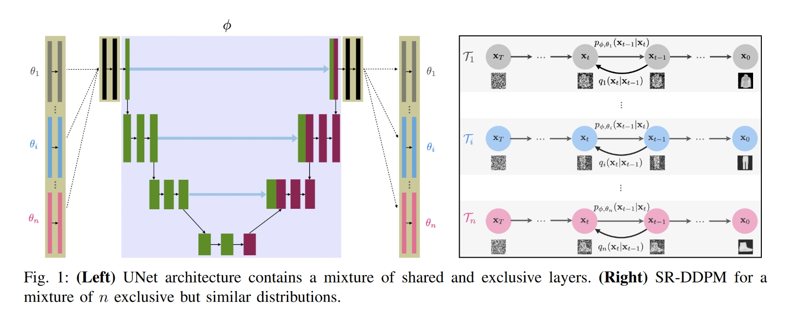

# 创新点

主要目的是有条件的生成图像。设计了一个新的UNet结构，其中包含类间共享结构和私有结构，此时只需要训练一个Unet就可以实现有条件采样。

类间共享结构可以捕捉不同类的相似结构，私有结构可以捕捉单独每个类的特点。因此可以不用训练多个网络。

# 方法

# 实验

# 总结

也是一种直观的想法，不需要单独训练分类器。与classifier-free相比，这个是改进UNet网络结构。
