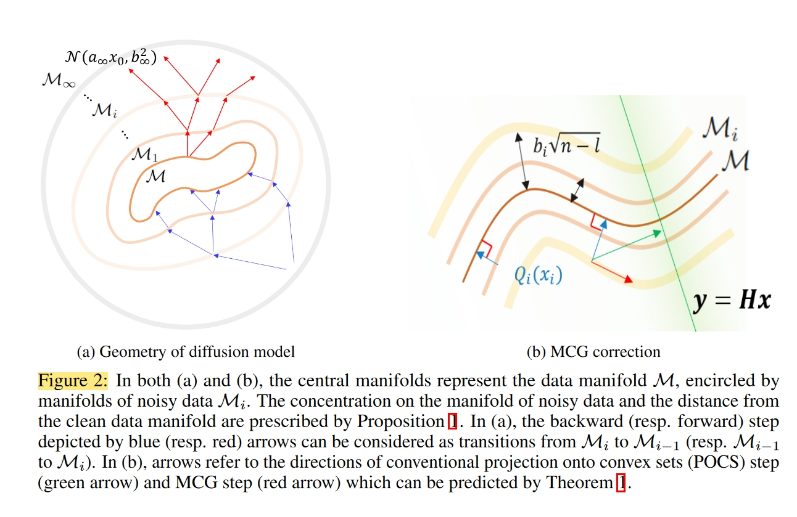
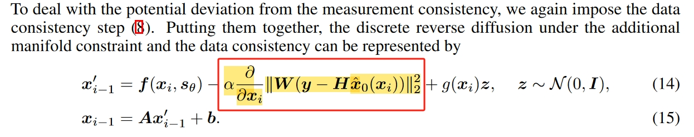
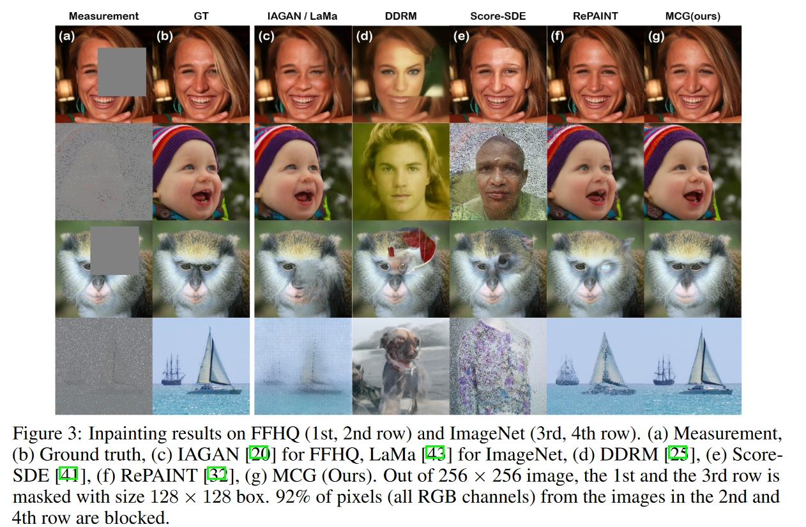
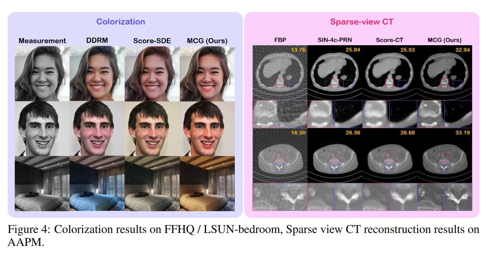
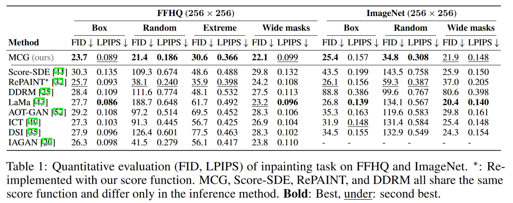
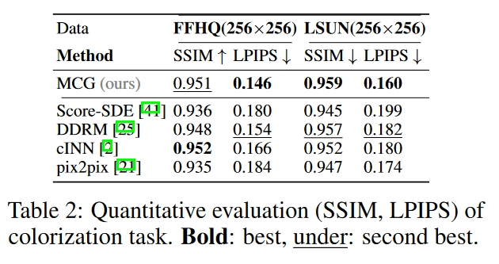

# 创新点

最近，通过对采样过程进行适当修改，扩散模型已被用于以无监督方式解决各种逆问题**。然而，目前的求解器在递归应用反向扩散步骤后，再应用基于投影的测量一致性步骤，往往会产生次优结果。通过研究生成采样路径，我们在此表明，当前的求解器会使采样路径偏离数据流形，从而导致误差累积。为了解决这个问题，我们从流形约束中得到启发，提出了一个额外的修正项，它可以与之前的求解器协同使用，使迭代接近流形。提出的流形约束只需几行代码就能直接实现，但却能以惊人的幅度提高性能。**通过大量实验，我们证明了我们的方法在理论和经验上都优于之前的方法，在图像着色、着色和稀疏视图计算机断层扫描等许多应用中都取得了可喜的成果。代码在此提供

# 方法

# 实验

# 总结
