# Mamba: Linear-Time Sequence Modeling with Selective State Spaces

## Abstract

基础模型目前为深度学习领域大多数令人兴奋的应用提供了动力，这些模型几乎都基于 Transformer 架构及其核心注意力模块。为了解决 Transformer 在长序列上的计算效率低下问题，人们开发了许多亚二次时间架构，如线性注意力、门控卷积和递归模型以及**结构化状态空间模型（SSM）**，但它们在语言等重要模态上的表现不如注意力。我们发现，此类模型的一个关键弱点是无法进行基于内容的推理，因此做出了几项改进。首先，只需让 SSM 参数成为输入的函数，就能解决它们在离散模态方面的弱点，使模型能够根据当前标记，有选择地沿序列长度维度传播或遗忘信息。其次，尽管这种变化阻碍了高效卷积的使用，我们还是设计了一种硬件感知的并行递归模式算法。我们将这些选择性 SSM 集成到一个简化的端到端神经网络架构中，该架构没有注意力，甚至没有 MLP 块（Mamba）。Mamba 具有快速推理（吞吐量比 Transformers 高 5 倍）和序列长度线性伸缩的特点，其性能在实际数据中可提高到百万长度序列。作为通用序列模型的骨干，Mamba 在语言、音频和基因组学等多种模式中都达到了最先进的性能。在语言建模方面，无论是预训练还是下游评估，我们的 Mamba-3B 模型都优于同等规模的 Transformers，并能与两倍于其规模的 Transformers 相媲美。

## 结构

# U-shaped Vision Mamba for Single Image Dehazing

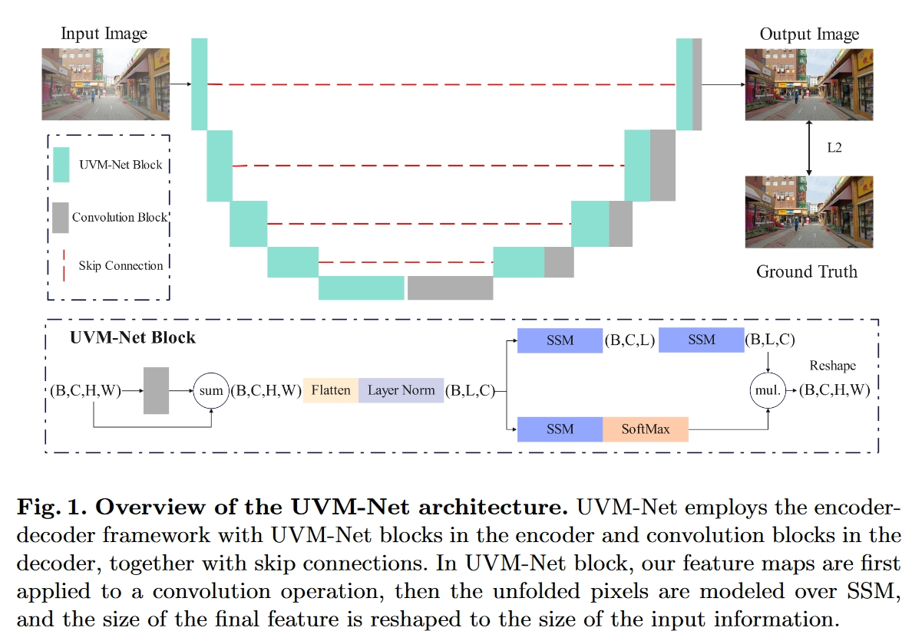

# VMamba: Visual State Space Model

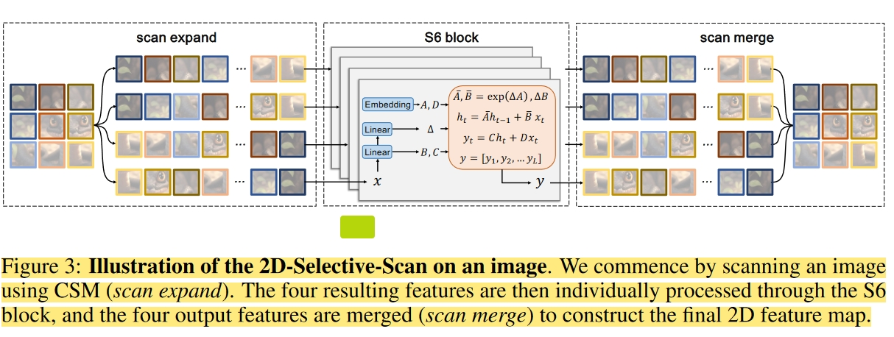

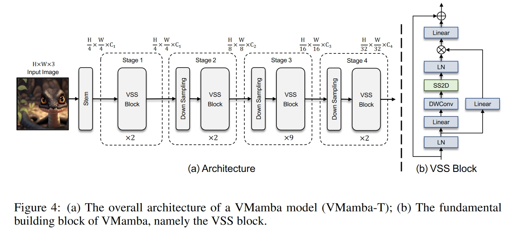

# U-Mamba: Enhancing Long-range Dependency for Biomedical Image Segmentation

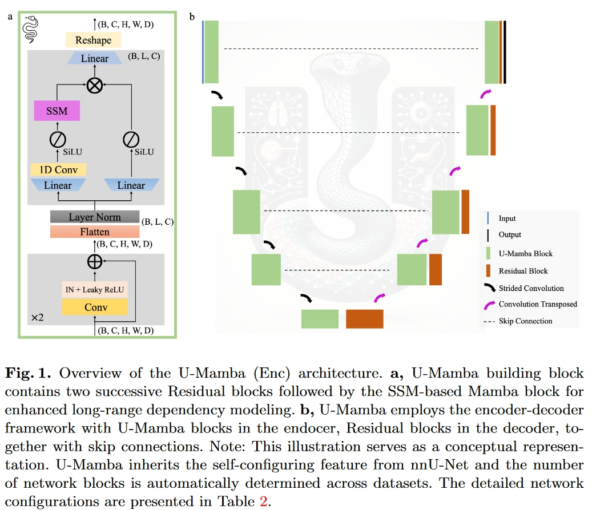

# Swin-UMamba: Mamba-based UNet with ImageNet-based pretraining

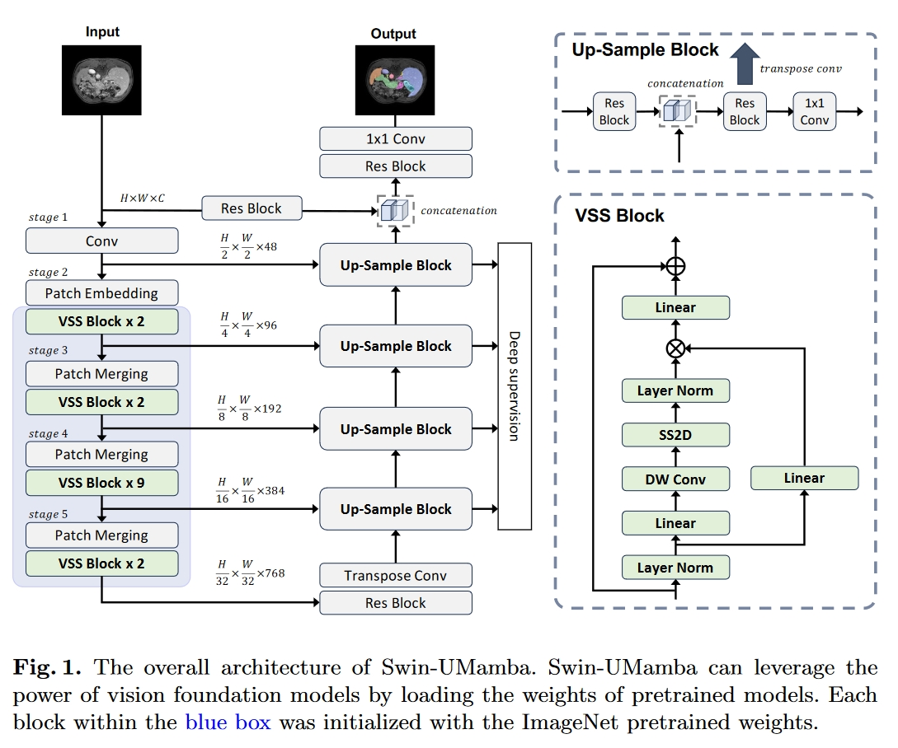

# Semi-Mamba-UNet: Pixel-Level Contrastive Cross-Supervised Visual Mamba-based UNet for Semi-Supervised Medical Image Segmentation

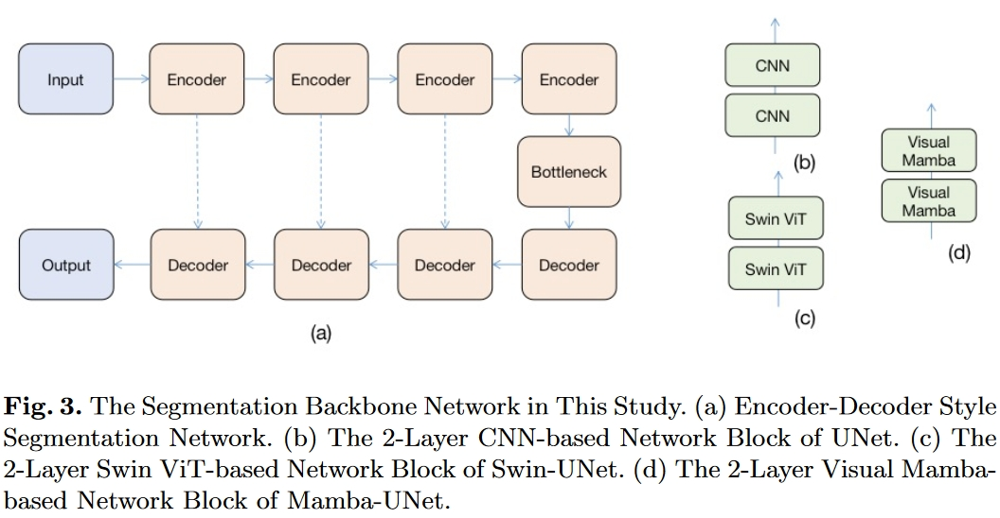

# SegMamba: Long-range Sequential Modeling Mamba For 3D Medical Image Segmentation

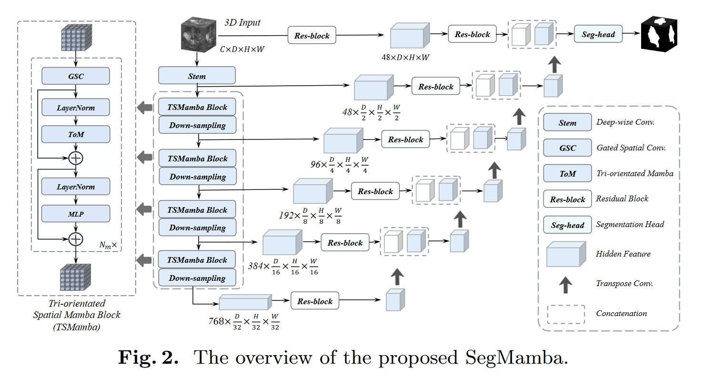

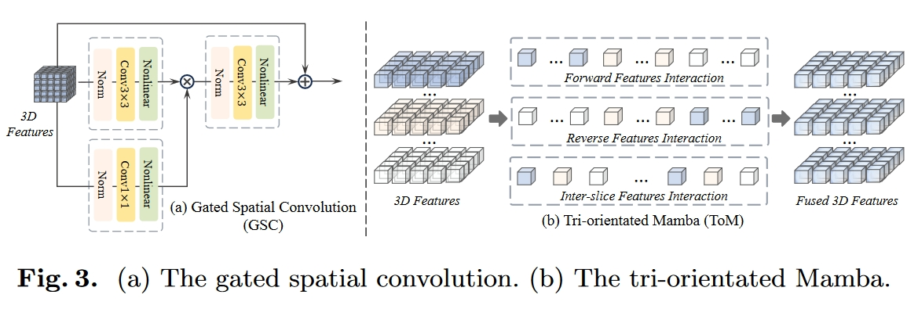

# nnMamba: 3D Biomedical Image Segmentation, Classification and Landmark Detection with State Space Model

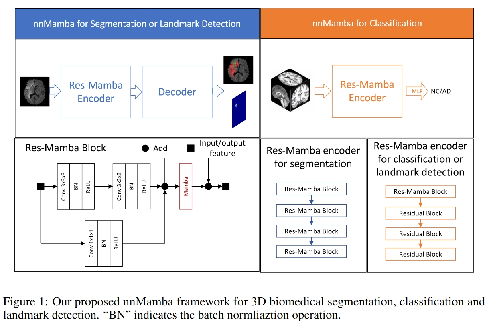

# Mamba-UNet: UNet-Like Pure Visual Mamba for Medical Image Segmentation

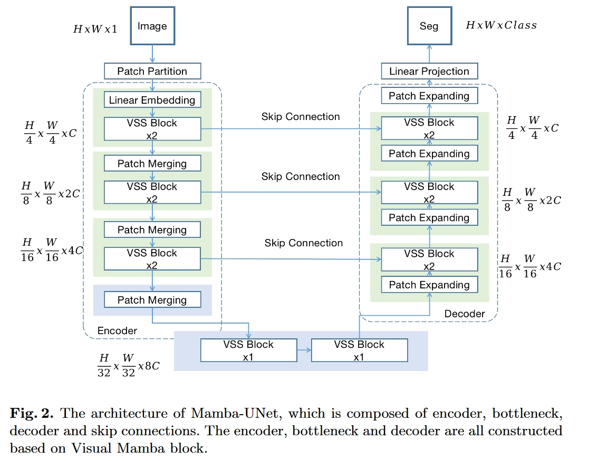

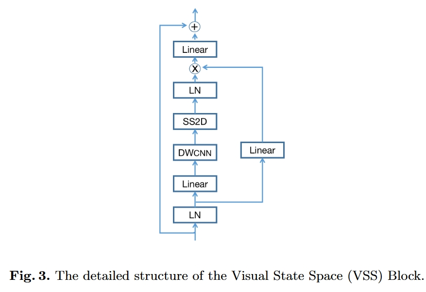

# Weak-Mamba-UNet: Visual Mamba Makes CNN and ViT Work Better for Scribble-based Medical Image Segmentation

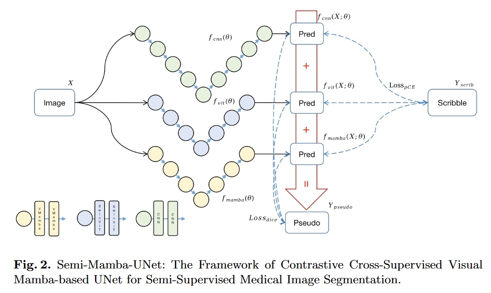

# VM-UNet: Vision Mamba UNet for Medical Image Segmentation

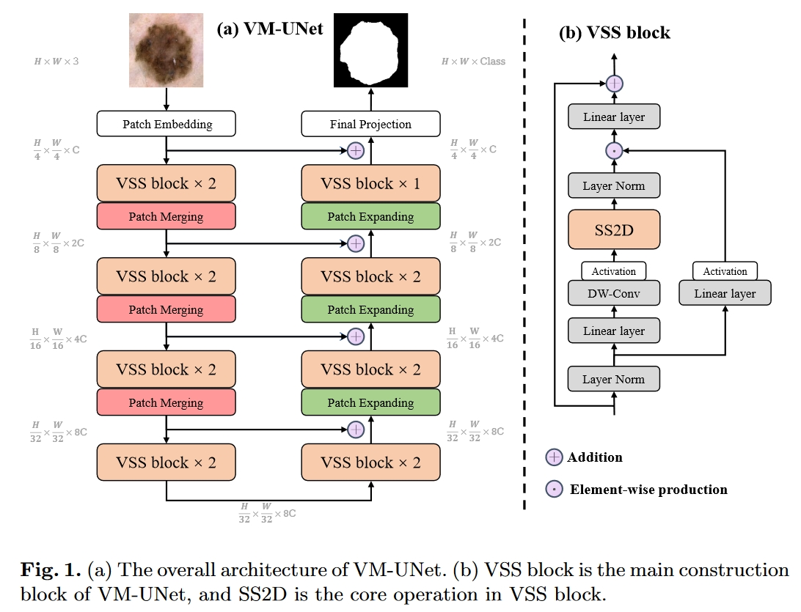

