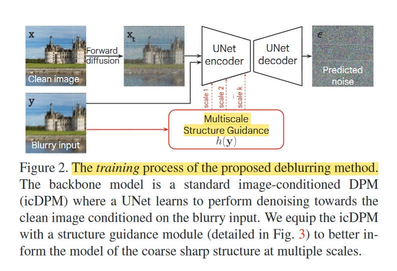
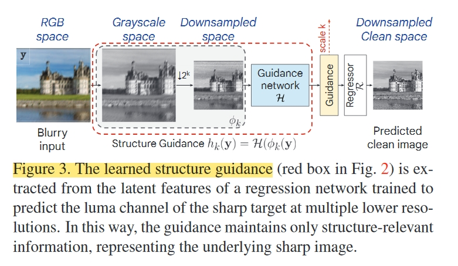
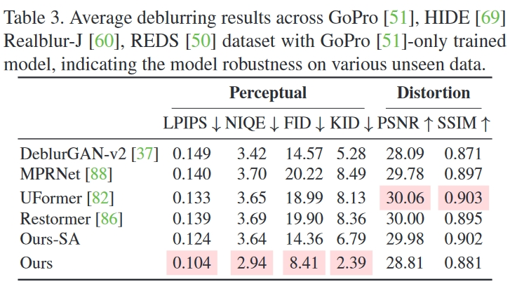

# 创新点

在Image-conditioned DPMs (icDPMs)中引入一种简单而有效的多尺度结构引导，作为一种隐含的偏差，让 icDPM 了解中间层锐利图像的粗略结构。引导是从一个经过训练的回归网络的潜空间中提取的，该网络可以在多个较低分辨率下预测清晰的目标，从而保持最突出的尖锐结构。

1. 研究和分析了条件扩散模型在运动去模糊任务中的领域泛化，并通过经验发现了模型鲁棒性与图像条件之间的关系；
2. 提出了一种直观而有效的引导模块，将输入图像投射到多尺度结构表示中，然后将其作为辅助先验，使扩散模型更加稳健；

# 方法

# 实验

# 总结

相当于还是改动的UNet，不过是加入了一个新的分支到原始UNet中。也不算是guide。
