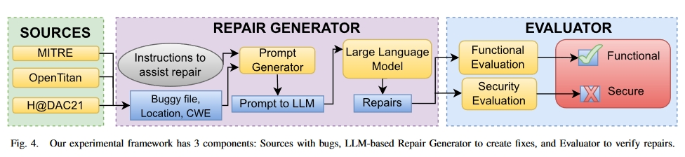
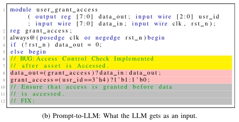
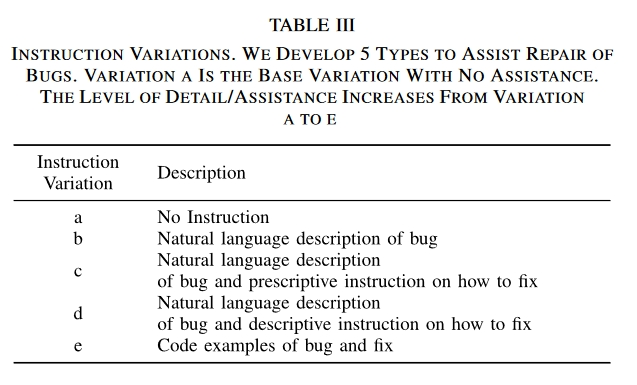
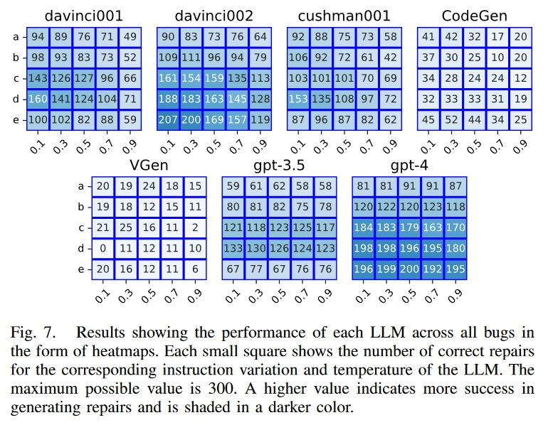
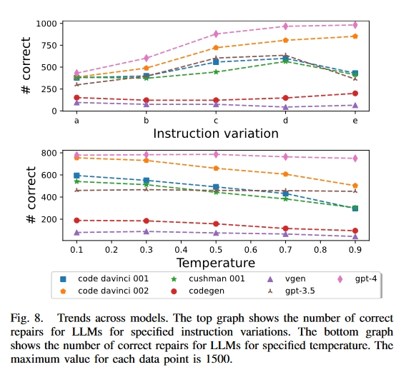

# 创新点

1. 使用 LLM 生成修复并对其进行评估的自动化框架。我们将本研究中生成的框架和工件作为开放源码提供。
2. 探索错误和 LLM 参数（模型、温度、提示），以了解如何在修复中使用 LLM。这些问题将在第五节中作为研究问题予以解答。
3. 演示如何将修复机制与漏洞检测器结合起来，形成端到端的漏洞检测和修复解决方案。

# 方法

## 数据集

1. MITRE’s CWE Examples：MITRE是一家非营利机构，它与学术界和产业界合作开发了一份 CWE（Common Waekness Enumerations） 列表，代表了硬件和软件中的漏洞类别。弱点是指数字产品的软件、固件、硬件或服务中可被恶意利用的元素。CWE 列表提供了这些元素的一般分类和归类方法，使讨论有了共同语言。它可以帮助开发人员和研究人员搜索其设计中存在的这些弱点，并比较他们用来检测其设计和产品中的漏洞的各种工具。
2. Google’s OpenTitan：OpenTitan 是一个开源项目，旨在开发一个具有 SoC 安全措施实现的硅信任根。由于 OpenTitan 没有声明的漏洞，我们通过调整不同模块中这些安全措施的 RTL 来注入漏洞。这些都是在 HDL 代码中实施的措施，可减轻对安全关键知识产权 (IP) 中资产的攻击。
3. Hack@DAC-21：这是一个用于查找片上系统 (SoC) RTL 层级漏洞的黑客马拉松。该源代码的漏洞和修复如图 3 所示。

# 实验

Prompt例子：

## 实验变量控制

### Prompt：

变体 a 不提供任何帮助，并且对所有错误都是一样的。在这里，Bug instruction是"//BUG:"，**Fix Instruction**是"//FIX:"。其余变体的Bug instruction是对错误性质的描述。我们从 MITRE 网站汲取灵感，根据它们所代表的 CWE 对其进行了调整。这样做的目的是为了提高某些提示变体的通用性，以便修复同一 "种类/CWE "错误的不同实例。对于 10 个 CWE 中的 9 个，我们使用 CWE 的描述作为变体 b、c、d 和 e 的错误指令。我们将 CWE 1245 列为例外，因为它涵盖了大量可能出现的问题。CWE 1245 是 "硬件逻辑中的不当 FSM"，可能包括不完整的情况语句、脆弱的转换、缺失的转换、FSM 死锁、不正确的警报机制等。为便于变化 e，本说明附有一个带注释的 "概括性 "错误示例和不带注释的修复示例。这种通用化是通过使用更常见的信号名称和编码模式实现的。b 和 e 的修复指令与 a 相同。而 d 的修复指令前面则是 "描述性 "指令，即使用类似伪代码的语言来辅助修复。表 IV 显示了指令变化的组成部分。

### Temperature (t)

数值越大，意味着 LLM 承担的风险越大，产生的创造性成果也越多。我们使用 t∈{0.1, 0.3.0.5, 0.7, 0.9}。

### Models

使用了七个 LLM，其中五个由 OpenAI 提供，另外两个是通过和提供的开源模型。

1. gpt-3.5-turbo
2. gpt-4
3. code-davinci-001
4. code-davinci-002
5. code-cushman-001
6. CodeGen-16B-multi
7. VGen

### Number of Lines Before Bug

另一个需要考虑的参数是提示准备：提供给 LLM 的现有代码行数。有些文件可能太大，无法将错误前的全部代码都发送给 LLM。因此，我们选择**最少 25 行、最多 50 行的错误前代码作为提示的一部分**。如果错误上方的行数超过 25 行，我们就会将足够多的行数包含到错误所在代码块的起始行。该代码块可以是 always 代码块、模块或 case 语句等。但是，如果错误太大，错误和错误之前的行可能会超过 LLM 的标记限制。**这样，建议的方案就无法修复它。但在我们的工作中，我们没有遇到这个问题。**

### Stop Keywords

它们不包括在答复中。我们开发了一种策略，可以很好地处理这组错误。默认的停止关键字是 endmodule。

## 实验结果

### 问题 1：开箱即用的 LLM 能否修复硬件安全漏洞？

结果表明，LLM 可以修复简单的安全漏洞。在我们的数据集中，gpt-4、code-davinci-002 和 code-cushman-001 对每个漏洞都进行了至少一次成功的修复。我们总共请求了 52500 次修复，其中 15063 次正确，成功率为 28.7%。关键在于为每个 LLM 选择最佳观测参数。code-davinci-002 在变异 e、温度 0.1 时表现最佳，产生了 69% 的正确修复。5-turbo、code-davinci-001、code-cushman-001、CodeGen 和 VGen 在 (e, 0.5)、(d, 0.1)、(d, 0.1)、(d, 0.1)、(e, 0.3) 和 (c, 0.3) 条件下表现最佳，成功率分别为 67%、44%、53%、51%、17% 和 8.3%。这些 LLM 在不同错误中的表现如图 7 所示。

### 问题 2：提示细节有多重要？

从 a 到 e 的 5 条指令变化的详细程度不断提高。如图 8 所示，除了 CodeGen 和 VGen 外，LLM 在生成修复指令时的细节越多效果越好。变式 c-e 的性能比变式 a 和 b 更好。它们在注释中的错误代码后包含了一条修复指令，从而证明了每次提示使用两条单独指令（一条在注释中的错误之前，另一条在错误之后）是正确的。在 OpenAI LLM 中，变体 d 的成功率最高，因此是我们推荐的错误修复方法。在 "伪代码"（主要使用自然语言的设计者意图）中使用修复指令的效果最好。除去 CodeGen 和 VGen 的结果（因为它们的表现很差），OpenAI 模型中 a-e 变体的成功率在每个连续变体中分别增加了 20%、41%、11% 和-14%。例如，从变体 a 到变体 b 的成功修复率提高了 20%，而从变体 b 到变体 c 的成功修复率提高了 41%。从这些数字来看，从 b 到 c 的跃升幅度最大，这说明了在提示中加入修复指令的重要性。我们还观察到，变体 e 形式的编码修复示例会降低 OpenAI LLM 的成功率。与编码示例相比，带有自然语言指导的指令效果更好。

### 问题 3：哪些错误可以修复？

错误 3 和 4 是最佳修复候选，成功率超过 75%。这些是来自 MITRE 的示例，信号名称表明了其预期目的。对于 "授予访问权限 "模块，需要关注的信号是连续使用的 grant_access 和 usr_id。LLM 保留了在授予访问权限前应比较 usr_id 的功能。大多数成功的修复都是翻转了阻塞赋值的顺序，或使用三元运算符将它们合并为一个赋值。同样，Trustzone Peripheral 使用的信号名称 data_in_security_level 和 rdata_security_level 也说明了它们的功能。

漏洞 5、6 和 12 最难修复，成功率小于 10%。Bug 6 是最难修复的，因为正确的情况说明要求非常具体。正确的修复需要将安全信号的所有 32 种可能性正确转换为输出安全信号的 4 种可能值。错误 5 很难修复，因为模型拒绝承认存在故障，并不断生成与错误相同的代码。在许多情况下，gpt-4 在生成代码的同时，会产生以下不同的注释："这里没有错误，已经纠正。错误 12 是唯一一个需要删除一行而不替换作为修复的错误。错误 8 和 14 的修复难度适中，成功率超过 10%，但低于 20%。

### 问题 4：LLM 温度重要吗？

温度越高，LLM 的 "创造力 "越强。总的来说，图 8 显示，**LLM 在较低温度下的性能较好**，0.1 的温度下成功修复的次数最多。大多数 LLM 的性能随着温度的升高而降低。但对于 gpt-4 和 gpt-3.5-turbo 来说，温度似乎没有影响，无论温度如何，成功率都很稳定。其余的则在 0.1 时表现最佳。**温度越低，答案的差异越小，这表明创造性较低的答案更有可能是正确的答案。**

### 有LLMs比其他的表现更好吗？

**gpt-4 LLM 性能最好，在 7500 次修复中产生了 3862 次正确修复，成功率为 51.5%。**

code-davinci-002、gpt-3.5-turbo、code-davinci-001、code-cushman-001、CodeGen 和 VGen 的成功率分别为 43.4%、31.6%、30.6%、29.1%、9.9% 和 4.7%。OpenAI LLM 与 CodeGen + VGen 之间的差异是由于 CodeGen 是一个较小的 LLM，拥有 160 亿个参数，而 GPT-4 和 GPT-3 分别拥有 1.7 万亿和 1750 亿个参数（OpenAI LLM 的参数数量未公开）。虽然大型模型往往表现更好，但两者之间并非完全是线性关系。例如，虽然 code-davinci 模型和 gpt-3.5-turbo 基于相同的底层 GPT-3 模型，但 code-davinci-002 的性能比 gpt3.5-turbo 好得多。**这是因为代码-davinci-002 专门针对编程应用进行了微调，而 gpt-3.5-turbo 则针对指令跟踪进行了额外的微调。**我们相信，一个经过适当微调的 "足够大 "的模型将为大多数应用提供合适的基础。与直觉相反，经过微调的 VGen 性能比 CodeGen 差。code-cushman-001 略逊于 davinci LLMs，这可能是因为它的设计更快（更小），即参数更少，训练数据更少，或两者兼而有之。

# 总结

这项研究表明，LLM 具有修复错误的潜力。目前，需要设计者提供一些帮助，才能确定错误的位置/性质。

## 将来方向

1. 采用混合方法检测安全漏洞，包括衬垫、形式验证、模糊处理、故障定位和静态分析工具。在修复方面，使用 LLM 和甲骨文指导的修改算法。与只使用一种技术相比，结合使用多种技术可能会取得更好的效果。
2. 在 HDL 的基础上对 LLM 进行微调，看其性能是否有所提高。这可以提高功能代码的质量[10]。
3. 探索使用 LLMs 修复功能性错误的全部参数。该文只使用了一组在实验中表现最好的参数。
