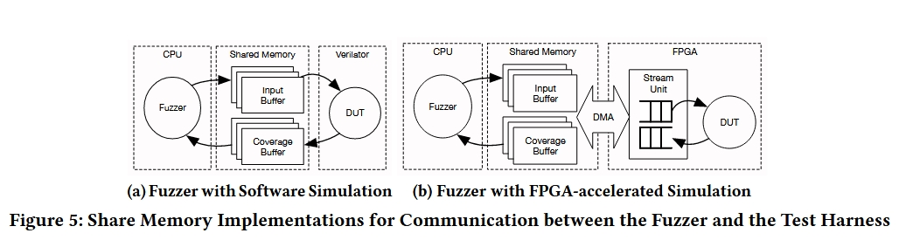
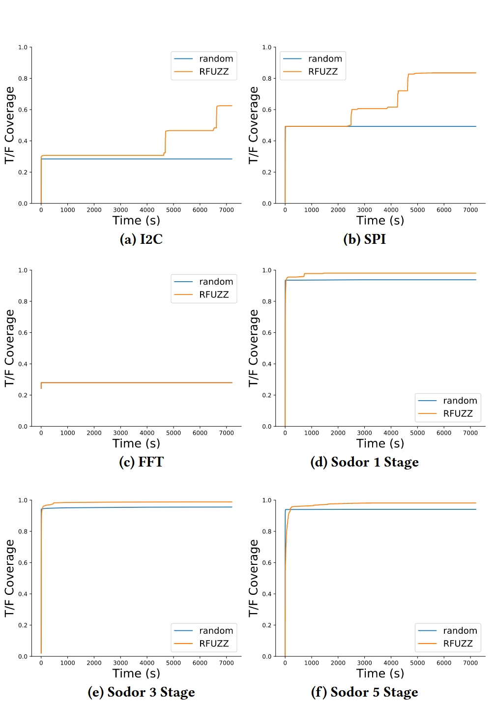

# 创新点

基于软件测试界围绕**覆盖引导突变模糊测试（Coverage guided mutation fuzz testing）**的新思路，提出了一种解决覆盖引导测试生成（Coverage directed generation, CDG）问题的新方法，该方法只需最少的设置，并利用 FPGA 加速仿真实现快速测试。

即将覆盖引导突变模糊测试应用到了覆盖引导测试生成中，提出了一种新的测试生成方法，并将其应用到了硬件领域中。

# 方法

普通的突变模糊测试很难直接运用到硬件电路中（**主要是因为模糊测试需要输出仅仅依赖于输入，因此程序的初始状态必须一致，而硬件中的各种寄存器和内存并不能做到每次都是一致的，因此本文的两种适应性改进主要是针对初始化这一块做了适应性改进**），本文采用了两种策略来进行适应性改进。

## 确定性测试执行

为了使测试具有确定性和可重复性，**模糊测试要求被测程序或设备从已知状态启动**。这样可以确保只有测试输入才会影响模糊引擎观察到的行为，因此只要输入是已知的，测试就能完全重现。**将程序重置到已知状态需要花费大量时间。最简单的方法是在每次测试调用时重启被测程序，但这包括将程序载入内存和创建进程的成本，从而限制了每秒的测试执行次数。**流行的模糊器 AFL 利用 fork 系统调用和操作系统的写时复制优化来减少开销。

快速重置映射到 FPGA 上的 RTL 电路会带来一系列挑战，要将模糊测试应用到这一领域，就必须解决这些挑战。在下面的章节中，我们将讨论两个主要问题以及如何解决这些问题：

1. 出于效率原因，许多寄存器在器件复位时不会被重新初始化；
2. 存储器没有复位电路，每次只能初始化一个字。

## 寄存器元重置

寄存器的复位电路会占用晶圆空间，因此在设计中尽可能省略。因此，当 DUT 复位时，这些寄存器的初始值是未定义的。传统的电路模拟器通过引入一个 X 值或随机化寄存器的初始值（在 2 态模拟中）来处理这一事实。**由于这项工作的目标是 FPGA 加速仿真，我们希望采用 2 态解决方案。**然而，在 FPGA 上随机化寄存器的值也不是一件容易的事，可能会导致零星的测试。取而代之的是两种可行的解决方案：

1. 可以将初始寄存器状态作为输入的一部分，在每次测试前通过扫描链加载寄存器值；
2. 可以在每次测试前将所有寄存器重置为预定义值。

在这项工作中，我们通过对电路的中间表示（IR）进行转换来实现**解决方案 2**，并添加了一条 **MetaReset 线**，**将电路中的所有寄存器重置为零**。图 4 举例说明了在 Verilog 的寄存器描述中添加 MetaReset 的过程。因此，我们的测试线束在每次测试前都会应用以下序列：

1. 元复位被激活一个周期，以便将每个寄存器初始化为零。
2. 释放元复位，断言 DUT 的实际复位，以便让设备通过设计者设想的复位过程。在这一阶段，必须为 DUT 提供确定性输入，因为寄存器可能会直接硬连接到原始设计中的顶层输入。
3. 我们再次选择全零作为确定性输入。

这种方法是合理的，因为 RTL 允许在所有寄存器都设置为零的情况下开始设计（X 可以是任何值），但并不完整，因为没有探索其他可能的值。

## 稀疏内存

存储器很少会在电路开启时被复位。内存的状态一致相对来说要简单一些。其核心思想在于，内存在测试期间能够读写的次数是有限的。因此可以追踪其操作步骤（地址和操作数），然后依次进行逆向操作，则可以保证在每次测试时，内存的值都是一致的。

但是观察到每次测试过程中，内存的改变都很有限（稀疏），因此这里可以采用下面的策略：**由于写入次数很少，大多数内存位置将包含重置值，我们将其定义为零，就像寄存器一样。这种稀疏存储器的读取端口需要按以下方式工作：如果请求的地址已被写入，则返回最后写入的值。如果请求读取的地址从未被写入，则该地址未被初始化，因此我们需要返回 0。**

我们可以使用内容可寻址内存（CAM）来跟踪已被写入的地址。CAM 还可用于将请求的地址映射到一个小得多的内存中，该内存只需能够容纳在最大长度测试期间可能写入的尽可能多的值。因此，这种稀疏存储器所需的 SRAM 往往比原始版本要少得多。通过将每个条目的有效位连接到 DUT 的复位信号，CAM 可以在一个周期内轻松复位。通过在 DUT 的 RTL 上实施自定义转换，我们可以自动将存储器替换为足够大的稀疏存储器。

### 覆盖率定义

相较于原始软件测试中的语句覆盖，这里需要定义一种新的精确的覆盖率指标。

大多数自动覆盖定义侧重于用 Verilog 或 VHDL 等通用 HDL 表达的电路描述。然而，我们的系统适用于任何 RTL 电路，无论其采用何种硬件描述或生成语言编写。**因此，我们根据用与 HDL 无关的 IR 表示的电路可综合结构来定义覆盖率指标。**这也确保了我们可以在 FPGA 加速仿真过程中进行综合，从而收集覆盖率信息。

> 对于多路复用器控制覆盖范围，它将每个 2:1 多路复用器选择信号视为一个独立的覆盖点。**具有两个以上输入的多路复用器可以简单地转换成一系列 2:1 多路复用器。**我们之所以选择这一指标，是因为只要对多路复用器进行明确建模，它就能自动应用于任何 RTL 电路。它也非常适合 FPGA 加速仿真，因为我们不需要任何额外的电路来评估覆盖点。
>
> 
>
> **为了全面覆盖多路复用器控制条件，我们要求在单次测试中，该条件既能评估为 "真"，也能评估为 "假"。在 FPGA 上，这只需要极少的额外硬件（两个 1 位寄存器和两个 1 位多路复用器）来记忆观察到的值。我们通过计算多路复用器控制条件的覆盖范围来综合多个测试中观察到的覆盖范围。需要注意的是，根据这一定义，一个条件在一个测试中总是为真，而在另一个测试中总是为假，并不能算作覆盖。相反，需要在一次测试中观察到这两个值。**

**也就是说，将普通电路全部都转化为2:1的多路复用电路，然后将每个 2:1 多路复用器选择信号视为一个独立的覆盖点。**

## 变异算法

输入定义允许我们直接实施第 2.2 节中介绍的成功 AFL 模糊测试工具中的突变启发式。与 AFL 类似，我们测试集中的每个新条目都会首先使用图 1 中列出的确定性突变技术进行突变。一旦确定性突变用完，就切换到 AFL havoc 阶段的实现，利用图 3 所示的突变。对于任何改变输入数组大小的突变，我们都会在必要时填充零，以保持输入大小是单周期所需字节数的倍数。

## 受限接口

在软件和硬件中，所有的接口应该都是有一定范围的（比如手机号码只能是数字）。因此在模糊测试中，也需要一个机制来保证输入数据的合法。

模糊处理方法的反馈导向方式可以提供更方便的解决方案：我们注意到，现代 HDL 允许设计人员通过 DUT 源代码中的假设语句来指定接口约束。在我们广泛使用 TileLink 总线的基准测试中，这种机制被用来实现可综合总线监控器，以检测无效事务。**将监控器中的所有假设与测试中的所有周期结合起来，我们就可以得出一个二进制信号，它表明给定的测试输入是否以有效的方式执行了 DUT。**FPGA 上的测试线束会将此有效信号与常规复用条件覆盖范围结合起来，作为对模糊引擎的反馈。**使用该信号的最简单方法是在更新覆盖图之前剔除所有无效输入。这相当于随机定向测试中的剔除采样。**

# 实现

我们在 RFUZZ2 的开源工具中应用了提出的测试方法。我们工具的第一部分是仪器和线束生成组件，可用于 FIRRTL IR中描述的任意 RTL 电路。它能自动生成用于软件或 FPGA 加速仿真的测试线束。我们工具的第二部分是实际输入生成器，它连接到在软件或 FPGA 上运行的测试线束，以提供 DUT 输入并分析由此产生的覆盖率。

该工具与语言无关，因为它可以处理以 FIRRTL IR表达的任意 RTL 设计。一旦目标设计从其源 HDL 转化为 FIRRTL IR，无论其源 HDL 如何，我们都可以对目标 RTL 应用编译器传递。RFUZZ 也是完全自动化的，因为目标 RTL 是通过编译器传递进行检测的，而模糊器则使用编译器生成的目标信息。用户只需指定模糊器的一些参数，如突变技术和使用的种子输入。

## 测试线束生成

测试线束生成器通过使用目标设计信息（包括仪器通道生成的输入和覆盖引脚），自动为任何 RTL 设计生成封装。

它将仪器 DUT 实例化，并将仪器插入的覆盖范围引脚连接到切换检测电路。它还会根据所需的输入和覆盖范围大小自动生成缓冲器格式定义，**并为软件和 FPGA 加速仿真环境生成 Verilog 和 C++ 代码**，以便与缓冲器连接。

FIRRTL 编译器会进一步自动转换测试线束，以便在 FPGA 上进行高效的基于令牌的仿真[8]，从而大大减少了 FPGA 加速仿真的人工工作量。我们的工具还能自动生成 FPGA 上映射的缓冲流单元，并将其与测试线束集成，以便与模糊器通信。

最后，测试线束生成器会发出有关覆盖范围计数器、顶层输入和缓冲区格式的特定目标信息，**模糊器利用这些信息来测试特定的电路设计**。

# 实验

## 数据集

1. TileLink Peripheral IP:它们由 SPI 和 I2C 外设 IP 组成，用于商用 SiFive Freedom SoC 平台 3。它们通过 TileLink 端口与模糊器连接，TileLink 端口包括一个可合成的总线监控器。监视器的反馈用于确保报告的覆盖范围只包括有效输入。
2. FFT: 作为 DSP 块的一个示例，我们使用由开源 FFT 生成器 4 生成的 FFT 实现。
3. RISC-V Sodor Cores: 我们选择了 LibreCores 项目维护的三个不同的 RISC-V 教育内核 5。为了直接影响已执行的指令，我们创建了一个特殊的模糊测试顶层模块，它不是实例化一个刮板存储器，而是直接将指令存储器接口连接到顶层输入。这样，我们的测试工具就能充当指令存储器，直接向内核提供要执行的指令。
4. RISC-V Rocket Core: 为了测试我们方法的可扩展性，我们使用 RISC-V Rocket Chip [1] 作为最终基准。这种 64 位有序内核得到了业界的支持，能够启动 Linux 操作系统。它的大小会影响软件仿真的执行速度，因此这样，我们就能评估采用 FPGA 加速仿真方法来解决 CDG 问题的优势。

## 结果

# 总结

在本文中:

1. 展示了如何利用覆盖定向突变模糊测试在 FPGA 上自动测试任意 RTL 电路。
2. 提供了这一技术的高性能实现。
3. 评估结果表明，与随机测试相比，尤其是对提供测试输入有效性反馈的电路进行测试时，测试结果有了持续改善。

总的来说就是：覆盖引导突变模糊测试->覆盖引导测试生成->通用硬件领域。
