# SDP(symmetrized dot pattern)表示

对称点图（SDP）可以描述时间序列信号的振幅和频率变化，可用于语音信号的可视化[39,40]。SDP 方法可以直接将非光滑和非高斯的原始振动信号转换为由极坐标镜像对称点组成的 SDP 图像，而无需进行时频变换。这提供了简单、方便和快速的计算方法。


振动信号是一维时间序列信号。当使用 SDP 方法将振动信号转换为图像时，其振幅和频率变化可以通过 SDP 图像的形状特征、几何中心、曲率、点的集中区域等要素反映出来，从而更好地描述振动信号的变化特征。如图 2 所示，对于时间序列 X = {x1, x2, ., xi, ., xn}，X 中的任意点 i 都可以转换成极坐标空间 P(r(i)，φ(i)，φ(i)) 中的一个点。

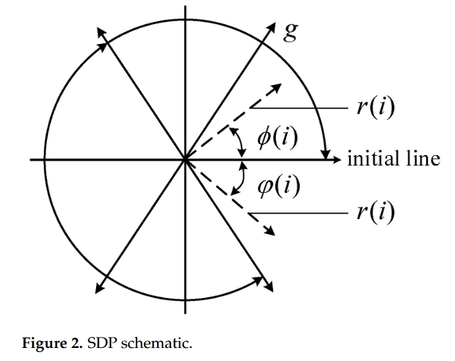

在图 2 中，r(i) 表示极坐标半径，φ(i) 和 φ(i) 分别表示极坐标沿初始线逆时针和顺时针旋转的角度。一组信号（xi，x(i+L) ）可以通过改变初始线的旋转角度转换成极坐标中的镜像对称点图像，转换公式如下：

$r(i)=\frac{x_i-x_{\min}}{x_{\max}-x_{\min}}\\\\\phi(i)=\theta+\frac{x_{(i+L)}-x_{\min}}{x_{\max}-x_{\min}}g$

$\varphi(i)=\theta-\frac{x_{(i+L)}-x_{\min}}{x_{\max}-x_{\min}}g$

其中，xmax 和 xmin 分别描述采样数据的最大值和最小值；L 描述时间间隔（通常在 1 到 10 之间）；θ 描述初始线旋转角度（值为 360 m/n，m = 1，...，n，其中 n 是对称镜面的数量，通常为 6）；g 描述角度放大系数（通常值小于 θ）。

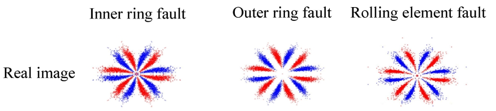

# PR(recurrence plot)变换

Recurrence Plots（RP）是一种用于可视化和分析时间序列或动态系统的方法。它将时间序列转化为图形化的表示形式，以便分析时间序列中的重复模式和结构。Recurrence Plots 是非常有用的，尤其是在时间序列数据中存在周期性、重复事件或关联结构时。

```python
 import numpy as np
 import matplotlib.pyplot as plt
 
 def recurrence_plot(data, threshold=0.1):
     """
     Generate a recurrence plot from a time series.
 
     :param data: Time series data
     :param threshold: Threshold to determine recurrence
     :return: Recurrence plot
     """
     # Calculate the distance matrix
     N = len(data)
     distance_matrix = np.zeros((N, N))
     for i in range(N):
         for j in range(N):
             distance_matrix[i, j] = np.abs(data[i] - data[j])
 
     # Create the recurrence plot
     recurrence_plot = np.where(distance_matrix <= threshold, 1, 0)
 
     return recurrence_plot
```

上面的代码创建了一个二进制距离矩阵，如果时间序列i和j的值相差在0.1以内（阈值），则它们的值为1，否则为0。得到的矩阵可以看作是一幅图像。

## example

### 白噪音

接下来我们将可视化白噪声。首先，我们需要创建一系列模拟的白噪声:

```python
 # Set a seed for reproducibility
 np.random.seed(0)
 
 # Generate 500 data points of white noise
 white_noise = np.random.normal(size=500)
 
 # Plot the white noise time series
 plt.figure(figsize=(10, 6))
 plt.plot(white_noise, label='White Noise')
 plt.title('White Noise Time Series')
 plt.xlabel('Time')
 plt.ylabel('Value')
 plt.legend()
 plt.grid(True)
 plt.show()
```

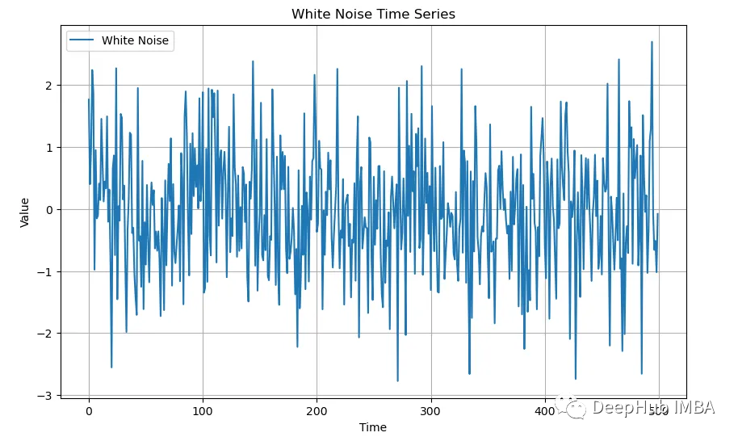

递归图为这种白噪声提供了有趣的可视化效果。对于任何一种白噪声，图看起来都是一样的:

```python
 # Generate and plot the recurrence plot
 recurrence = recurrence_plot(white_noise, threshold=0.1)
 
 plt.figure(figsize=(8, 8))
 plt.imshow(recurrence, cmap='binary', origin='lower')
 plt.title('Recurrence Plot')
 plt.xlabel('Time')
 plt.ylabel('Time')
 plt.colorbar(label='Recurrence')
 plt.show()
```

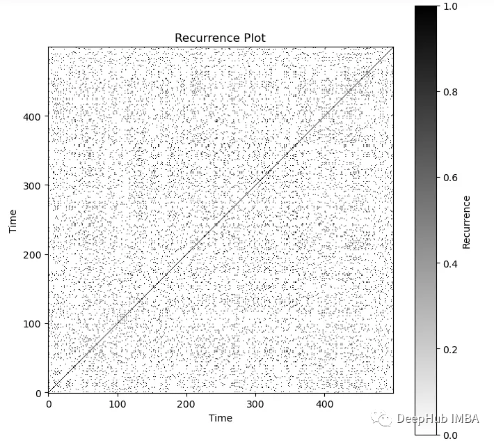

### 随机游走

接下来让我们看看随机游走（Random Walk）是什么样子的:

```python
 # Generate 500 data points of a random walk
 steps = np.random.choice([-1, 1], size=500) # Generate random steps: -1 or 1
 random_walk = np.cumsum(steps) # Cumulative sum to generate the random walk
 
 # Plot the random walk time series
 plt.figure(figsize=(10, 6))
 plt.plot(random_walk, label='Random Walk')
 plt.title('Random Walk Time Series')
 plt.xlabel('Time')
 plt.ylabel('Value')
 plt.legend()
 plt.grid(True)
 plt.show()
```

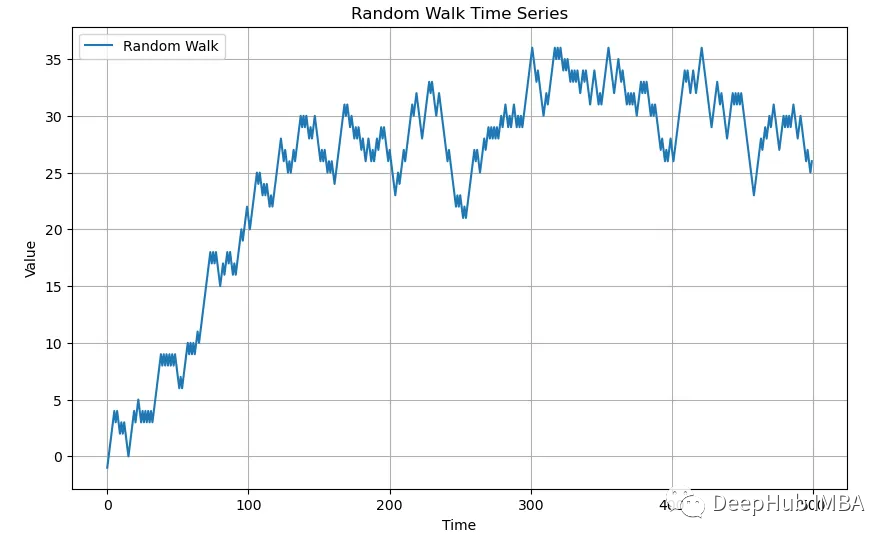

```python
 # Generate and plot the recurrence plot
 recurrence = recurrence_plot(random_walk, threshold=0.1)
 
 plt.figure(figsize=(8, 8))
 plt.imshow(recurrence, cmap='binary', origin='lower')
 plt.title('Recurrence Plot')
 plt.xlabel('Time')
 plt.ylabel('Time')
 plt.colorbar(label='Recurrence')
 plt.show()
```

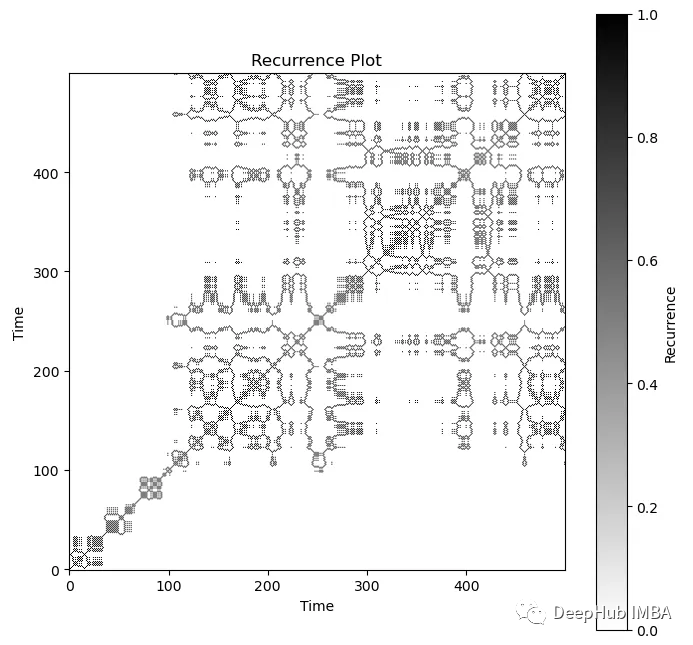

### 标普500

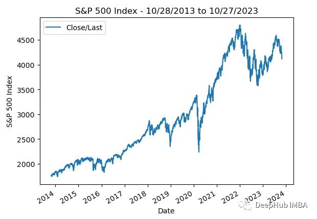

```python
recurrence = recurrence_plot(df['Close/Last'], threshold=10)
 
 plt.figure(figsize=(8, 8))
 plt.imshow(recurrence, cmap='binary', origin='lower')
 plt.title('Recurrence Plot')
 plt.xlabel('Time')
 plt.ylabel('Time')
 plt.colorbar(label='Recurrence')
 plt.show()
```

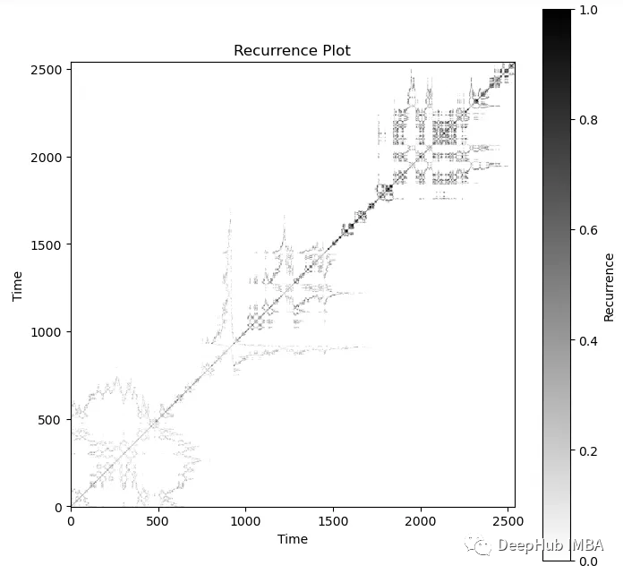


# Poincare Plot

Poincare Plot是HRV非线性分析的一种方法。对于一段连续的心跳间隔，将第i个心跳间隔作为横坐标，第(i+1)个心跳间隔作为纵坐标，在二维平面可以画出如下图形。这些点的分布可以近似为椭圆，椭圆的中心位于(x轴心跳间隔平均值，y轴心跳间隔平均值)确定的坐标点，椭圆的半长轴和半短轴分别为SD1和SD2。

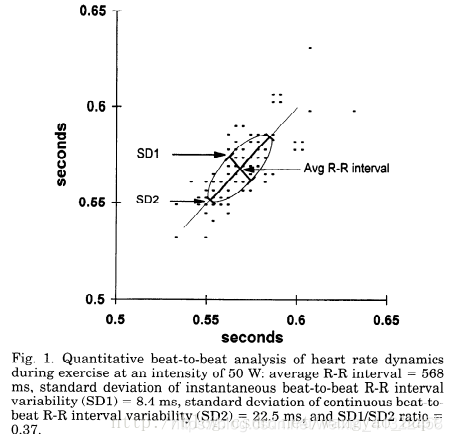


从上图可以看到，SD1和SD2分别由数据点沿着y=x和y=−x+2∗RRI两条直线的离散程度决定，即在这两个方向上数据的方差决定。这样，对原始坐标轴做逆时针45°旋转，旋转后的坐标系中X′方向和Y′方向的数据标准差就是SD1与SD2。

不规则信号的PP图：

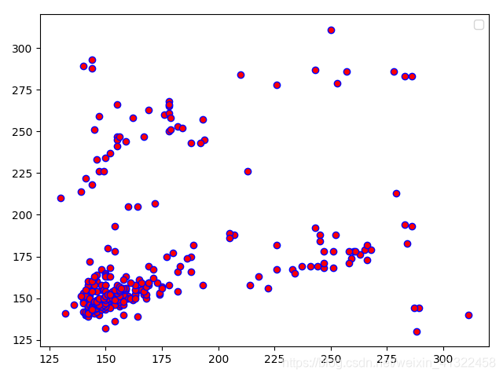

规则信号的PP图：


# Short-Time Fourier Transform (STFT)

短时傅里叶变换定义为:

$X(n,\omega)=\sum_{m=-\infty}^\infty x(m)w(n-m)e^{-j\omega m}$

其中$x(m)$为输入信号，$w(m)$是窗函数，它在时间上反转并且有n个样本的偏移量。 $X(n,w)$是时间 n和频率 w 的二维函数，它将信号的时域和频域联系起来，我们可以据此对信号进行时频分析，比如 $S(n,w)=|X(n,w)|^2$就是语音信号所谓的语谱图(Spectrogram)。

画出上节中两路扫频信号叠加后的信号的语谱图，如下图

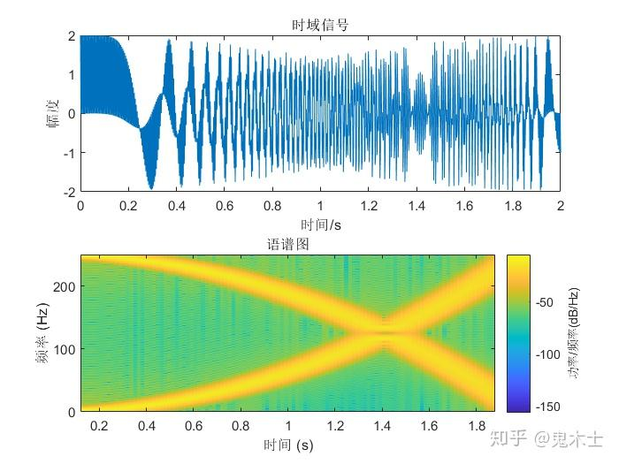

可见该信号是由一个0~250Hz二次递增的扫频信号和一个250~0Hz二次递减的扫频信号的叠加。通过STFT，我们可以很容易地得出非平稳信号的时变特性。

继续对STFT进行分析。

计算语谱 $S(n,w)$时采用不同窗长度，可以得到两种语谱图，即窄带和宽带语谱图。长时窗（至少两个基音周期）常被用于计算窄带语谱图，短窗则用于计算宽带语谱图。**窄带语谱图具有较高的频率分辨率和较低的时间分辨率**，良好的频率分辨率可以让语音的每个谐波分量更容易被辨别，在语谱图上显示为水平条纹。相反**宽带语谱图具有较高的时间分辨率和较低的频率分辨率**，低频率分辨率只能得到谱包络，良好的时间分辨率适合用于分析和检验英语语音的发音。

如下图所示，分别为一段语音的帧长为128和512的语谱图。

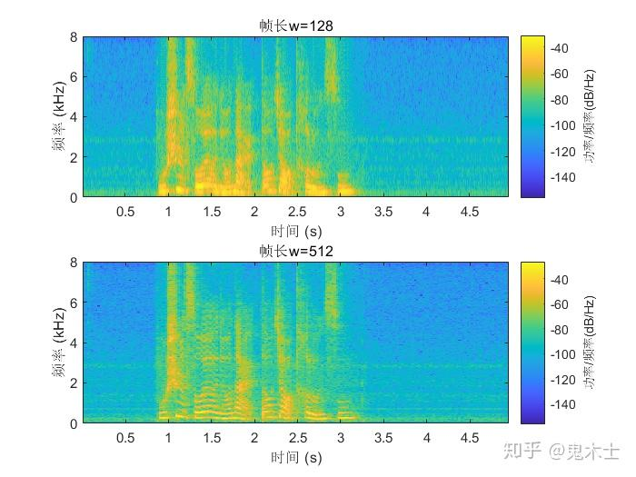

可见，对于帧长固定的短时傅里叶变换，在全局范围内的时间分辨率和频率分辨率是固定的。如果我们想要在低频区域具有高频率分辨率，在高频区域具有高时间分辨率，显然STFT是不能满足要求的。我们继续引入另一种时频分析方法——小波变换。


# CWT、WT变换

对于任意能量有限信号 $f(t)$，其连续小波变换(CWT)定义为

$W_f(a,b)=\frac{1}{\sqrt a}\int_{-\infty}^{+\infty}f(t)\psi^*(\frac{t-b}{a})dt$

其中$\psi(t)$是母小波或者基本小波，它满足 $\psi(±\infty)=0$ ， $\psi(0)=0$ ，$\int_{-\infty}^{+\infty}\psi(t)dt=0$ ，前两个条件表明$\psi(t)$在时域上是一个有限长的函数，最后一个条件则表明 $\psi(t)$必须时正时负地波动，否则它的积分结果不会为零，因此它在频域上也是有限的。所以不同于傅里叶变换的基函数是一个无限长的正弦波，小波变换的基函数是一个经过衰减处理的有限长小波，小波基函数在时域和频域上都是局部化的，如下图分别为傅里叶变换和小波变换的基函数

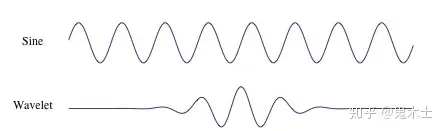

将 $\psi(t)$ 进行伸缩和平移得到一族函数 $\psi_{a,b}(t)$，称为分析小波，这就是小波变换的基函数族，其中 a 为伸缩参数，当 a>1 时，沿时间轴方向拉伸，因子 $1/\sqrt(a)$ 是为了保持伸缩之后能量不变； b为平移参数。

使用MATLAB的小波变换工具箱画出上节两路扫频信号叠加信号的小波变换结果，如下图，其中纵轴(频率轴)是对数轴。

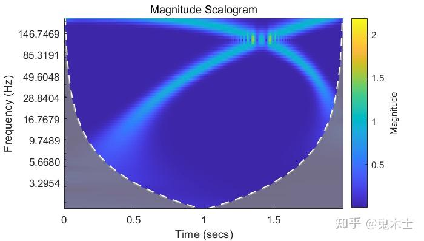

可见在低频区域的变换结果具有较高的频率分辨率(频率轴是对数轴，在低频区域跨度较小)，在高频区域具有较高的时间分辨率。

## 一些总结

我们对上述方法进行总结，可以发现上述方法的区别都可以归结为选取的时频窗尺寸不同。画出时域信号、频域信号、使用STFT得到的时频域信号、使用小波变换得到的时频域信号的时频窗，如下图，每一个小方块表示一个时频窗，沿时间方向的边长表示时间分辨率，沿频率方向的边长表示频率分辨率。


[more][https://zhuanlan.zhihu.com/p/150705777]

# 格拉米角场 GAFs

格拉米角场（Gramian Angular Field）是一种基于时间序列数据的特征提取方法，用于捕捉序列数据中的动态变化。它通过计算时间序列数据的相对角度来构建一个二维矩阵，该矩阵反映了不同时间点之间的相互关系。格拉米角场可以应用于各种领域，如机器学习、信号处理和时间序列分析。


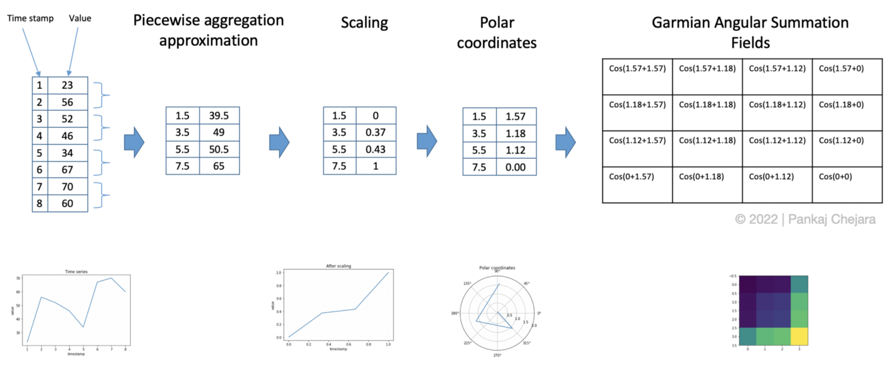

## 算法

1. 通过取每个 M 点的平均值来聚合时间序列以减小大小。 此步骤使用分段聚合近似 ( Piecewise Aggregation Approximation / PAA)。
2. 区间[0,1]中的缩放值。
3. 通过将时间戳作为半径和缩放值的反余弦（arccosine）来生成极坐标。 这杨可以提供角度的值。
4. 生成GASF / GADF。 在这一步中，将每对值相加（相减），然后取余弦值后进行求和汇总。

# 马尔可夫变迁场 MTF

马尔可夫转移场（Markov Transition Field, MTF）是基于马尔可夫转移矩阵的一种时间序列图像编码方法。该方法将时间序列的时间推移看成是一个**马尔可夫过程**，即：在已知目前状态的条件下，它未来的演变不依赖于它以往的演变，由此构造马尔可夫转移矩阵，进而拓展为马尔可夫转移场，实现图像编码。

对于时间序列X= (xt,t = 1,2,...,T)，其图像编码步骤如下：

1. 将时间序列X(t)分成Q个分位箱（标记为1,2,...,Q,每个分位箱内的数据量相同）；

2. 将时间序列中每一个数据更改为其对应的分位箱的序号；

3. 构造转移矩阵W（ωij表示分位箱i转移到分位箱j的频率）：

   $W=\begin{bmatrix}\omega_{11}&\ldots&\omega_{1Q}\\\omega_{21}&\cdots&\omega_{2Q}\\\vdots&\ddots&\vdots\\\omega_{Q1}&\cdots&\omega_{QQ}\end{bmatrix}\quad\text{s.t.}\quad\sum_j\omega_{ij}=1$

4. 构造马尔可夫转移场M。

$\left.M=\left[\begin{array}{ccc}\omega_{ij}\mid x_1\in q_i,x_1\epsilon q_j&\ldots&\omega_{ij}\mid x_1\in q_i,x_N\in q_j\\\omega_{ij}\mid x_2\in q_i,x_1\epsilon q_j&\cdots&\omega_{ij}\mid x_2\in q_i,x_N\in q_j\\\vdots&\ddots&\vdots\\\omega_{ij}\mid x_N\epsilon q_i,x_1\epsilon q_j&\cdots&\omega_{ij}\mid x_N\in q_i,x_N\in q_j\end{array}\right.\right]$

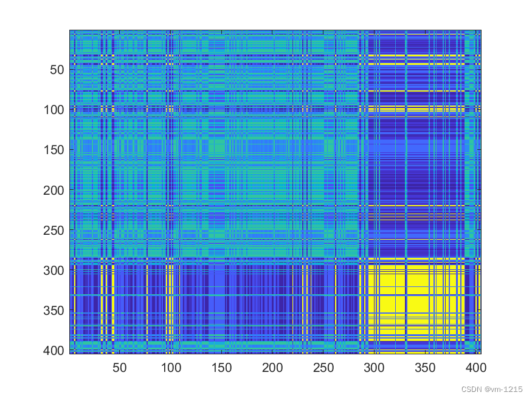


# 相对位置矩阵(Relative Position Matrix)

相对位置矩阵(Relative Position Matrix, RPM)包含了原始时间序列的冗余特征，使转换后的图像中，类间和类内的相似度信息更容易被捕捉。 对于一个时间序列X=(xt,t=1,2,…,N)，可以通过以下步骤得到RPM图：

1. 针对原始时间序列，通过以下z-分值标准化的方法得到一个标准正态分布Z。

   $z_t=\frac{x_t-\mu}{\sigma},t=1,2,\ldots,N$

   其中μ表示X的平均值，σ表示X的标准差。

2. 采用分段聚合近似(PAA)方法，选择一个合适的缩减因子k，生成一个新的平滑时间序列$\hat{X}$，将维度N减少到m。通过计算分段常数的平均值进行降维，可以保持原始时间序列的近似趋势，最终新的平滑时间序列的$\hat{X}$长度为m。

   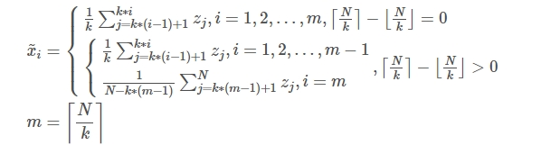

3. 计算两个时间戳之间的相对位置，将预处理后的时间序列X转换为二维矩阵M。如上所示，该矩阵表征了时间序列中每两个时间戳之间的相对位置关系。

   $\begin{aligned}\cdots\\M=\begin{bmatrix}\tilde{x}_1-\tilde{x}_1&\tilde{x}_2-\tilde{x}_1&\cdots&\tilde{x}_m-\tilde{x}_1\\\tilde{x}_1-\tilde{x}_2&\tilde{x}_2-\tilde{x}_2&\cdots&\tilde{x}_m-\tilde{x}_2\\\vdots&\vdots&\ddots&\vdots\\\tilde{x}_1-\tilde{x}_m&\tilde{x}_2-\tilde{x}_m&\cdots&\tilde{x}_m-\tilde{x}_m\end{bmatrix}\end{aligned}$

   其每一行和每一列都以某一个时间戳为参考，进一步表征整个序列的信息；

4. 最后利用最小-最大归一化将M转换为灰度值矩阵，最终得到相对位移矩阵F：

   $F=\frac{M-\min(M)}{\max(M)-\min(M)}\times255$

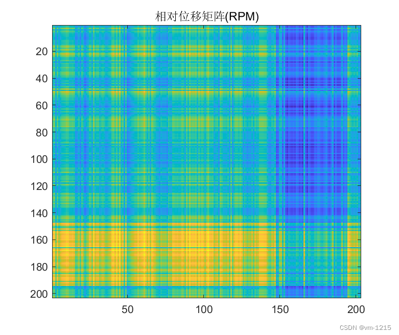

# 图形差分场方法

时间序列图形表达了时间序列的时间结构信息，基于时间序列图形的序列熵则可以用于时间序列的复杂性测量、动态系统表征等。因此，作者提出了基于不同图形长度的图形差分场，实现时间序列到图像的转换。

图形差分场(Motif Difference Field, MDF)的基本思想是：给定一个时间序列X=(xt,t=1,2,...,N)，设定需要得到的图像数量n(1<n<N)，再设定不同步长d(1≤d≤dmax,dmax=[(N−1)/(n−1)]))，不同长度s(s=1,2,3,...,N−(n−1)d))的时间窗口，以此多次提取时间序列原始图形的某一段，然后经过组合变换获得n个图像。

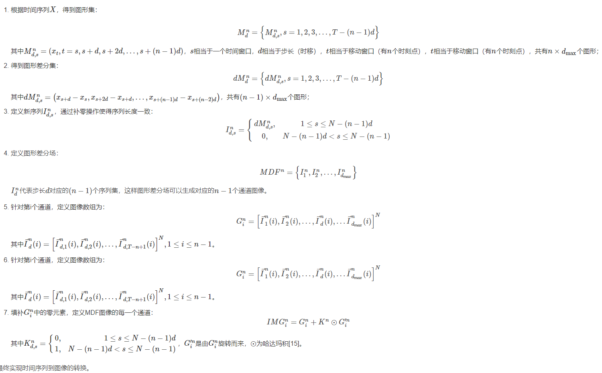

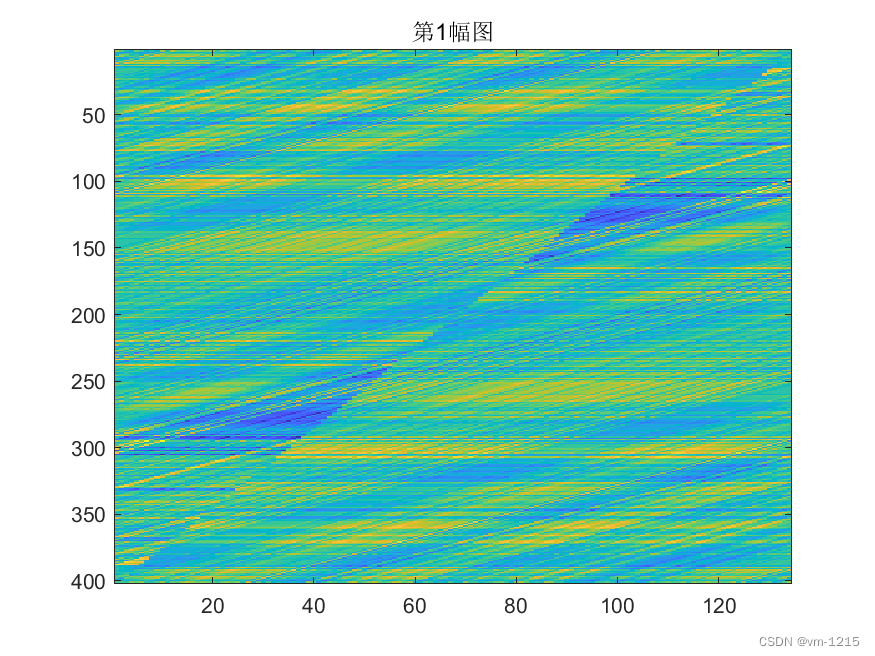

# EMD、VMD直接组合
