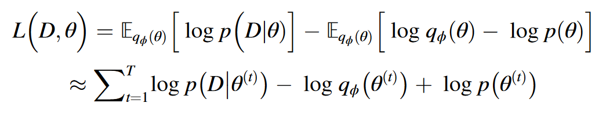
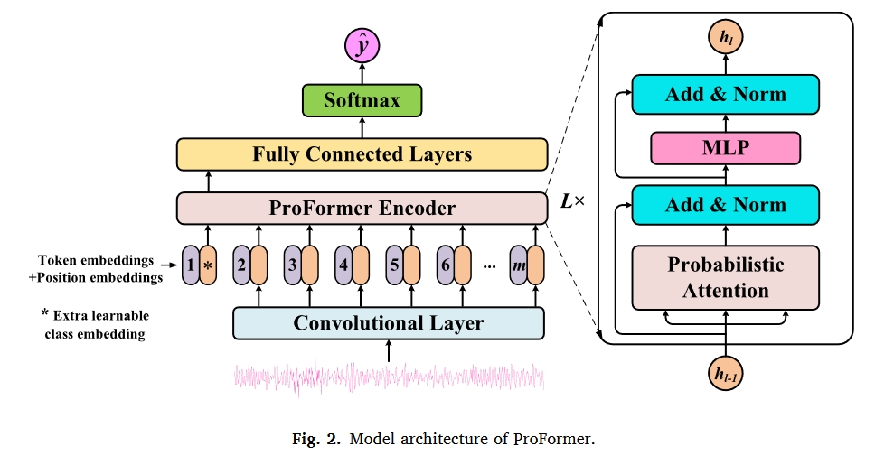
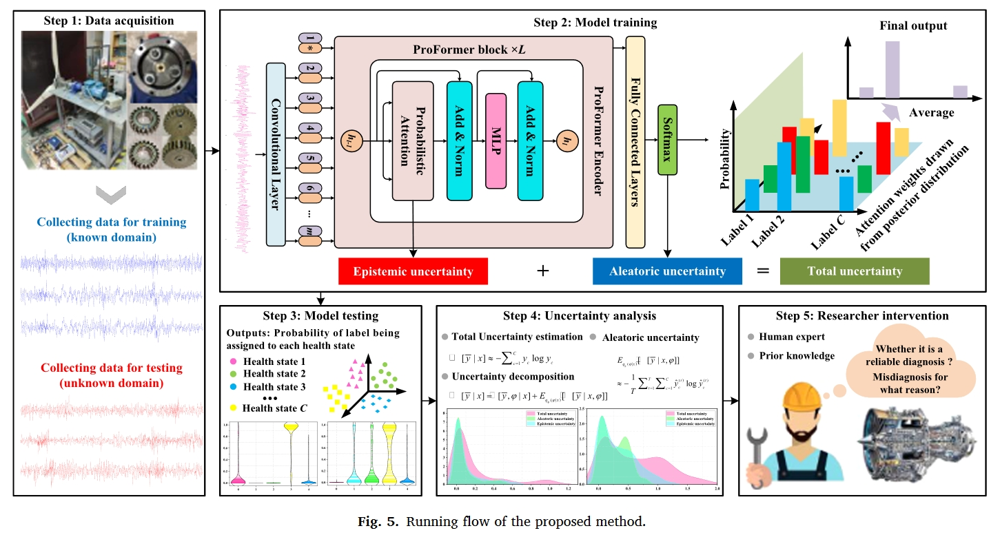
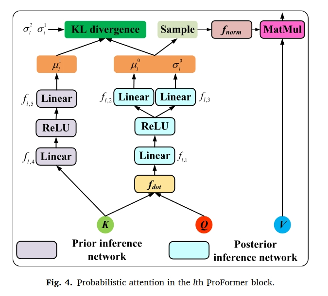
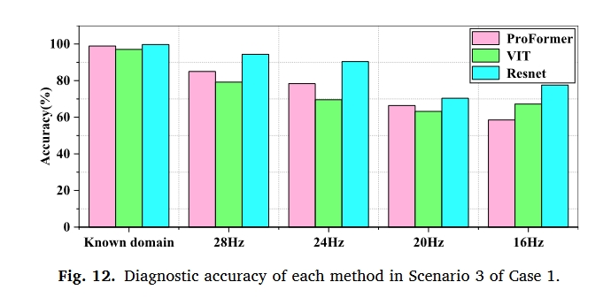

# 引言

1. 转动机械很重要。轴承和齿轮式主要部件。转动机械部件进行诊断很重要。
2. 介绍基于深度学习的转动机械故障诊断。
3. 为了解释深度模型做出的诊断决策背后的基本原理，以便研究人员能够更加信任它们，出现了可解释的RMFD研究。*现有的方法主要集中在开发可解释模块并将其嵌入到深层模型中，为诊断结果分配一些物理意义，或者推断模型的深层逻辑，根据结果做出决策。关于如何量化诊断结果中的不确定性并解释其来源和组成的工作有限，这对于构建值得信赖的诊断模型以及在研究人员和深度模型之间建立依赖关系至关重要。*
4. 介绍了不确定量化技术。*如果诊断结果中的不确定性可以量化，研究人员可以澄清这些结果的可信度，从而调整设备的操作和维护策略，以避免潜在的故障风险。此外，通过解释结果中不确定性的来源和组成，可以建立研究人员与深度模型之间的依赖关系，增强诊断过程的透明度和可解释性*
5. 介绍了不确定性的类型：
   1. **认知不确定性**：认知不确定性是指由于诊断知识不足而导致的模型参数的不确定性，例如有限的训练数据或不平衡的数据，无法涵盖所有可能的操作条件、故障类型等。
   2. **任意不确定性**：任意不确定性是指数据受未观测因素影响的固有随机性，如噪声干扰、传感器硬件损坏等。
6. 然而，现有的深度诊断模型通常无法正确表达诊断结果的不确定性。原因是他们的模型参数通常是固定值，这使得他们只能给出过于自信的点估计预测。本文考虑Transformer的应用前景，结合概率贝叶斯提出了一种新的Transformer模型（Probabilistic Bayesian Transformer (ProFormer)）来进行可信故障诊断。该文的创新主要集中在以下三点：
   1.  提出了一种新的可信RMFD方法，通过分析和解释诊断结果中不确定性的来源和组成，提高了模型的可信度。该方法的有效性在分布外的泛化场景中得到了充分验证，测试数据包含未知故障类别、未知噪声水平或未知操作条件的样本。本研究是当前可解释RMFD领域的一项重要探索。
   2. 设计了概率注意力，并定义了相应的最优目标函数，作为ProFormer的核心，该函数可以对注意力权重的先验分布和变分后验分布进行建模，从而使模型能够感知不确定性。这是在贝叶斯DL框架中构建注意力机制的开创性工作。 
   3. 开发了一种不确定性量化和分解方案，以实现诊断结果的置信度表征以及认识不确定性和任意不确定性的分离。

# 相关工作

## 多头注意力机制

[简介](https://zhuanlan.zhihu.com/p/109983672)

## 贝叶斯变分学习（Bayesian variational learning）

深度神经网络（DNN）的训练目标是找到关于训练数据的最优模型参数，并且每个最优参数只是该参数的点估计。因此，训练的DNN的模型参数是确定的，并且对于给定的输入只能提供一个固定的输出。

贝叶斯神经网络（BNN）没有给出这些参数的点估计，而是提供了所有参数的概率分布，即后验分布$p(θ|D)$。通常，贝叶斯规则可以用于求解后验分布：

$p(\theta|D)=\frac{p(D|\theta)p(\theta)}{p(D)}=\frac{p(D|\theta)p(\theta)}{\int_\theta p(D|\theta)p(\theta)d\theta}$

其中$p(D|θ)$是似然性，$p(D)$是边际概率，并且先验概率$p(θ)$通常被选择为高斯分布。

然而，由于神经网络通常包含大量参数，使得$∫_θp(D|θ)p(θ)dθ$ 的计算变得棘手，因此需要用变分推理来捕捉该后验分布的近似分布。

变分推理的目标是在一组由参数φ控制的分布$q_φ$中找到一个尽可能接近真实后验分布的分布，从而将上述后验推理问题转化为优化问题，即最小化变分分布$q_φ(θ)$和真后验分布$p(θ|D)$之间的差异。通常，选择Kullback-Leibler（KL）散度作为度量：

$KL(q\phi(\theta)||p(\theta|D))=\int q_\phi(\theta) log \frac{q_\phi(\theta)}{p(\theta|D)}d\theta \\=\int q_\phi(\theta) log \frac{q_\phi(\theta)p(D)}{p(D|\theta)p(\theta)}d\theta\\ =log p(D) - \underbrace{ \int q_\phi(\theta) log \frac{p(D|\theta)p(\theta)}{q_\phi(\theta)}d\theta}_{L(D,theta)} $

其中$log p(D)$和$L(D,θ)$分别称为证据和证据下界（ELBO）。

由于$log p(D)$是一个计算困难的常数，因此有必要将上述最小化KL散度的问题转化为最大化ELBO，ELBO可以进一步定义为：

$\begin{aligned}L{\left(D,\theta\right)}&=\int q_\phi(\theta){\log p}{\left(D|\theta\right)}d\theta-\int q_\phi(\theta){\log\frac{q_\phi(\theta)}{p(\theta)}}d\theta\\&=\underbrace{\mathbb{E}_{q_\phi(\theta)}[{\log p(D|\theta)}]}_{L_1}-\underbrace{KL{\left(q_\phi(\theta)\right|}\left|{p(\theta)}\right)}_{L_2}\end{aligned}$

其中 L1 是似然成本，表示模型与数据的拟合程度；L2 是复杂度成本，表示变分后验与给定先验之间的相似度。根据无偏蒙特卡罗估计法，ELBO 可以通过从变分后验分布$p(θ|D)$ 中提取 T 次模型参数来近似：

其中$θ(t)$是第t次采样的模型参数。以$L(D,θ)$为优化目标训练BNN，以获得接近真实后验的变分后验。

# 概率贝叶斯Transformer

如图所示，2，所提出的ProFormer模型由卷积层、由多个ProFormer块堆叠的ProFormer编码器和由多个完全连接（FC）层堆叠的分类器组成。具体来说，ProFormer块由设计的概率注意力、多层感知器（MLP）、两个层归一化层和两个残差连接组成。

## 概率注意力设计与优化目标定义

所设计的概率注意力是所提出的ProFormer的核心，它可以取代缩放的点积注意力，赋予Transformer类似于BNN的特性。如图所示

在所提出的概率注意力中，注意力权重不再是通过计算获得的确定值，而是从注意力权重的后验分布中采样的潜在随机变量。

然而，我们注意到注意力权重并不直接等价于模型参数；注意力权重应该取决于输入，而模型参数可以在所有输入之间共享。

因此，对于数据集$D:=\{x_i,y_i\}^N_{i=1}$，需要建模的是每个输入$p(A|x,y)$的注意力权重的后验分布，其中$A=\{A_l\}_{l=1}^L$是来自所有ProFormer块的样本x的归一化注意力权重。

# 实验

## 数据集

1. Tsinghua University on planetary gearbox faults for wind turbine
2. collected using QPZZ-II bearing fault

