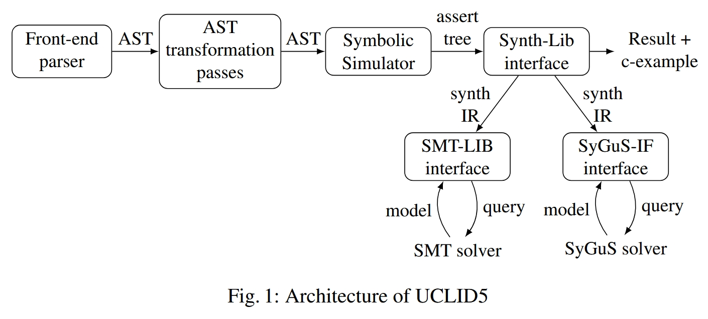

# 创新点

这篇工具论文介绍了 UCLID5 工具的新发展，包括新的语言特点、与语法指导合成和可满足性求解新技术的集成、对超属性和公理建模与运算建模组合的支持、新问题类别的演示以及强大的实现。

UCLID5 在2018年被提出，而本文则是对UCLID5 工具的最新进展。没有提出新的方法。

# 方法

## UCLID5

在验证模式下，UCLID5 将模型是否满足给定规范的问题简化为一组约束条件，现成的 SMT 求解器可以解决这些约束条件。在综合模式下，UCLID5 将为一个未被解释的函数找到解释从而满足规范的问题简化为一个 SyGuS 问题，该问题可由现成的 SyGuS 求解器求解。

### Front end

UCLID5 将以 UCLID5 语言编写的模型作为输入。命令行前端允许用户进行配置，包括指定要使用的外部 SMT 求解器/SyGuS 求解器，以及启用某些实用程序，如自动将未解释的函数转换为数组。解析器根据模型构建抽象语法树。

### AST passes

UCLID5 对抽象语法树进行了一系列转换和检查，包括类型检查和过程内联。这种中间表示法支持有限的控制流，如 if 语句和开关情况，但不允许在过程代码中使用循环，而是通过解卷（有界 forloops）或用用户提供的不变式（while 循环）来删除循环。不过，无界控制流可以通过表示过渡系统来处理（每个模块都由一个过渡系统组成，其中有初始块和下一模块，每个模块都表示为一个单独的 AST）。

### Symbolic Simulator

符号模拟器根据所提供的验证指令对模型中的过渡系统进行模拟，并生成一组断言。例如，如果使用有界模型校验，UCLID5 将以符号方式执行主模块的有界次数。UCLID5 会将违反每个独立验证条件的情况编码为单独的断言树。

### Synth-Lib interface

UCLID5 支持综合和验证。Synth-Lib 接口根据符号仿真器生成的断言构建验证或综合问题。验证问题传递给 SMT-LIB 接口，后者将 UCLID5 中间表示法中的每个断言转换为 SMT-LIB 中的断言。同样，综合问题被传递到 SyGuS-IF 接口，该接口将每个断言转换为 SyGuS-IF 中的断言。然后，验证和综合问题会被传递给相应的外部求解器，并将结果反馈给用户。

## 多模态语言特征

### 多模态验证与合成

Specification：UCLID5支持多种不同类型的规范。支持的标准属性包括序列代码中的内联断言和假设、过程的前置条件和后置条件，以及全局公理和不变量（既作为命题谓词，也作为线性时态逻辑（LTL）中的时态不变量）。

Verification：最新版本的 UCLID5 将程序综合完全集成到了前面所述的所有验证模式中。具体来说，用户可以在其模型的任何地方声明和使用综合函数，UCLID5 将自动综合这些函数的函数体，从而使用户选择的验证任务能够通过。在本节中，我们将举例说明 UCLID5 中的综合功能，介绍程序综合的必要背景，然后阐述 UCLID5 内部现有的综合验证技术。

### 多模态建模

结合并行建模与顺序建模：结合并发和顺序建模 UCLID5 建模语言的一个独特功能是能够轻松地结合顺序和并发建模。这使得用户可以在顺序模型中轻松表达代表顺序程序的模型，包括标准控制流、过程调用、顺序更新等，并将这些组件结合到基于转换系统的并发建模系统中。顺序程序建模受到 Boogie 等系统的启发，用户可以将 Boogie 模型移植到 UCLID5 中。并发建模是通过定义带有一组初始状态和过渡关系的过渡系统来完成的。在 UCLID5 中，每个模块都是一个过渡系统。可以定义一个主模块，当每个子模块步进时触发主模块。

# 总结

介绍UCLID5的一篇文章。

