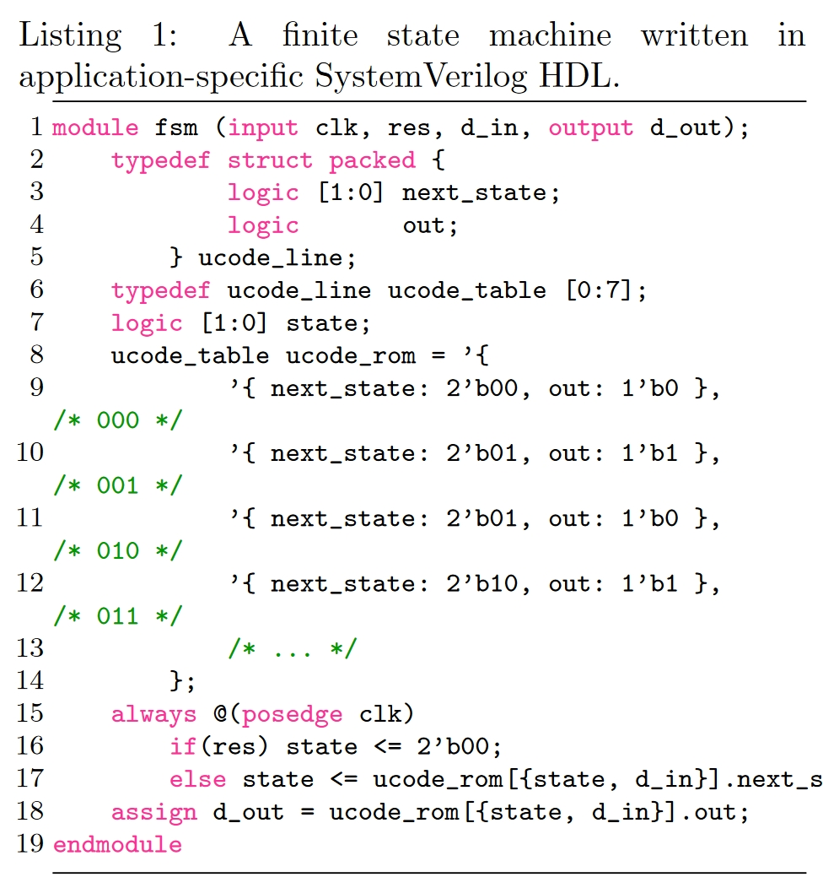
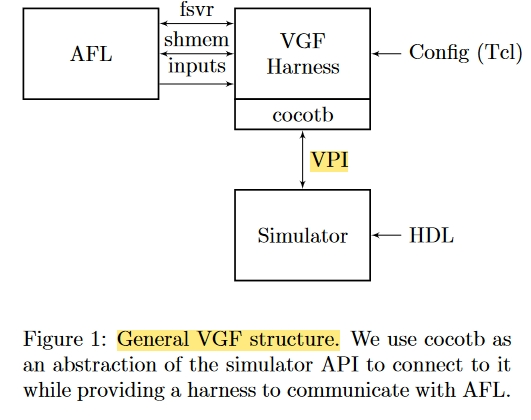
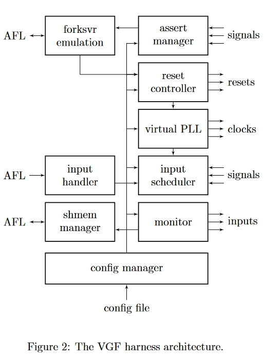
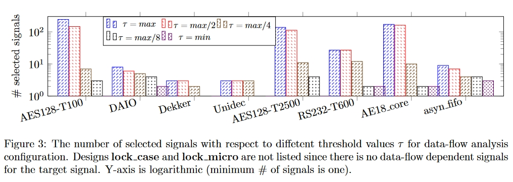
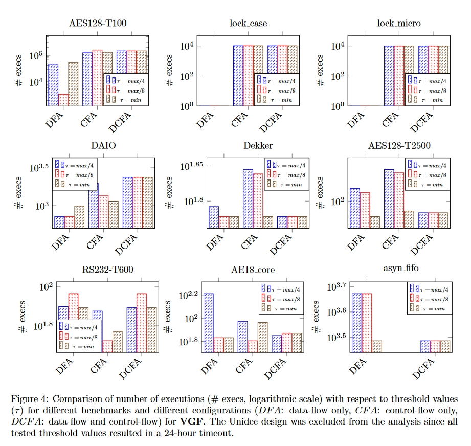
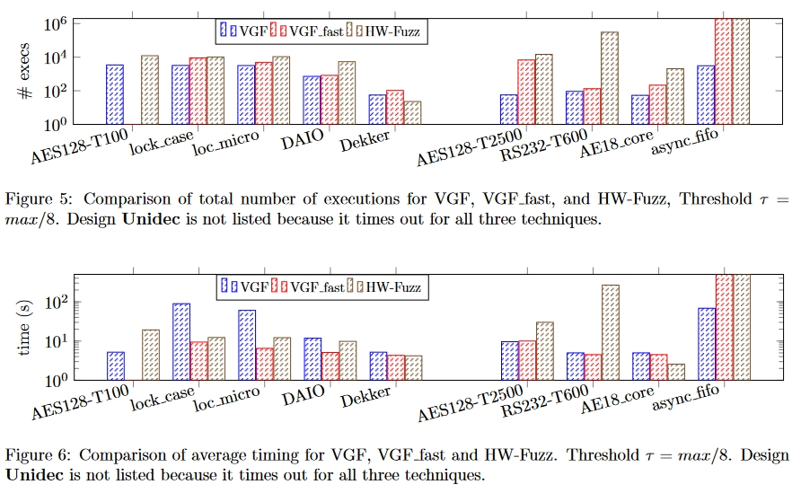

# 创新点

提出了一种值引导模糊测试（Value-Guided Fuzzing, VGF）方法，试图通过分析设计中的关键信号来重建缺失的控制流信息，从而解决控制流覆盖引导的软件模糊器无法捕获隐式控制流的问题。

对于上述 FSM，VGF 通过研究状态寄存器的变化来实现这一目标，它所依赖的观点是，一旦可以跟踪状态寄存器值的变化，就可以推断出沿着新路径的遍历，从而在原本扁平化的设计上重建控制流。

据我们所知，硬件模糊方法目前采用了**控制流引导反馈**这种或那种形式来跟踪代码覆盖率，并成功地在具有明确控制流的设计中发现了许多硬件错误，从而实现了仪器化。

但是，根据设计的实现情况，可能无法获得控制流信息。例如，控制流信息无法从门级网表或微编码设计中恢复。对于 ROMtable 设计来说，一般情况下都是如此。事实上，硬件设计中的控制流仅在某些情况下产生，如在 HDL 描述中使用 if/else 或 case 语句推断出显式多路复用或解码逻辑时。

## claim

原始的硬件代码一般通过Verilog等工具翻译为C++代码。然而作者认为翻译过后的代码无法获得明确的控制流信息，因此无法推断出控制流引导的覆盖范围。

因此提出了一种值引导模糊测试（Value-Guided Fuzzing, VGF）方法，试图通过分析设计中的关键信号来重建缺失的控制流信息，从而解决控制流覆盖引导的软件模糊器无法捕获隐式控制流的问题。

##  例如

覆盖引导模糊器无法检测微代码 ROM 的控制流。因此，它无法动态地确定哪些输入驱动着从 FSM 的一个状态向另一个状态的转换，这意味着它无法学习优先输入以进入错误状态。从根本上说，这使覆盖引导模糊器（coverage-guided fuzzer）沦为随机搜索，从而破坏了它的目的。

# 方法

图 1 中展示了模糊方案的整体结构。我们的实现由三个部分组成：

1. HDL 仿真器
2. Fuzzer（AFL）
3.  VGF 测试套件

VGF 线束是在 cocotb的基础上实现的，cocotb 为 VPI 提供了与仿真器无关的层，还为 SystemVerilog 仿真器提供了 DPI，为 VHDL 仿真器提供了 VHPI 和 FLI。线束使用 cocotb 与仿真器通信，同时为 AFL 模糊器提供接口。

图2显示了测试套件的详细架构。一旦启动，该工具就会读取包含AFL导出的System V共享内存区域（shmem）的环境变量作为其哈希图，使其可访问，并为AFL分叉服务器（fsvr）管道提供桥接。

测试套件的配置文件指定了要监视哪些信号以进行更改，以及这些信号在设计中的权重。第2.2节解释了使用静态分析选择这些信号。启动时，将为指定信号的信号更改事件添加回调函数。回调函数继续使用唯一的信号标识符以及信号的值作为索引AFL导出的哈希图的手段。

**在模糊测试过程中，每当跟踪信号之一发生变化时，模拟器都会触发一个事件。**harness服务会对哈希映射的桶进行事件递增。我们实现的一些回调函数使用权重参数来修改hashmap中的值。

最后，线束的配置文件以类似于SystemVerilog断言的格式提供了一系列要检查的条件。安全带监测这些条件，如果满足条件，则向AFL报告。硬件不会像软件那样崩溃。**如果在模糊测试过程中遇到检查条件，模拟不会停止。相反，模糊线束会创建一个虚假的信号错误代码，并将其发送到AFL。**AFL将此视为一次崩溃，创建了一个记录，其中包含发送到导致故障的线束的输入。稍后可以在线束处于手动模糊模式时重放此输入。

## 快速VGF测试套件

通过编程接口与模拟器连接的一个固有限制是**模拟速度**。这对于快速模糊测试是不利的。为了解决速度问题，该文引入了另一种实现方法，即使用修改后的 Verilator 输出模型，将信号变化报告给与模糊引擎通信的中间桥接器。所讨论的桥允许硬件的快速软件仿真，同时提供必要的模糊反馈。任何基于Verilog的工具都无法捕获由于定时事件而出现的错误，例如在具有多个时钟域的设计中。这是因为Verilog以忽略SystemVerilog标准的重要部分为代价实现了高速仿真能力。

快速VGF 通过在 Verilated 代码事件循环执行前后检查设计中的信号，快速收集信号变化。收集到的变化会异步发送到中间网桥，而**无需中断仿真**。**一旦网桥收集到所有信号变化数据，就会向模糊引擎发送必要的反馈。**这样可以提高模糊处理的吞吐量，但却牺牲了仿真的准确性。

## 检测属性相关信号

该文选择了两种方法来进行属性相关信号的检测

1. 直观信号分析：直观信号分析（VGFintuitive）的目的是展示用户在不借助外部工具的情况下，根据自己对设计的理解选择要跟踪的信号时 VGF 的性能。在这些实验中，每个设计都要进行手动分析，并根据每个信号与测试台检查以验证设计是否正确执行的断言的相关重要性来选择信号配置。
2. 设计静态分析：该文使用静态分析工具SVF进行数据流分析和控制流分析，从而为相关信号提供与信号相关的依赖性信息。我们将这种方法称为 VGF 静态分析。具体来说，我们使用 Verilator1 生成硬件的软件表示，然后使用 clang 编译器在 LLVM IR 中生成其表示。静态值流（SVF）是在 LLVM 的基础上实现的，允许以迭代方式执行值流构建和指针分析。SVF 还通过利用稀疏分析实现了可扩展的精确程序间分析，为分析大型程序提供了一种前景广阔的解决方案。

# 实验

## 不同的信号数量

## 不同流的影响

# 总结

本文主要有两个点：

1. 针对传统方法将硬件代码转换为C++代码控制流信息消失的问题，因此无法推断出控制流引导的覆盖范围，提出直接使用模拟硬件环境来进行模糊测试，具体来说是使用关键的信号的状态来解决这个问题。
2. 对于上述的关键信号，提出了一种基于静态统计（数据流和控制流）来获取信号量。（但此处统计仍然硬件代码转换的C++代码，和上述好像优点矛盾）

