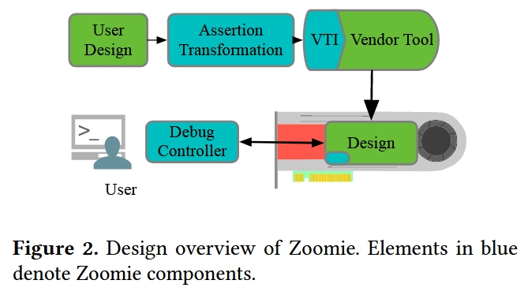

# 创新点

构建了 Zoomie，一种用于快速增量编译、重复使用验证基础架构，以及采用软件启发的开源仿真方法。

研究表明，与供应商的工具链相比，Zoomie 在百万门设计的增量编译时间上**提高了 18 倍**。同时，Zoomie 还提供了类似软件的调试体验，包括断点、步进设计以及在运行设计中强制取值。

1. 快速增量编译
2. 重复使用验证基础设备
3. 类软件调试器

（感觉又是另一个赛道，为硬件开发做配套工具，文中引用有很多类似的工作）

# 方法

基于 FPGA 的原型验证是指将硬件设计编译为在 FPGA 上运行的比特流，并使用 FPGA 测试硬件设计与不同物理输入和输出（IO）（如 DDR 或以太网）接口的行为。FPGA 与真实 IO 接口的独特能力，加上比周期精确的软件 RTL 仿真快四个数量级的速度，使其成为硬件验证和硅前软件开发不可或缺的工具。然而，尽管 FPGA 原型开发在学术界和工业界得到广泛应用，但其严重缺点是缺乏类似软件的开发环境。编译时间通常需要数小时甚至数天，而且供应商提供的调试器只能观察到非常有限的一组信号，需要重新编译才能观察到不同的信号。目前的 FPGA 原型开发侧重于事后查找错误，这使得找出问题所在（错误定位）和问题发生的原因变得更具挑战性。

## FPGA 原型验证的基本概念

FPGA 是一种半定制电路，可以在制造后通过编程配置为执行特定的功能。由于它们的高度灵活性，FPGA 可以用来模拟几乎任何数字逻辑电路，包括复杂的系统级芯片（SoC）的设计。在原型验证过程中，FPGA 用于实现设计的全部或部分逻辑，以便进行早期的功能验证、性能评估以及软件开发。

### FPGA 原型验证的过程

1. 设计输入：首先，设计团队将RTL（寄存器传输级）描述的设计代码转换成适合在FPGA上实现的形式。这通常涉及到综合（synthesis）、映射（mapping）和布局布线（placement and routing）等步骤。
   FPGA 编程：将综合后的设计下载到FPGA中。这通常需要将设计分割成多个部分，因为单个FPGA可能无法容纳整个设计。
2. 验证环境设置：创建一个验证环境，该环境包括必要的接口和外围设备，以模拟目标系统中的真实环境。这可能包括内存模块、处理器、传感器模拟器等。
3. 功能验证：使用预先定义的测试用例来验证设计的功能正确性。这些测试用例可能包括边界条件、异常情况以及其他复杂场景。
4. 性能评估：评估设计在FPGA上的性能，包括时序、功耗和资源利用情况。这有助于确定设计是否满足预期的要求。
5. 软件开发：对于包含嵌入式系统的SoC设计，原型验证平台可以用来开发和测试相关的固件或驱动程序。

### FPGA 原型验证的优势

1. 早期验证：允许在实际硅片制造之前进行早期验证，减少后期调试的需求。
2. 高保真度：提供接近最终产品的性能和行为，比纯软件仿真更可靠。
3. 灵活配置：可以根据需要快速更改设计配置，支持迭代验证。
4. 并行开发：软件开发团队可以在硬件设计还在验证阶段就开始编写和测试代码。

Zoomie 通过提供一套连贯的组件，使 FPGA 原型开发和调试通用，这些组件为用户提供了与用于 FPGA 原型开发的现代软件调试器相同的抽象功能。用户可以在执行过程中全面查看 FPGA 的执行情况、以分钟为单位的重新编译时间、断点、快照以及重放任意 RTL 设计的 FPGA 执行情况。Zoomie 还是首个利用基于芯片的先进 FPGA 的特定功能的 FPGA 调试平台。

## 现有缺点

1. **错误检测**需要反复重新编译。相比之下，用户有很多方法来本地化软件中的错误。这进一步削弱了错误定位功能，因为仿真检查不适用于 FPGA。
2. 此外，商业工具链中几乎没有**增量编译**。
3. 最后，终端用户**很难观察中间过程**。

这三个缺点不利于我们在 FPGA 上提供敏捷、高效的调试体验。Zoomie 为用户提供了类似软件的 FPGA 调试界面。用户可以即时插入自定义断点或观察点，当它们被触发时，设计就会暂停。在这里，用户可以选择继续执行设计，或操作快照状态以测试不同的执行方案。

## Zoomie 结构

1. Debug Controller：暂停、恢复和检查 FPGA 状态由调试控制器（Debug Controller）实现，它为用户提供了检查和操作设计状态的界面。它由一个硬件组件组成，插入用户设计中，并与主机上的软件通信，以控制和调试在 FPGA 上运行的设计。
2. Assertion Synthesis：断言合成编译器将 SVA 转化为可合成状态机，从而从 SVA 生成断点触发器。
3. VTI (Vendor Tool Incrementalizer)：VTI（Vendor Tool Incrementalizer，供应商工具增量器）组件实现了快速增量合成和放置与路由，大大缩短了从 RTL 更改到更新设计在 FPGA 上执行所需的时间。

### 使用调试控制器暂停设计

Zoomie 提供在执行过程中停止设计的功能，类似于软件断点。停止设计可通过内部触发信号（如断言失败）启动。它也可以由用户从主机启动，例如，当他们观察到意外行为或设计挂起时。暂停部分设计以进行调试面临两大挑战：(1) 暂停的时间必须精确，这意味着我们可以在触发器被激活的确切周期内停止设计；(2) 我们必须能够恢复暂停设计的执行。调试控制器可以解决这两个问题。这个 RTL 组件被放置在被测模块（MUT）周围，即用户当前正在测试的设计部分。MUT 可以相当大；我们在一个案例研究中选择了一个完整的处理器片。当 MUT 通过解耦接口进行通信时，这种方法效果最佳（即需要设计人员花费最少的精力）。如今，硬件设计中经常使用这些接口，它们在可扩展性、仿真速度和形式推理方面都有好处。

调试控制器可以解决这两个问题。这个 RTL 组件被放置在被测模块（MUT）周围，即用户当前正在测试的设计部分。MUT 可以相当大；我们在一个案例研究中选择了一个完整的处理器片。当 MUT 通过解耦接口进行通信时，这种方法效果最佳（即需要设计人员花费最少的精力）。如今，这些接口经常用于硬件设计，在可扩展性、仿真速度和形式推理方面都有优势。

### 状态提取

设计暂停后，Zoomie 会使用 FPGA 供应商提供的回读功能，检索 MUT 中所有状态元素的值。然后，Zoomie 会解析二进制数据，并将其与设计的 RTL 描述中的寄存器和存储器名称相匹配。供应商工具链生成的元数据使这一功能成为可能，但需要定制程序将回读与 RTL 名称相匹配，并提供对用户有用的输出。

### 操纵设计状态

Zoomie 还能让用户操作设计中的所有寄存器和内存值。与软件调试器类似，这使设计人员能够探索不同的运行时行为，而无需重新启动或重新编译设计。

### 使用内部触发器暂停设计

调试控制器包含三个主要的内部触发源：(1) 值断点，当用户选择的信号达到一定值时激活；(2) 周期断点，在用户指定的时钟周期数后激活；(3) 断言断点，当设计中的 SVA 出现故障时激活。

# 实验

# 总结

在本文中，介绍了用于 FPGA 的类软件调试工具 Zoomie。还深入了解了 Xilinx 多芯片 FPGA，并展示了如何利用这种了解来提供一种具有高可见性、低开销并可扩展至庞大设计的解决方案。我们在多个设计上对我们的方法进行了评估，这些设计的规模比之前的评估结果大 100 倍以上，并详细介绍了我们的比较结果。有了 Zoomie，用户现在可以以更高的效率调试他们的设计，并调试比以前大得多的设计。

